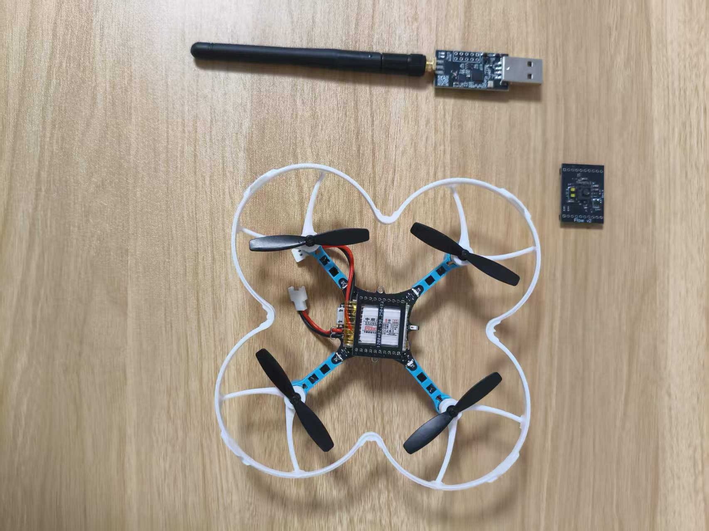
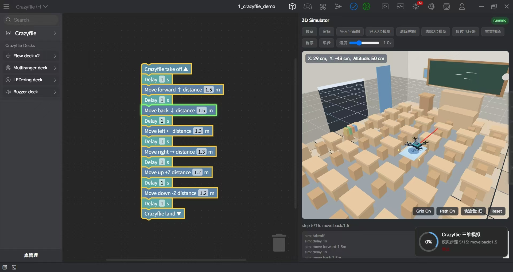

Crazyflie STEM aily blockly 模拟飞行平台
=========================================

.. contents:: 目录
    :depth: 2
    :local:

本项目基于 Crazyflie 2.1 和 Flow deck V2，围绕阿里项目场景开发了一套用于模拟飞行的控制平台。当前版本主要用于在软件环境中验证 Crazyflie 的飞行逻辑、轨迹规划以及控制策略，用户可以通过 Python 脚本模拟无人机的起飞、前进、上升和着陆等动作。

该项目目前重点是模拟控制平台的实现，后续将逐步扩展到真实 Crazyflie 的实物控制能力。也就是说，当前阶段主要用于仿真验证和演示，后续会加入实物飞行控制功能。

项目概述
--------

- 目标：在不依赖真实机体的情况下验证飞行控制算法
- 当前状态：已经具备基本的模拟飞行与演示能力
- 未来扩展：后续增加真实 Crazyflie 的实物控制功能
- 应用场景：教学演示、算法验证、飞行模拟测试

硬件与软件
----------

- 1 x Crazyflie 2.1
- 1 x Flow deck V2
- 1 x Crazyradio 2.0 或 Crazyradio PA
- Python 3 与 cflib
- aily blockly 项目开发环境 / 飞行控制脚本

整体硬件展示
-------------

   Flow deck v2 STEM 套件整体展示

模拟飞行示例
------------

当前平台已经能够通过脚本模拟 Crazyflie 的起飞与飞行过程，包含起飞、上升、前进、下降和降落等典型动作。下面的图片展示了实现效果。

   模拟起飞状态

   模拟上升状态

   模拟着陆状态

可视化演示
----------

.. raw:: html

   

      <video width="100%" height="auto" controls autoplay muted loop>
         <source src="../../_static/STEM/aily_blockly_crazyflie2.1_takeoff.mp4" type="video/mp4">
         Your browser does not support the video tag.
      </video>
   

后续规划
--------

目前该平台主要用于模拟飞行开发和验证，已经可以完成基本控制与展示任务。下一步计划是接入真实 Crazyflie 的实物控制能力，让平台在完成模拟验证后，进一步扩展到真实无人机飞行场景中，提升实验和演示效果。