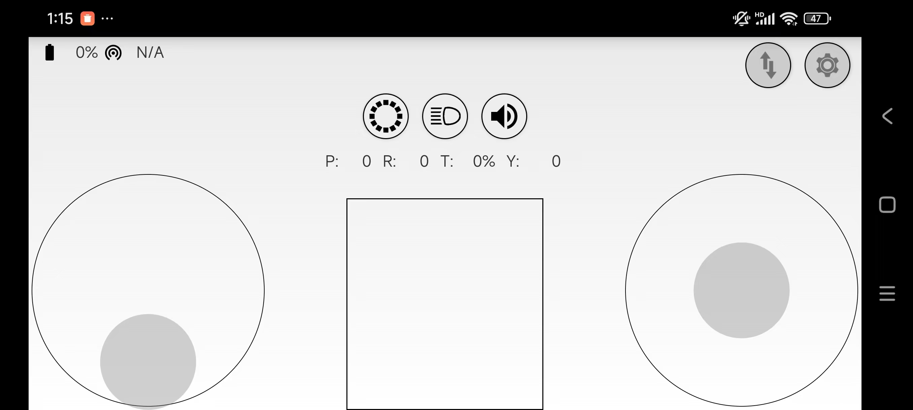
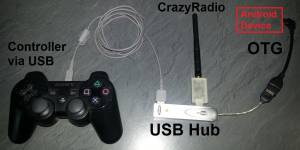

Crazyflie PC-cfclients/Android-App/iPhone-App
===============================================

Crazyflie PC 客户端支持刷写和控制 Crazyflie。它实现了用户界面和高级控制（例如游戏手柄处理）。与 Crazyflie 的通信以及控制 Crazflie 的 CRTP 协议的实现由cflib 项目负责。

Windows系统下安装
-----------------

参考：

   https://www.bitcraze.io/documentation/repository/crazyflie-clients-python/master/installation/install/

python安装
^^^^^^^^^^

从python官方网站下载：`python3.10.10 <https://www.python.org/downloads/release/python-31010/>`_。

您也可以从以下链接下载 python 程序 python-3.10.10-amd64.exe：

`下载 python 3.10.10 64位程序 <../../_static/tools/python-3.10.10-amd64.exe>`_

.. figure:: ../../_static/tools/python-3.10.10-amd64.png
   :align: center
   :alt: win-install

crazyflie client安装
^^^^^^^^^^^^^^^^^^^^

.. code-block:: bash

   python --version
   pip --version
   pip3 install --upgrade pip
   pip3 install cfclient
   python3 -m cfclient.gui

如果python3不支持，可以使用python

.. code-block:: bash

   python -m cfclient.gui

如果网速很差，可以更换镜像源

.. code-block:: bash

   pip config set global.index-url https://mirrors.aliyun.com/pypi/simple
   pip config set install.trusted-host mirrors.aliyun.com

如果您使用的是 Python 3.13，则需要安装Visual Studio。在安装过程中，您只需在 Visual Studio 安装程序中选择使用 C++ 的桌面开发工作负载。

https://visualstudio.microsoft.com/zh-hans/downloads/

Linux系统下安装
-----------------
参考：

   https://www.bitcraze.io/documentation/repository/crazyflie-clients-python/master/installation/install/#linux

Mac系统下安装
-----------------
参考：

   https://www.bitcraze.io/documentation/repository/crazyflie-clients-python/master/installation/install/#macos

Android系统下安装
-----------------

安装方法
^^^^^^^^^

第一，从bitcraze github官方网站下载：`crazyflie-android-client <https://github.com/bitcraze/crazyflie-android-client/releases>`_。

第二，您也可以从以下链接下载 crazyflie-android-client 的安装包：

`crazyflie-android-client-release_v0.7.4.apk <../../_static/tools/android/crazyflie-android-client-release_v0.7.4.apk>`_

`crazyflie-android-client-debug_20250517.apk 支持连接带地址的BLE名称 <../../_static/tools/android/crazyflie-android-client-debug_20250517.apk>`_

第三，也可以从Crazyflie Android 客户端应用程序可在 Google Play 商店下载：https://play.google.com/store/apps/details?id=se.bitcraze.crazyfliecontrol2

硬件要求
^^^^^^^^

- Crazyflie 1.0 或 Crazyflie 2.X
- Crazyradio 加密狗（Crazyflie 1.0 必需，crazyflie 2.X 可选）
- 带有 Micro USB 转 USB 的 USB On-the-Go (OTG) 线缆（又称 USB 主机线缆）
- Android 设备，Android 版本 4.0（API 级别 14）或更高
- 支持蓝牙 LE 和 Android 版本 4.4+ 的 Android 设备（通过蓝牙 LE 连接到 Crazyflie 2.X 时必需）
- 可选：PS3 控制器（或兼容）

Android手机连接Crazyradio控制
^^^^^^^^^^^^^^^^^^^^^^^^^^^^^

- 使用 USB OTG 电缆将 Crazyradio 加密狗连接到 Android 设备。
- 弹出窗口会询问您想要与 USB 设备一起使用哪个应用程序。
- 选择 Crazyflie 应用程序（“Crazyflie 客户端”）。
- 首次运行应用程序时，您可以扫描 [Crazyflie（必须启用）。（“首选项”按钮 ->“连接设置”->“无线电扫描”）
   - 或者您可以在首选项中手动设置频道和数据速率
- 设置好频道和数据速率后，即可连接。（连接按钮）
   - Crazyflie 和 Crazyradio 上的绿色 LED 应该快速闪烁。
- 使用屏幕上的控制来驾驶 Crazyflie
   - 警告：小心使用屏幕控制，它们比游戏手柄更难使用。

Android手机蓝牙连接Crazyflie 2.X
^^^^^^^^^^^^^^^^^^^^^^^^^^^^^^^^^
- 您的 Android 设备必须支持蓝牙 LE（低能耗）4.0 并运行 Android 4.4+（例如 Nexus 4、Nexus 5、三星 Galaxy S4）
- 确保您尚未通过手机的常规蓝牙设置将手机与 Crazyflie 2.0 配对，否则应用程序将无法正确连接（连接将显示成功，但控制将不起作用）
- 如果没有连接 Crazyradio USB 加密狗，将尝试通过蓝牙 LE 进行连接
   - 请注意：（旧版）Crazyflie 1.0 不支持蓝牙 LE，只有 Crazyflie 2.x 支持

连接外部控制器
^^^^^^^^^^^^^^^^
除了使用屏幕控制之外，您还可以连接外部控制器，例如 PS3 控制器（或兼容控制器）：

连接 PS3 控制器（通过 USB）
^^^^^^^^^^^^^^^^^^^^^^^^^^^^^^^^

除了 USB OTG 电缆外，您还需要：

- USB Y 型线缆
- USB 集线器
- PS3 控制器（或兼容的操纵杆/游戏手柄）

设置：

- 将 USB 主机 (OTG) 适配器连接到您的 Android 设备
- 将 USB Y 型电缆与 USB 主机适配器连接
- 将墙上插头与 Y 型电缆的（红色）电源插头连接起来（需要外部电源）
- 将 USB 集线器的上游端口与 Y 型电缆的插座连接
- 将 PS3 控制器和 crazyradio 插入 USB 集线器
- Crazyflie Android 客户端应该显示“使用外部 PS3 控制器”，并且 crazyradio 的 LED 灯应该亮一秒钟
- 按下“PS”按钮并移动模拟摇杆（屏幕上的俯仰/滚动/推力/偏航值应该会发生变化）

不使用 USB Y 型电缆的替代设置：

实测可用手机
^^^^^^^^^^^^^

- 红米Readmi Note 13

iPhone系统下安装
-----------------

在AppStore搜索crazyflie，可以看到绿色飞行器图标，Crazyflie iPhone 客户端仅支持具有蓝牙 LE 通信功能的 Crazyflie 2.X。它兼容 iPhone 4s+ 和 iOS 7.1+ 系统。

实测可用手机如下：

- iPhone 8 plus
- iPhone 12

在主屏幕上，点击“Connect”即可连接 Crazyflie 2.X。连接成功后，按钮将变为“Disconnect”，并且顶部进度条将充满。

.. figure:: ../../_static/tools/iPhone/1.png
   :align: center
   :alt: win-install

.. figure:: ../../_static/tools/iPhone/2.png
   :align: center
   :alt: win-install

要开始飞行，请将两个拇指放在屏幕两侧。会出现两个蓝色方块，它们代表两个触摸操纵杆。

.. figure:: ../../_static/tools/iPhone/3.png
   :align: center
   :alt: win-install