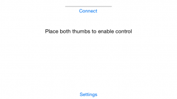

Crazyflie iPhone
=================

iPhone系统下安装
-----------------

在AppStore搜索crazyflie，可以看到绿色飞行器图标，Crazyflie iPhone 客户端仅支持具有蓝牙 LE 通信功能的 Crazyflie 2.X。它兼容 iPhone 4s+ 和 iOS 7.1+ 系统。

实测可用手机如下：

- iPhone 8 plus
- iPhone 12

在主屏幕上，点击“Connect”即可连接 Crazyflie 2.X。连接成功后，按钮将变为“Disconnect”，并且顶部进度条将充满。

要开始飞行，请将两个拇指放在屏幕两侧。会出现两个蓝色方块，它们代表两个触摸操纵杆。

.. figure:: ../../_static/tools/iPhone/3.png
   :align: center
   :alt: win-install