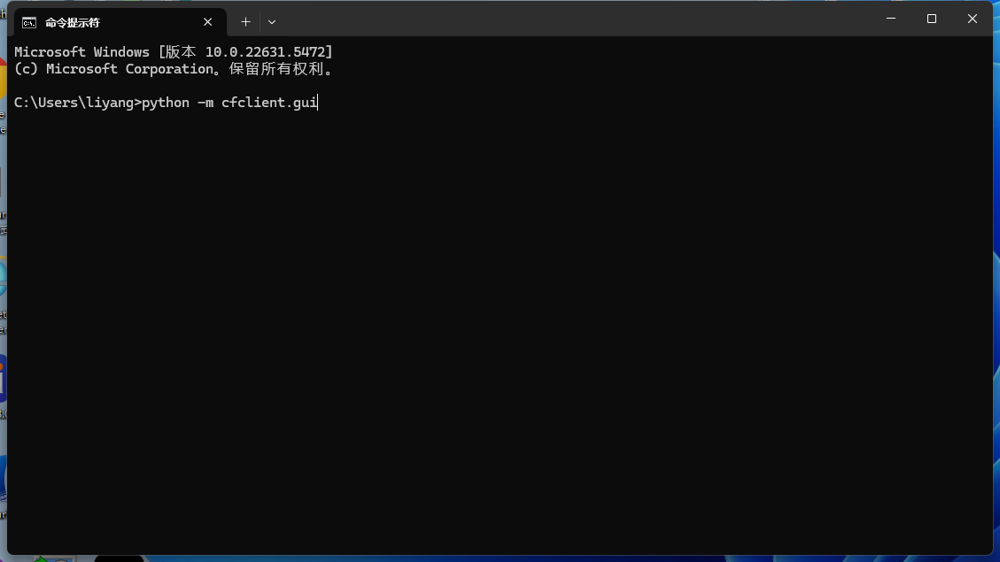
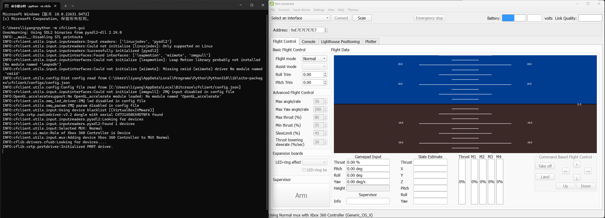

Crazyflie PC cfclients
=======================

Crazyflie PC 客户端支持刷写和控制 Crazyflie。它实现了用户界面和高级控制（例如游戏手柄处理）。与 Crazyflie 的通信以及控制 Crazflie 的 CRTP 协议的实现由cflib 项目负责。

Windows系统下安装
-----------------

参考：

   https://www.bitcraze.io/documentation/repository/crazyflie-clients-python/master/installation/install/

python安装
^^^^^^^^^^

从python官方网站下载：`python3.10.10 <https://www.python.org/downloads/release/python-31010/>`_。

您也可以从以下链接下载 python 程序 python-3.10.10-amd64.exe：

`下载 python 3.10.10 64位程序 <../../_static/tools/python-3.10.10-amd64.exe>`_

.. figure:: ../../_static/tools/python-3.10.10-amd64.png
   :align: center
   :alt: win-install

crazyflie client安装
^^^^^^^^^^^^^^^^^^^^

.. code-block:: bash

   python --version
   pip --version
   pip3 install --upgrade pip
   pip3 install cfclient
   python3 -m cfclient.gui

如果python3不支持，可以使用python

.. code-block:: bash

   python -m cfclient.gui

如果需要从旧版本更新到新版本

.. code-block:: bash

   pip install --upgrade cfclient

如果网速很差，可以更换镜像源

.. code-block:: bash

   pip config set global.index-url https://mirrors.aliyun.com/pypi/simple
   pip config set install.trusted-host mirrors.aliyun.com

如果您使用的是 Python 3.13，则需要安装Visual Studio。在安装过程中，您只需在 Visual Studio 安装程序中选择使用 C++ 的桌面开发工作负载。

https://visualstudio.microsoft.com/zh-hans/downloads/

Linux系统下安装
-----------------
参考：

   https://www.bitcraze.io/documentation/repository/crazyflie-clients-python/master/installation/install/#linux

Mac系统下安装
-----------------
参考：

   https://www.bitcraze.io/documentation/repository/crazyflie-clients-python/master/installation/install/#macos
