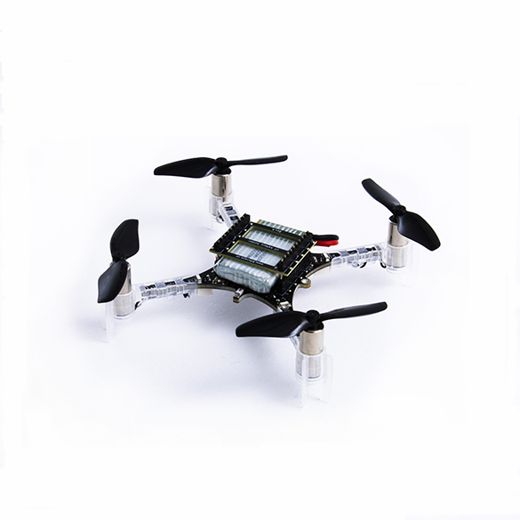

Crazyflie2.X
===================

Crazyflie2.X 是一款由 Bitcraze 公司开发的开源微型四轴飞行器，是一款灵活、开源的微型无人机，适合研究、教育和开发，凭借其丰富的扩展性和活跃的社区支持，成为开发者的理想选择。

详情可查阅 `Crazyflie 官网 <https://www.bitcraze.io/>`__。

1. 尺寸与重量
-------------

- **尺寸**：约 9 厘米宽
- **重量**：约 27 克

2. 硬件配置
---------------

- **处理器**：STM32F4 微控制器 和 nRF51822 蓝牙SOC
- **传感器**：加速度计、陀螺仪、磁力计、气压计等
- **通信**：支持蓝牙和 2.4GHz 无线通信

3. 软件开发
-----------

- **开源**：硬件和软件均开源，便于定制
- **编程**：支持 C 和 Python
- **扩展**：可通过扩展板增加 GPS、摄像头等功能

4. 应用领域
-----------

- **研究**：用于无人机算法和控制研究
- **教育**：适合教学和实验
- **开发**：开发者可快速实现原型设计

5. 社区支持
-----------

- **活跃社区**：提供丰富的资源和项目分享
- **文档**：详细的开发文档和教程

6. 价格
-----------

- **价格**：相对较低，适合个人和小团队

.. toctree::
   :maxdepth: 2
   :caption: 目录:
   
   组装测试 <1_crazyflie_assembly>
   