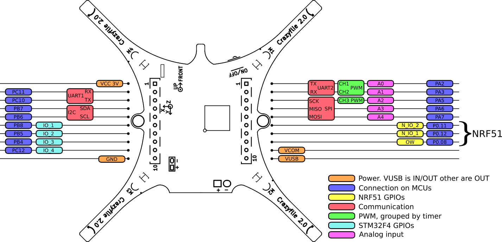

Crazyflie2.1 介绍
===================

.. contents:: 目录
    :depth: 3
    :local:
    
Crazyflie 2.1+ 是一个多功能的开源飞行开发平台，重量仅为 27 克，可握在手掌中。

Crazyflie 2.1+ 不仅飞行性能出色，还配备了低延迟/长距离无线电以及蓝牙 LE。这样，您可以选择下载我们的应用程序，并将您的移动设备用作控制器，或者与Crazyradio 2.0 结合使用或Crazyradio PA，使用您的计算机显示数据并使用游戏控制器进行操控。

Crazyflie 2.x 开发平台的 Crazyflie 2.1+ 版本配备了升级版电池和螺旋桨，飞行性能提升高达 15%。加上广泛的软件生态系统和甲板扩展，它非常适合教育、研究和群集。

我们将 Crazyflie 2.1+ 设计得尽可能灵活。对我们来说，这意味着添加尽可能多的功能并编写可修改的固件。除了 Crazyflie 2.1+ 附带的默认功能外，我们还添加了一个灵活的扩展接口，可以在 Crazyflie 2.1+ 的顶部和底部连接各种扩展板。通过此扩展接口，用户可以访问 UART、I2C 和 SPI 等总线以及 PWM、模拟输入/输出和 GPIO。

.. figure:: ../../../_static/images/crazyflie2-1-plus/CF21_plus_585px.jpg
   :align: center
   :alt: crazyflie-overview
   :figclass: align-center

详情可查阅 `Crazyflie 官网 <https://www.bitcraze.io/>`__。

更新
----
我们不断致力于固件、软件、文档以及使用系统的新颖、富有创意的方式。我们还设计了新的扩展板，以增加新功能和可能性并扩展 Crazyflie 生态系统。该平台支持通过无线电和蓝牙 LE 进行无线固件更新，因此当发布新固件时，更新变得轻而易举。

入门
----
转到crazyflie 2.x 入门教程来构建您的 crazyflie、更新其固件并与客户端一起飞行。此外，请查看我们的系统概述，以了解有关 Crazyflie 的定位系统生态系统、客户端以及 crazyflie 本身及其扩展卡的更多信息。

Crazyflie2.1 规格
--------------------

特征
^^^^^

- 耐用的设计
- 易于组装，无需焊接
- 支持自动检测的扩展卡
- 支持通过蓝牙 LE 从 iOS 和 Android 飞行，以及通过 Crazyradio、Crazyradio PA 或 Crazyradio 2.0 从 Windows/Mac OSX/Linux 飞行
- 使用 Crazyradio PA 测试了 1 公里以上的无线电范围视线 (LOS)

无线固件更新
^^^^^^^^^^^^^^^
- 通过标准 uUSB 进行板载充电
- 双 MCU 架构，具有专用无线电/电源管理 SoC，适用于高级应用
- 使用 Crazyradio 或 Crazyradio PA 和计算机时，除了可以充分利用扩展卡之外，还可以进行实时记录、绘图和变量设置

机械规格
^^^^^^^^^^
- 起飞重量：27g
- 尺寸（宽 x 高 x 深）：92 x 92 x 29mm（电机到电机，包括电机安装脚）

板载微控制器
^^^^^^^^^^^^^^^

- STM32F405 主应用 MCU（Cortex-M4、168MHz、192kb SRAM、1Mb flash）
- nRF51822 无线电和电源管理 MCU（Cortex-M0、32Mhz、16kb SRAM、128kb 闪存）
- 微型 USB 连接器
- 板载 LiPo 充电器具有 100mA、500mA 和 980mA 模式可供选择
- 全速USB设备接口
- 部分 USB OTG 功能（存在 USB OTG 但没有 5V 输出）
- 8KB 电可擦除只读存储器

IMU 规格
^^^^^^^^^^
- 3 轴加速度计/陀螺仪 (BMI088)
- 高精度压力传感器（BMP388）

飞行规格
^^^^^^^^^^
- 使用原装电池的飞行时间：7 分钟
- 原装电池充电时间：40 分钟
- 建议最大有效载荷重量：15 克

无线电规格
^^^^^^^^^^^^^^^
- 2.4GHz ISM 频段无线电
- 使用 20 dBm 无线电放大器增加范围，使用 Crazyradio PA 测试范围 > 1 km LOS（取决于环境）
- 提供低功耗蓝牙支持，适用于 iOS 和 Android 客户端
- 支持双天线，带有板载芯片天线和 U.FL 连接器

Crazyflie2.1 生态
--------------------
我们认为开发平台不应仅仅提供代码，因此我们的软件、固件和实用程序具有日志记录、实时参数设置和无线固件更新等功能。大多数子系统的完整开发环境都可在虚拟机中使用，因此您无需安装任何工具链即可开始开发。此外，虚拟机也同样适用于飞行。

完成一些修改后，只需通过无线电刷新新固件即可开始使用。对于那些对更高级开发感兴趣的人，有一个开发适配器套件，支持与 Crazyflie 2.1+ 上的两个 MCU 轻松建立 JTAG/SWD 连接。

开源
^^^^
Crazyflie 2.1+ 是一个开源项目，其源代码和硬件原理图均已记录并可供使用。由于我们所有的开发工具都是开源的（iOS 除外），因此我们能够以方便用户的方式重新分发它们。除了固件和软件项目外，还有许多以 Java、Ruby、C/C++、C# 和 Javascript 编写的社区支持 API。

更改代码
^^^^^^^^
无论您喜欢哪种语言，都有充足的机会来使用代码。我们的客户端 API 是用 Python 编写的，而 GitHub 上还有许多其他用 Ruby、C#、C/C++、JavaScript、Node.JS、Cylon.JS 或 Java 编写的客户端实现。或者，为什么不克隆我们的 iOS 存储库并进入一些 ObjectiveC/Swift。

如果您对嵌入式系统感兴趣，STM32F405 拥有强大的处理器能力，您可以用它来进行实验、改进和添加新功能。扩展板允许您进行实验、制作原型和设计自己的硬件。

扩展连接器规格
^^^^^^^^^^^^^^^^

扩展连接器用于连接具有附加功能的卡座。可以使用官方 Bitcraze 卡座，也可以使用我们的 KiCad 模板设计自定义卡座。

扩展连接器包括以下内容：

- VCC 3.0V (最大 100mA)
- GND
- VCOM 不受管制的 VBAT 或 VUSB，最大 1A)
- VUSB (用于输入和输出)
- I2C (400kHz)
- SPI
- 2 x UART
- 4 x GPIO/CS 用于 SPI
- 用于扩展识别的单线总线
- 2 x GPIO 连接到 nRF51

请注意以下事项：

- Crazyflie 2.1+ 是 3.0V 系统，这意味着高输出将为 3.0V，但仍与 3.3V 系统兼容。
- 除 PA5 和 NRF51 引脚外，所有 IO 引脚均可承受 5V
- NRF51 引脚可以与任何可用的 NRF51 外围设备复用。
- STM32F405RG引脚可以复用更多功能。

扩展连接器多路复用
^^^^^^^^^^^^^^^^^^^

资料下载
--------

- `数据手册 <../../../_static/products/crazyflie-2_1_plus/datasheet/crazyflie_2_1_plus-datasheet.pdf>`_

- `原理图 <../../../_static/products/crazyflie-2_1_plus/electronics/crazyflie_2.1_schematics_rev.b.pdf>`_

