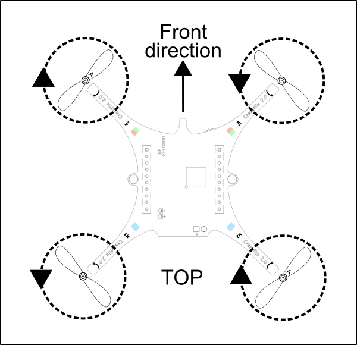

Crazyflie 2.X 组装
==================

.. contents:: 目录
    :depth: 2
    :local:
    
本教程将指导您完成 Crazyflie 2.X 的首次飞行，包括组装、软件设置和基础操作。

准备工作
-----------

在开始前，请确保您拥有以下物品：

- 1 x Crazyflie 2.0 或 2.1 控制板，所有组件已安装
- 5 x 顺时针螺旋桨 (CW propellers)
- 5 x 逆时针螺旋桨 (CCW propellers)
- 6 x 电机支架 (Motor mounts)
- 1 x 锂聚合物电池 (LiPo battery)
- 5 x 空心杯直流电机 (Coreless DC motors)
- 2 x 短扩展连接器引脚 (1×10, 2mm 间距, 8 或 9 mm 长)
- 2 x 长扩展连接器引脚 (1×10, 2mm 间距, 14 或 15 mm 长)
- 1 x 电池支架扩展板 (Battery holder expansion board)
- 1 x USB 数据线 (仅随 Crazyflie 2.1 提供)

.. note:: 
   推荐使用官方 `Crazyflie 套件 <https://store.bitcraze.io/>`_ 以确保兼容性。

测试
-----------

Crazyflie在生产过程中经过了广泛的测试，但为了确保在运输/存储过程中没有发生任何问题，您应该在开始组装之前运行测试。使用USB电源（可以是电脑或充电器）为Crazyflie供电，并检查以下测试的结果。请注意，在测试过程中保持Crazyflie稳定并远离强磁场源非常重要。

自我测试
--------
在开始组装任何东西之前，请将 Crazyflie 连接到 uUSB 电源，进行通电自检。LED M1 和 M4 将指示测试结果。如果 M4 LED 快速闪烁绿色五次，则表示测试通过。

.. raw:: html

   

      <video width="100%" height="auto" controls autoplay muted loop>
         <source src="../../../_static/videos/self_test_pass.mp4" type="video/mp4">
         Your browser does not support the video tag.
      </video>
   

自检失败
--------

如果自检失败，M1 LED 将快速闪烁红色 5 次，然后暂停并再次闪烁。请访问我们的支持讨论以获取帮助。

.. raw:: html

   

      <video width="100%" height="auto" controls autoplay muted loop>
         <source src="../../../_static/videos/self_test_fails.mp4" type="video/mp4">
         Your browser does not support the video tag.
      </video>
   

组装
--------

组装 Crazyflie 大概需要不到 10 分钟的时间，但也有一些小问题。因此，请务必遵循以下说明！

扭线
^^^^^

首先将四台电机的电线扭在一起。这样可以减少电子噪音，使电线更好地安装在电机安装“挂钩”上。

.. raw:: html

   

      <video width="100%" height="auto" controls autoplay muted loop>
         <source src="../../../_static/videos/twisting_the_wires.mp4" type="video/mp4">
         Your browser does not support the video tag.
      </video>
   

安装电机
^^^^^^^^

将四个电机推入电机支架。您需要用一些力才能插入它们。如果像视频中那样很难做到，请尝试将电机罐朝向桌子边缘并按下支架，但插入时不要按压电机轴，因为这可能会损坏电机。应将电机一直插入支架直至停止。

.. raw:: html

   

      <video width="100%" height="auto" controls autoplay muted loop>
         <source src="../../../_static/videos/mount_the_motors.mp4" type="video/mp4">
         Your browser does not support the video tag.
      </video>
   

连接绞线
^^^^^^^^
将绞合线连接到电机支架下方的两个小“钩子”上。

.. raw:: html

   

      <video width="100%" height="auto" controls autoplay muted loop>
         <source src="../../../_static/videos/attach_the_twisted wire.mp4" type="video/mp4">
         Your browser does not support the video tag.
      </video>
   

插入电机
^^^^^^^^
将电机支架插入 Crazyflie 机翼上。它们是压配合的，可能需要一点力。确保它们一直到停止。将哪个电机放在哪里并不重要。插入后，将电机连接器连接到 Crazyflie。

.. raw:: html

   

      <video width="100%" height="auto" controls autoplay muted loop>
         <source src="../../../_static/videos/insert_the_motor.mp4" type="video/mp4">
         Your browser does not support the video tag.
      </video>
   

安装螺旋桨
^^^^^^^^^^^^

现在是时候安装螺旋桨了。

注意：螺旋桨有两种，顺时针 (CW) 和逆时针 (CCW) 螺旋桨，每种螺旋桨在盒子里都有自己的包装袋。注意尖端的形状，尖角位于旋转方向的背面。CW 螺旋桨通常也标有“A”、“A1”或“A2”，而 CCW 螺旋桨标有“B”、“B1”或“B2”（数字无关紧要）。对于 Crazyflie 2.1+，螺旋桨看起来会有点不同，CW 螺旋桨标记为“47-17R”，而 CCW 标记为“47-17”。

还要确保正确的一面朝上，顶面应该是凸的。

这里我们安装 Crazyflie 2.1（不是 2.1+ 版本）的 CW 螺旋桨。

.. raw:: html

   

      <video width="100%" height="auto" controls autoplay muted loop>
         <source src="../../../_static/videos/attach_the_propellers.mp4" type="video/mp4">
         Your browser does not support the video tag.
      </video>
   

这是 CW 和 CCW 螺旋桨安装位置的详细视图。

安装橡胶垫
^^^^^^^^^^^
橡胶垫应安装在 Crazyflie 的扩展接头之间。这将产生摩擦力，防止电池滑出，同时保护电子设备。

.. raw:: html

   

      <video width="100%" height="auto" controls autoplay muted loop>
         <source src="../../../_static/videos/attach_the_rubber_pad.mp4" type="video/mp4">
         Your browser does not support the video tag.
      </video>
   

   

安装插针
^^^^^^^^

盒子里有两种类型的接头，长接头和短接头。找到两个短接头并将其插入扩展连接器中。

.. raw:: html

   

      <video width="100%" height="auto" controls autoplay muted loop>
         <source src="../../../_static/videos/attach_headers.mp4" type="video/mp4">
         Your browser does not support the video tag.
      </video>
   

   

安装电池
^^^^^^^^

将电池放在插入扩展连接器的接头之间，然后将电池支架板插入接头上。插入时注意针脚可能有点锋利。摩擦力应该可以将电池固定到位，因此请将其拧紧直至固定到位。

现在连接电池，组装就完成了。电池线最好弯曲并放置在 PCB 下方，以免妨碍。

.. raw:: html

   

      <video width="100%" height="auto" controls autoplay muted loop>
         <source src="../../../_static/videos/attach_the_battery.mp4" type="video/mp4">
         Your browser does not support the video tag.
      </video>
   

开机！
^^^^^^^^
组装完成，现在该通电了！请注意，电源按钮是按钮，而不是滑动按钮。在通电自检期间，所有螺旋桨将按顺序旋转。确保它们全部旋转，如果没有旋转，则检查电机连接。

.. raw:: html

   

      <video width="100%" height="auto" controls autoplay muted loop>
         <source src="../../../_static/videos/power_on.mp4" type="video/mp4">
         Your browser does not support the video tag.
      </video>
   
