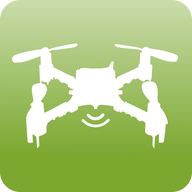
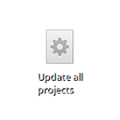
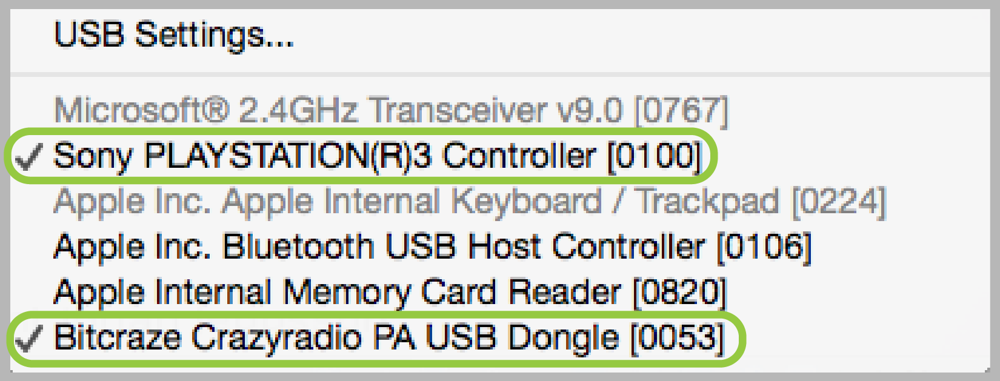
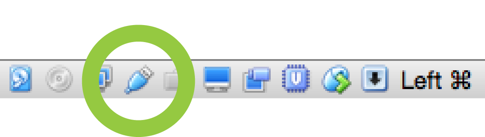
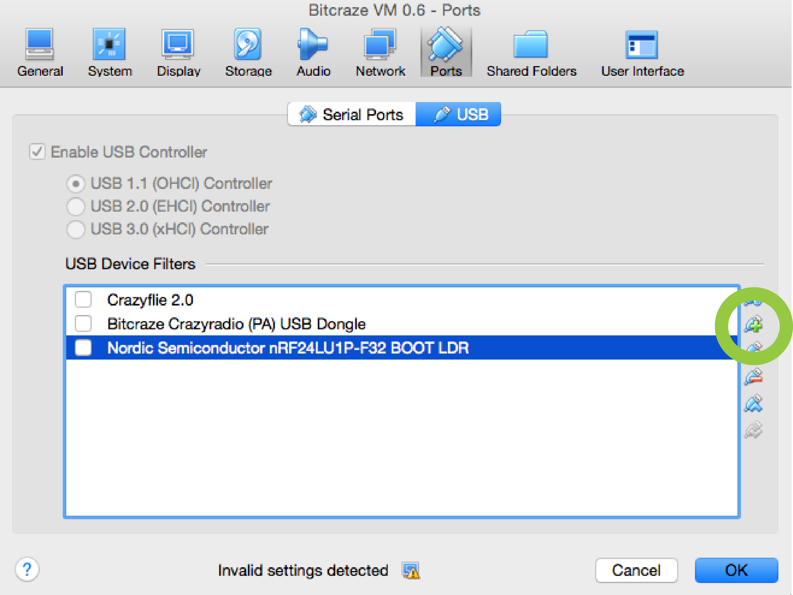
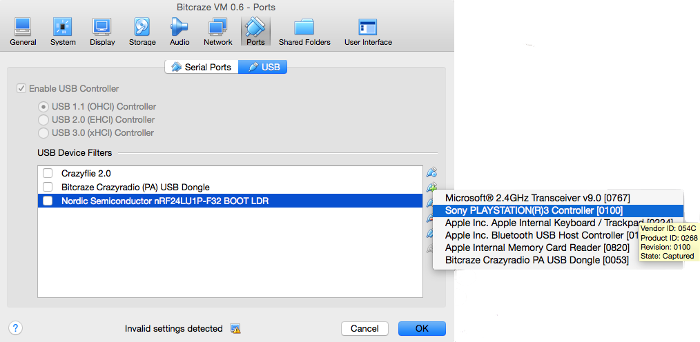
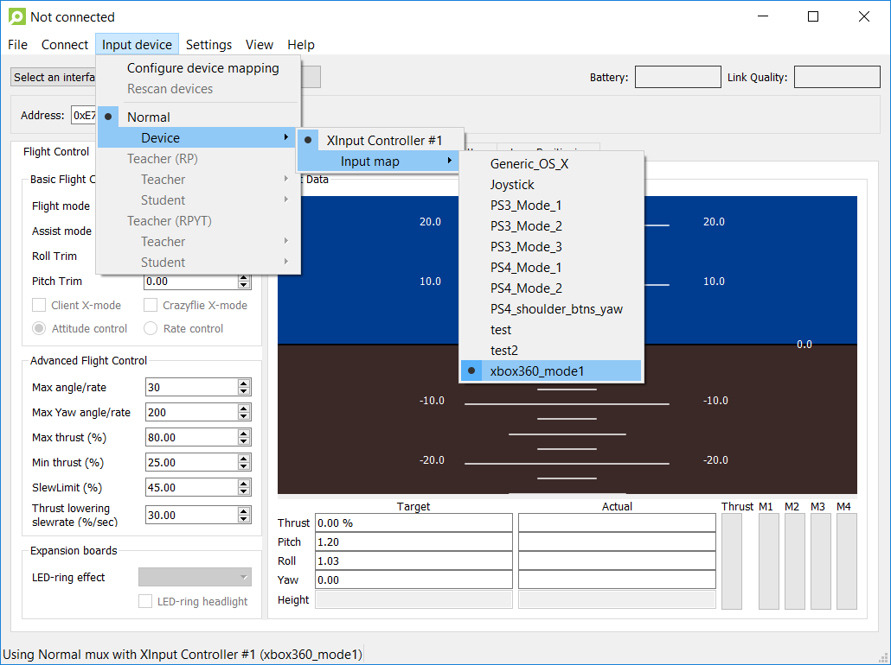
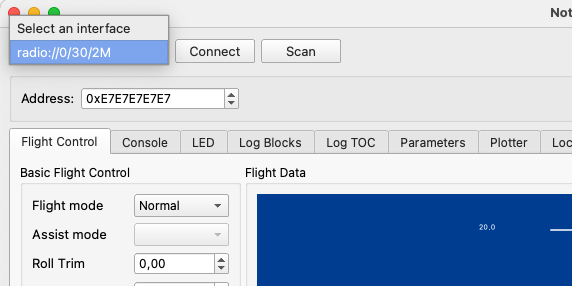
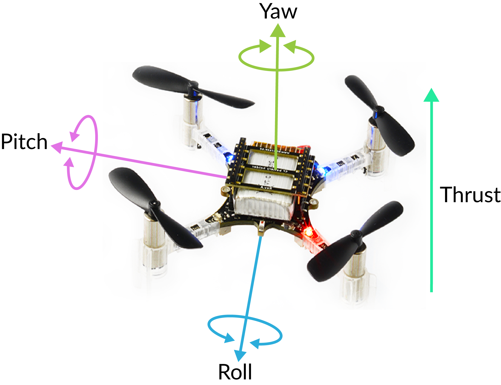

Crazyflie 2.X 入门指南
========================

.. contents:: 目录
    :depth: 2
    :local:

了解你的 Crazyflie
-------------------
首先，让我们看看什么是前部和后部，这在飞行时以及安装扩展板时都很重要。小“凸起”（天线）在前面，蓝色 LED 在后面。

启动顺序
~~~~~~~~~~~

当 Crazyflie 通电时，它将自动执行一系列简短的事件以准备飞行。

- 运行自检- Crazyflie 检查硬件是否正常
- 校准传感器- Crazyflie 读取其传感器以获取基本值。必须绝对静止才能执行此操作，因此最好将其放在水平面上一秒钟。
- 准备飞行！

LED灯定义
~~~~~~~~~~~
您还需要了解 LED 的含义。

- 打开电源后一切正常：蓝色 LED（2 和 3）完全亮起，右前 LED（1）每秒闪烁两次红色（参见上面打开电源！部分中的视频）。
- 通电后一切正常，但传感器尚未校准：蓝色 LED（2 和 3）完全亮起，右前 LED（1）以 2 秒为间隔闪烁红色。将 Crazyflie 放在水平表面上并保持绝对静止以进行校准。
- 收音机已连接：左前 LED（4）呈红色和/或绿色闪烁。
- 电池电量低：右前 LED (1) 完全亮起红色。是时候降落并给电池充电了。
- 充电中：后左蓝色 LED （3）闪烁，后右蓝色 LED （2）亮起。
- 引导加载程序模式：背面的蓝色 LED（2 和 3）大约每秒闪烁一次。
- 自检失败：右前 LED（1）反复闪烁五次红色短脉冲，每组之间有较长的暂停。

控制 Crazyflie
-------------------

您可以通过移动设备或计算机驾驶 Crazyflie。

手机控制
~~~~~~~~~~~

使用移动设备是飞行最快的方式，但可能需要更多的驾驶技能。

安装应用程序并连接到 Crazyflie 非常简单。您只需要一台支持低功耗蓝牙 (BLE) 的 Android 或 iOS 设备。

安装应用程序
^^^^^^^^^^^^^

Crazyflie 客户端适用于 Android 和 iOS。

- Android，来自 Google Play  https://play.google.com/store/apps/details?id=se.bitcraze.crazyfliecontrol2

- iPhone，来自 Apple iTunes https://itunes.apple.com/us/app/crazyflie-2.0/id946151480?mt=8

连接到 Crazyflie
^^^^^^^^^^^^^^^^

启动应用程序并单击连接按钮。Android 和 iOS 应用程序中的按钮外观不同，您可以在下面看到它们。

注意：如果您使用的是 Android，并且您的 Crazyflie 行为异常（例如从空中掉落或反应缓慢），请打开“蓝牙延迟解决方法”设置。

电脑控制
~~~~~~~~~~~

使用您的计算机需要Crazyradio 2.0 或 Crazyradio PA 和游戏手柄，但可以为您提供更多选项和更好的控制。

当使用计算机驾驶 Crazyflie 时，您还需要一个标准游戏手柄（更多信息）用于操控，以及一个Crazyradio 2.0 或 Crazyradio PA 进行通讯。

有几种运行 PC 客户端的方法

Windows安装
^^^^^^^^^^^^^^^^

目前在计算机上安装和运行客户端的支持方式是使用 python 包管理器pip安装 Crazyflie 客户端。

您可以按照客户端安装说明页面上的先决条件和说明来安装最新版本 。

设置客户端后，插入Crazyradio 2.0 或将 Crazyradio PA 和游戏手柄插入 USB 端口并启动客户端。继续阅读有关如何配置客户端的信息

虚拟机安装
^^^^^^^^^^
我们已设置虚拟机 (VM)，旨在帮助您开始飞行和开发。VM 包含满足您需求的基本软件，所有软件均已预安装，以简化设置过程。

在虚拟机上运行可实现跨各种操作系统的兼容性。但请注意，虚拟机可能未定期维护，因此可能会出现一些问题。

注意：由于 VM 是 Linux 的 AMD64 安装，因此它无法在 Apple Silicon Mac（M1/2/… 处理器）上运行。在 Apple Silicon Mac 上，您需要本地安装这些工具。

在虚拟机上安装
++++++++++++++

为了帮助您尽快起飞，虚拟机（VM）已安装飞行和开发所需的所有软件。

设置虚拟机
##########

查看bitcraze-VM 存储库的自述文件，了解安装和设置说明和提示。https://github.com/bitcraze/bitcraze-vm

更新源代码
##########

在虚拟机中双击桌面上的“更新所有项目”图标。这将从 GitHub 下载所有项目的最新源代码。

安装硬件
########
- 插入Crazyradio 2.0 或 USB 端口中的 Crazyradio PA。
- 将游戏控制器插入 USB 端口。

在虚拟机上配置 USB
##################

Windows 安装

- 安装Crazyradio Windows USB 驱动程序。
- 在右下角单击 USB 图标并选择“Bitcraze Crazyradio PA USB 加密狗”。

- 现在在同一个列表中选择您的游戏控制器。

Linux 安装
- 在右下角单击 USB 图标并选择“Bitcraze Crazyradio PA USB 加密狗”。

- 现在在同一个列表中选择您的游戏控制器。

MacOS 安装

- 单击右下角的 USB 图标，然后单击“USB 设置”。

- 单击 USB 过滤器“+”图标。

- 从列表中选择您的游戏控制器。单击“确定”。

- 现在再次单击 USB 图标并选择“Bitcraze Crazyradio PA USB 加密狗”。

- 现在在同一个列表中选择您的游戏控制器。

启动 Crazyflie 客户端
---------------------

双击虚拟机桌面上的“Crazyflie 客户端”图标

继续阅读有关配置客户端 https://www.bitcraze.io/documentation/tutorials/getting-started-with-crazyflie-2-x/#config-client

配置客户端
~~~~~~~~~~

在客户端中，打开输入设备设置。检查是否选择了正确的设备映射，否则请选择您的设备类型。

有关输入设备的更多详细信息，请参阅客户端用户指南。https://www.bitcraze.io/documentation/repository/crazyflie-clients-python/master/userguides/inputdevices/

在 Crazyflie 中更新固件
~~~~~~~~~~~~~~~~~~~~~~~

- 在 Crazyflie 客户端中选择正确的地址。默认值为 0xE7E7E7E7E7。要确定或更改Crazyflie 的地址，您可以按照无线电地址配置指南进行操作。
- 然后点击左上角的扫描按钮。Crazyflie 的无线电设置显示在下拉列表中。
- 从下拉列表中选择您的 Crazyflie。

- 单击“连接”按钮。

现在您已将 Crazyflie 连接到客户端，遥测数据会从直升机持续发送到客户端。当您移动 Crazyflie 时，您将看到实时更新的飞行数据，以及电池状态和链接质量。

起飞
----

现在是飞行的时候了，但首先你需要了解一些基本知识。

方向
~~~~

首先，当直升机指向远离您时，飞行会容易得多。蓝色 LED 位于背面，因此在开始飞行时请让它们指向您的方向。

操纵四轴飞行器
~~~~~~~~~~~~~~~~

飞行四轴飞行器时，主要有四个控制维度：滚转、俯仰、偏航和推力。

- 滚动 -是围绕四轴飞行器从后向前穿过的水平轴的旋转。这实际上是滚动 Crazyflie 并使其向左或向右移动。
- 俯仰 -是围绕四轴飞行器从左到右的水平轴的旋转。这会使 Crazyflie 倾斜并使其向前或向后移动。
- 偏航 -绕垂直轴旋转。这会使四轴飞行器向左或向右旋转。偏航用于通过将 Crazyflie 的前部指向不同方向来改变飞行方向。
- 推力——调整 Crazyflie 的高度。

移动应用程序/游戏控制器
~~~~~~~~~~~~~~~~~~~~~~~~

游戏手柄或移动应用程序上的控件具有以下映射：

.. figure:: ../../../_static/images/getting-started/controller.PNG
   :align: center
   :alt: crazyflie-overview
   :figclass: align-center

正常起飞
~~~~~~~~~

在不触碰任何其他控件的情况下进行推力时，它看起来可能是这样的。如果不进行补偿，Crazyflie 通常会向某个方向漂移，这是完全正常的。

.. raw:: html

   

      <video width="100%" height="auto" controls autoplay muted loop>
         <source src="../../../_static/videos/normal_flight.mp4" type="video/mp4">
         Your browser does not support the video tag.
      </video>
   

地面效应
~~~~~~~~~

当直升机靠近地面飞行时（离地面不到几分米），它会受到所谓的地面效应的影响。感觉就像空气很滑，就像在冰上滑行一样。为了避免这种情况，特别是在学习飞行时，起飞时要使用很大的推力，然后慢慢平飞。

如果 Crazyflie 不平衡
~~~~~~~~~~~~~~~~~~~~~~~~~~~

如果您的 Crazyflie 在起飞时漂移严重，您应该检查一些事项。

- 确保电池位于中央。如果电池向两侧滑落过多，Crazyflie 可能很难进行补偿。
- 检查螺旋桨是否能自由旋转。轻轻吹一下，确认它们能转动。常见的问题是头发卡在螺旋桨和发动机之间。如果是这个问题，只需将螺旋桨从发动机上拔下，去除头发，然后重新安装螺旋桨即可。
- 检查螺旋桨是否平衡，平衡螺旋桨

电池充电
~~~~~~~~~~~~~~~~

要为 Crazyflie 的电池充电，只需插入微型 USB 线即可。确保 Crazyflie 已打开电源。电池充电时，后侧蓝色 LED 将闪烁。当 LED 完全亮起时，表示电池已充满电。

