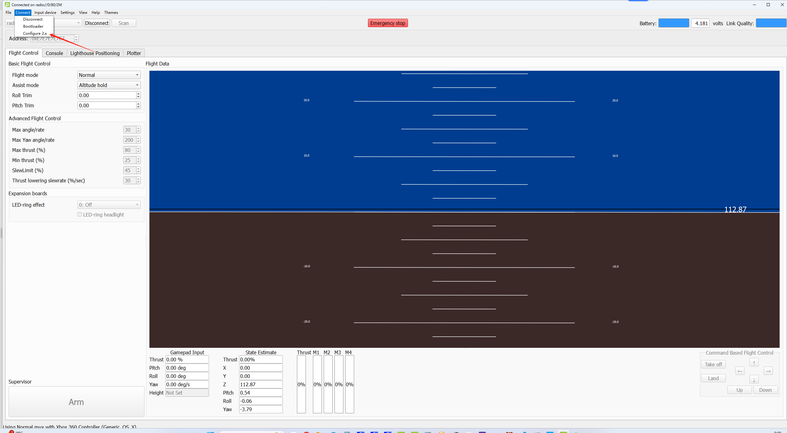

Crazyflie 2.X 配置地址
========================

.. contents:: 目录
    :depth: 2
    :local:

飞行器地址修改 --- Crazyradio PA/2.0
------------------------------------------------
 
从默认的 0xE7E7E7E7 修改成 0xE7E7E701 

(1) 用默认地址0xE7E7E7E7连接飞行器

(2) Configure 2.X

(3) 修改地址

(4) 用新地址0xE7E7E701连接飞行器

(5) 修改过地址的飞行器务必在外部做好标记，未来需要再修改回来

飞行器地址修改 --- MicroUSB
------------------------------------------------
 
从默认的 0xE7E7E7E7 修改成 0xE7E7E701 

(1) Crazyflie2.1插入MicroUSB接口到电脑端

.. figure:: ../../../_static/videos/swarm/cfclient_config_address/A.jpg
   :align: center
   :figclass: align-center

从设备管理器看，可能没有识别到驱动

.. figure:: ../../../_static/videos/swarm/cfclient_config_address/B.png
   :align: center
   :figclass: align-center

(2) 安装驱动程序

首先，从其官方网站下载 Zadig：`Zadig <http://zadig.akeo.ie/>`_。

您也可以从以下链接下载 Zadig 驱动程序 zadig-2.9.rar：

`下载 Zadig 驱动程序 <../../../_static/driver/zadig-2.9.rar>`_

启动 Zadig，您应该在列表中看到您的设备。选择设备，选择 libusb，然后点击“安装”按钮。

.. figure:: ../../../_static/videos/swarm/cfclient_config_address/C.png
   :align: center
   :figclass: align-center

安装过程应该会运行并成功完成。安装通常很快，但也可能需要一些时间,安装成功之后点击Scan可以看到：

   usb:://0

.. figure:: ../../../_static/videos/swarm/cfclient_config_address/D.png
   :align: center
   :figclass: align-center

(3) 点击 Connect -> Configure 2.X

.. figure:: ../../../_static/videos/swarm/cfclient_config_address/E.jpg
   :align: center
   :figclass: align-center

(4) 修改地址

(5) 修改过地址的飞行器务必在外部做好标记，未来需要再修改回来

飞行器信道修改
----------------

如果经常出现丢包问题，可以尝试切换信道，范围是[0~125]

