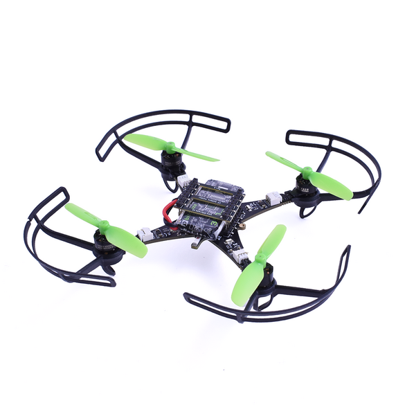

Crazyflie bolt 1.1 介绍
=======================

.. contents:: 目录
    :depth: 2
    :local:
    
Crazyflie 2.1 Brushless 是一款多功能开源飞行开发平台，重量仅为 32 克，可握在手掌中。

Crazyflie 2.1 Brushless 不仅飞行性能出色，还配备了低延迟/长距离无线电以及蓝牙 LE。这样您就可以将计算机与Crazyradio 2.0 结合使用或Crazyradio PA，使用游戏手柄飞行或编写脚本自主飞行。

成功的 Crazyflie 开发平台的最新版本改进了飞行性能、耐用性和无线电。加上广泛的软件生态系统和甲板扩展，它非常适合教育、研究和群集。

详情可查阅 `Crazyflie 官网 <https://www.bitcraze.io/>`__。

特征
-----

- 与 Crazyflie 2.X 生态系统完全兼容（LED 环除外）
- 多位置技术支持
- 易于组装，无需焊接
- 支持自动检测的扩展卡
- 无线固件更新
- 通过标准 uUSB 或接触垫进行板载充电
- 具有广泛库支持的开源软件
- Swarm 和 ROS 支持
- 具有点对点功能的低延迟无线电。
- 低噪音飞行

机械规格
--------
- 带腿起飞重量：34g
- 带防护装置的起飞重量：37g
- 机座尺寸：100mm（电机中心到电机中心对角线）

板载微控制器
------------

- STM32F405 主应用 MCU（Cortex-M4、168MHz、192kb SRAM、1Mb flash）
- nRF51822 无线电和电源管理 MCU（Cortex-M0、32Mhz、16kb SRAM、128kb 闪存）
- 微型 USB 连接器
- 板载 LiPo 充电器具有 100mA、500mA 和 980mA 模式可供选择
- 全速USB设备接口
- 部分 USB OTG 功能（存在 USB OTG 但没有 5V 输出）
- 8KB 电可擦除只读存储器

IMU 规格
--------

- 3 轴加速度计/陀螺仪 (BMI088)
- 高精度压力传感器（BMP388）

飞行规格
---------

- 4 个 08028-10000KV 高品质电机，每个电机可产生高达 30 克的推力
- 4 个集成 1 节 5A ESC，运行 BLHeli_S/Bluejay
- 定制设计和优化的 55 毫米螺旋桨，螺距为 35 毫米
- 使用原装电池的飞行时间：10 分钟
- 原装电池充电时间：60 分钟
- 建议最大有效载荷重量：40 克

无线电规格
----------
- 2.4GHz ISM 频段无线电
- 使用 20 dBm 无线电放大器增加范围，使用 Crazyradio PA 测试范围 > 1 km LOS（取决于环境）
- 低功耗蓝牙支持
- 支持双天线，带有板载芯片天线和 U.FL 连接器

资料下载
--------

- `数据手册 <../../../_static/products/crazyflie-2_1_brushless/datasheet/crazyflie_2_1_brushless-datasheet.pdf>`_

- `原理图 <../../../_static/products/crazyflie-2_1_brushless/electronics/cf2.1_bl_schematics_Rev.G.pdf>`_

使用手册
----------------

.. toctree::
   :maxdepth: 2
   :caption: Crazyflie User Manual

   1_crazyflie2.1_brushless_assembly
   2_crazyflie2.1_brushless_getting_started
