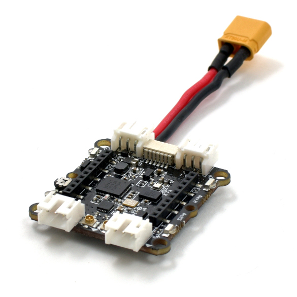

Crazyflie bolt 1.1 介绍
=======================

.. contents:: 目录
    :depth: 2
    :local:
    
Crazyflie Bolt 1.1 是一款兼容 Crazyflie 2.x 的无刷飞行控制器。它旨在具有 Crazyflie 2.1 的优势，但体积略大一些。Crazyflie Bolt 1.1 运行与 Crazyflie 2.1 相同的固件基础，并包含相同的 IMU。因此，您可以先使用小得多的 Crazyflie 2.1 开始开发，然后随着应用程序的增长而扩展。

与 Crazyflie Bolt 的区别

- 电机信号输出 M4 已从 PB9 移至 PB10，以便能够支持 DSHOT 协议。
- 为了减轻重量，PCB 厚度从 1.6 毫米减小到 1 毫米。
- 修订版更新至 Rev.H

详情可查阅 `Crazyflie 官网 <https://www.bitcraze.io/>`__。

特征
-----

- 耐用的设计
- 易于组装，无需焊接
- 支持自动检测的扩展卡
- 支持通过蓝牙 LE 从 iOS 和 Android 飞行，以及通过 Crazyradio、Crazyradio PA 或 Crazyradio 2.0 从 Windows/Mac OSX/Linux 飞行
- 使用 Crazyradio PA 测试了 1 公里以上的无线电范围视线 (LOS)
- 无线固件更新
- 通过标准 microUSB 进行板载充电
- 双 MCU 架构，具有专用无线电/电源管理 SoC，适用于高级应用
- 使用 Crazyradio 或 Crazyradio PA 和计算机时，除了可以充分利用扩展卡之外，还可以进行实时记录、绘图和变量设置

机械规格
--------
- 起飞重量：27g
- 尺寸（宽 x 高 x 深）：92 x 92 x 29mm（电机到电机，包括电机安装脚）

板载微控制器
------------

- STM32F405 主应用 MCU（Cortex-M4、168MHz、192kb SRAM、1Mb flash）
- nRF51822 无线电和电源管理 MCU（Cortex-M0、32Mhz、16kb SRAM、128kb 闪存）
- 微型 USB 连接器
- 板载 LiPo 充电器具有 100mA、500mA 和 980mA 模式可供选择
- 全速USB设备接口
- 部分 USB OTG 功能（存在 USB OTG 但没有 5V 输出）
- 8KB 电可擦除只读存储器

IMU 规格
--------

- 3 轴加速度计/陀螺仪 (BMI088)
- 高精度压力传感器（BMP388）

飞行规格
--------

- 使用原装电池的飞行时间：7 分钟
- 原装电池充电时间：40 分钟
- 建议最大有效载荷重量：15 克

无线电规格
----------
- 2.4GHz ISM 频段无线电
- 使用 20 dBm 无线电放大器增加范围，使用 Crazyradio PA 测试范围 > 1 km 可视距离（取决于环境）
- 提供低功耗蓝牙支持，适用于 iOS 和 Android 客户端
- 支持双天线，带有板载芯片天线和 U.FL 连接器

资料下载
--------

- `数据手册 <../../../_static/products/crazyflie-bolt-1_1/datasheet/crazyflie_bolt_1_1-datasheet.pdf>`_

- `原理图 <../../../_static/products/crazyflie-bolt-1_1/electronics/crazyflie_bolt_1_1_revh.pdf>`_

使用手册
----------------

.. toctree::
   :maxdepth: 6
   :caption: Crazyflie User Manual

   1_crazyflie_bolt_1.1_assembly
   2_crazyflie_bolt_1.1_getting_started
   3_crazyflie_bolt_1.1_QAV250
   4_crazyflie_bolt_1.1_F330
   5_crazyflie_bolt_1.1_F450
