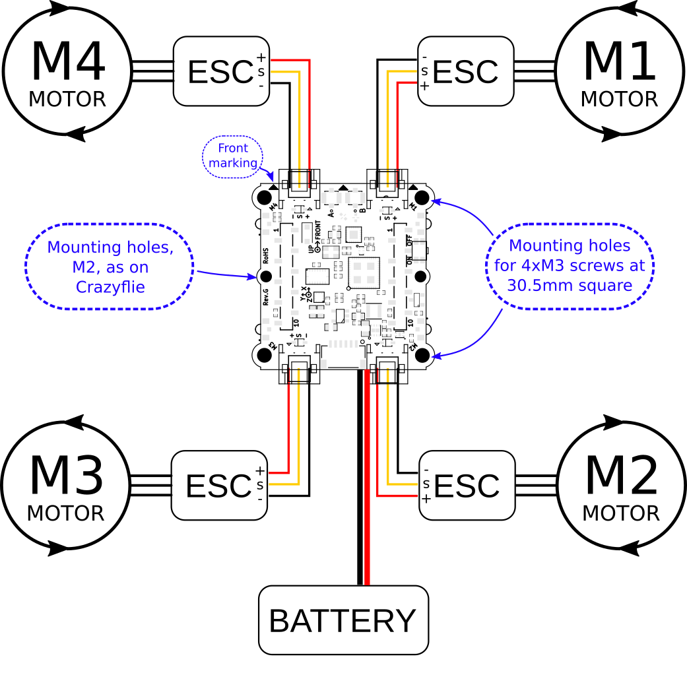
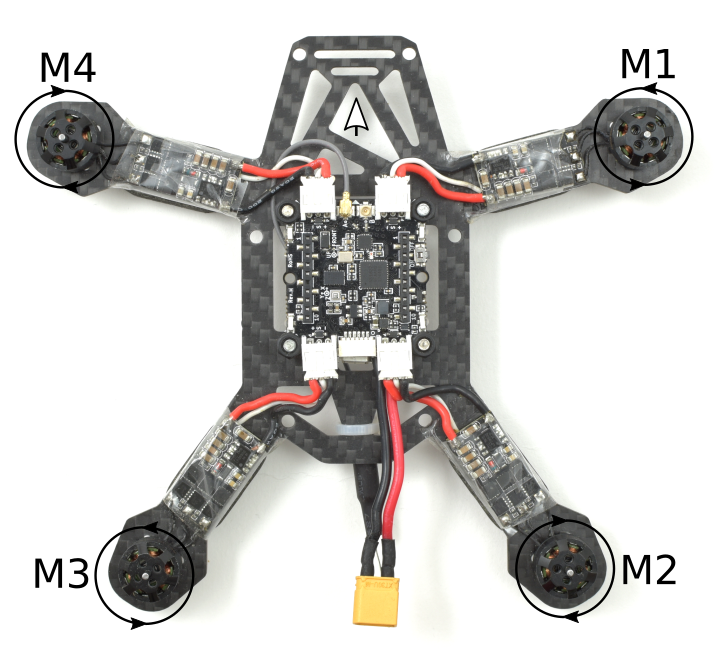

Crazyflie bolt 1.1 组装
==========================

.. contents:: 目录
    :depth: 2
    :local:
    
连接图
------

下面是电机的连接图：

- 为了不超过 8A / ESC 连接器输出，应选择电池电压、电机和螺旋桨，以免发生这种情况。ESC 的额定值可以更高，因为它不会明显影响电流消耗，只会影响效率。
- 最好选择一个框架，以便可以连接甲板。很难让 flow v2 甲板和灯塔甲板同时工作，因为电池需要放在某处，通常是在 Bolt 1.1 控制板的中央、上方或下方。
- 4 合 1 ESC 非常方便，但对于 Bolt 1.1 来说，最好使用安装在臂上的 4 个独立 ESC，因为这样可以释放甲板空间。
- 如果需要高于 8A 的电流，只需将信号线从 ESC 连接器连接到 ESC。最好仍通过电池连接器为 Bolt 1.1 控制板供电，以便可以监控电池电压。

示例连接
下面是示例设置的图片：

力量
------
Bolt 1.1 包含一个配电板 (PDB)，但它有点限制。电流必须通过 MOSFET 才能将其关闭，还要通过 ESC 连接器。我们已经测试过在链条中运行 8A 电流，没有任何限制加热，但这是我们建议的极限。如果需要额外的电流，可以通过将 ESC 直接焊接到连接器焊盘来绕过连接器。MOSFET 仍然存在，但应该可以稍微增加。对于更高的电流，应使用外部 PDB。保持电流较低但功率增加的其他技巧是在更高的电压（3S 或 4S）下运行并使用低 KV 电机。

配置
----

Crazyflie 固件将自动检测其是否在 Bolt 1.1 上运行并激活正确的模块。但是，一些配置仍需在编译时完成，并且使其在运行时可配置的工作目前正在进行中。

抢先体验说明（2021 年）
---------------------

- 可能需要不同的 PID 调节参数才能使其飞得更好。目前这必须是硬编码的。稍后这将保存在 EEPROM 或 1-wire 内存中。
- 可以读取外部电池电压/电流，但背后没有逻辑，因此不会耗尽电池。
- ESC PWM 输出默认设置为 400Hz。使用可以处理此问题的 ESC 或使用新值进行编译。还可以启用 OneShot125 输出。
- 在远距离飞行之前进行射程测试是明智的。
- 请注意，这是实验性软件。无需任何道具即可运行所有测试！