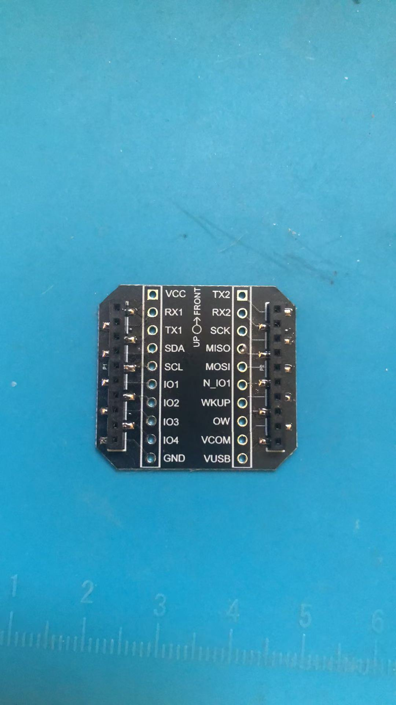

appMain调用打印位置数据
============================

.. contents:: 目录
    :depth: 6
    :local:
    
用户使用过程中，用户如何添加自己的代码，另外常用的问题是如何在飞行器上直接打印位置数据，针对这两个需求，这里合并到一起完成：

(1) 用户可以使用appMain，实现自己的代码逻辑，系统开启appMain调用;
(2) 开启连接器上的TX2和RX2，用于串口打印位置数据.

   建议使用官方的虚拟机文件 BitcrazeVM_2023.10.ova，导入VMware中，强烈建议用VMware，因为VitrualBox经常会出问题，导致虚拟机挂掉无法打开

进入crazyflie-firmware目录

.. code-block:: bash

   cd /home/bitcraze/projects/crazyflie-firmware

开启appMain
--------------

0. 增加appMain文件和修改Makefile文件：

// TODO，重新贴图片

.. figure:: ../../../_static/develop/crazyflie_firmware_develop/0_add_appMain/0_examples_app_uart.png
   :align: center
   :alt: crazyflie-overview
   :figclass: align-center

.. figure:: ../../../_static/develop/crazyflie_firmware_develop/0_add_appMain/0_make_config.png
   :align: center
   :alt: crazyflie-overview
   :figclass: align-center

1. 如果是第一次需要提供配置文件，需要根据飞行器型号加载配置文件：

 - crazyflie2.1 --> cf2_defconfig
 - crazyflie bolt 1.1 --> bolt_defconfig
 - crazyflie2.1 brushless --> cf21bl_defconfig

.. code-block:: bash

   make cf2_defconfig 
   make bolt_defconfig
   make cf21bl_defconfig

// TODO，重新贴图片

.. figure:: ../../../_static/develop/crazyflie_firmware_develop/0_add_appMain/2_make_config.png
   :align: center
   :alt: crazyflie-overview
   :figclass: align-center

2. 修改menuconfig

.. code-block:: bash

   make menuconfig

.. figure:: ../../../_static/develop/crazyflie_firmware_develop/0_add_appMain/2_make_menuconfig.png
   :align: center
   :alt: crazyflie-overview
   :figclass: align-center

进入 App layer configuration -> Enable app entry point

   注意: 使用空格切换选项去Enable，然后选择Exit，最后保存退出

.. figure:: ../../../_static/develop/crazyflie_firmware_develop/0_add_appMain/3_app_layer_config.png
   :align: center
   :alt: crazyflie-overview
   :figclass: align-center

.. figure:: ../../../_static/develop/crazyflie_firmware_develop/0_add_appMain/5_make.png
   :align: center
   :alt: crazyflie-overview
   :figclass: align-center

3. 编译

.. code-block:: bash

   make clean
   make

.. figure:: ../../../_static/develop/crazyflie_firmware_develop/0_add_appMain/4_enable_app.png
   :align: center
   :alt: crazyflie-overview
   :figclass: align-center

make如果没有报错，程序应该到此更改结束了。

4. 硬件连接 --- Crazyradio PA/2.0

Crazyradio PA举例，插入电脑之后，默认会在Windows的设备管理器中，首先需要让Crazyradio PA接入到VMware虚拟机中，使用lsusb查看是否接入

.. code-block:: bash

   lsusb

//TODO，需要一张接入VMware中USB的截图

.. figure:: ../../../_static/develop/crazyflie_firmware_develop/0_add_appMain/6_crazyradio_lsusb.png
   :align: center
   :alt: crazyflie-overview
   :figclass: align-center

5. 硬件操作进入Bootloader --- Crazyflie 2.1/Crazyflie bolt 1.1/Crazyflie2.1 brushless

进入bootloader流程：
  
   按键按下一次断电，然后长按直到M3蓝灯闪烁，松开按键，另外一个蓝灯M1也开始闪烁，此时两个蓝灯都在闪烁，表示进入了Bootloader状态

//TODO需要一张接入Bootloader模式的动态图

6. 升级

.. code-block:: bash

   make cload

.. figure:: ../../../_static/develop/crazyflie_firmware_develop/0_add_appMain/7_make_cload.png
   :align: center
   :alt: crazyflie-overview
   :figclass: align-center

7. 硬件连接 --- 查看打印位置信息

.. figure:: ../../../_static/develop/crazyflie_firmware_develop/0_add_appMain/9_console_display.png
   :align: center
   :alt: crazyflie-overview
   :figclass: align-center
