1_appMain调用打印位置数据
================================

.. contents:: 目录
    :depth: 6
    :local:
    
用户使用过程中，经常遇到三个问题:
 - 如何添加自己的代码【使用appMain】
 - 如何在飞行器上直接打印位置数据【使用串口2】
 - 代码修改完成之后如何升级【使用make cload】

建议使用官方的虚拟机文件 BitcrazeVM_2023.10.ova，导入VMware中，强烈建议用VMware，因为VitrualBox经常会出问题，导致虚拟机挂掉无法打开

参考代码 `crazyflie-firmware <https://github.com/bitcraze/crazyflie-firmware>`__。

使用VMware虚拟机导入BitcrazeVM_2023.10.ova之后，进入crazyflie-firmware目录:

.. code-block:: bash

   cd /home/bitcraze/projects/crazyflie-firmware

开启appMain
--------------

0. 增加appMain文件和修改Makefile文件：

(1) 增加app_uart的代码

- `app_uart.rar <../../../_static/develop/crazyflie_firmware_develop/0_add_appMain/app_uart.rar>`_

- `Makefile <../../../_static/develop/crazyflie_firmware_develop/0_add_appMain/Makefile>`_

注意代码目录:

.. code-block:: bash

   /home/bitcraze/projects/crazyflie-firmware/examples/app_uart/

目录截图如下：

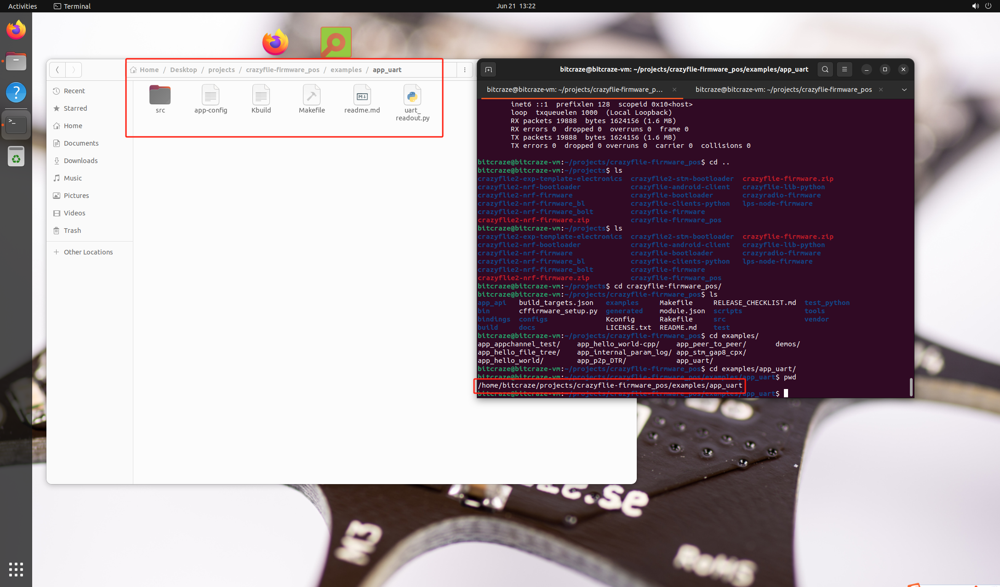

app_uart.rar压缩包中的 uart.c 获取位置数据，通过串口2发射:

.. code-block:: c

   #include <string.h>
   #include <stdint.h>
   #include <stdbool.h>

   #include "app.h"

   #include "FreeRTOS.h"
   #include "task.h"

   #define DEBUG_MODULE "HELLOWORLD"
   #include "debug.h"
   #include "uart2.h"
   #include "log.h"

   void appMain() {
      DEBUG_PRINT("Waiting for activation ...\n");
      //uint8_t it = 0;
      vTaskDelay(M2T(2000));
      uart2Init(9600);
      uint8_t start_byte = 0xAA;
      uint8_t end_byte = 0x55;
      uint8_t data[3 * sizeof(float) + 2]; // Extra space for start and end bytes
      float array[3] = {0.0, 0.0, 0.0};

      logVarId_t idx = logGetVarId("stateEstimate", "x");
      logVarId_t idy = logGetVarId("stateEstimate", "y");
      logVarId_t idz = logGetVarId("stateEstimate", "z");

      while(1) {
         vTaskDelay(M2T(100));

         array[0]= logGetFloat(idx);
         array[1]= logGetFloat(idy);
         array[2]= logGetFloat(idz);

         data[0] = start_byte;
         for (int i = 0; i < 3; i++) {
            memcpy(&data[i * sizeof(float) + 1], &array[i], sizeof(float)); // Offset by 1 for start byte
         }
         data[sizeof(data) - 1] = end_byte;
         for (int i = 0; i < sizeof(data); i++) {
            uart2Putchar(data[i]);
         }

         //DEBUG_PRINT("%d\n",it);
         //it++;
      }
   }

(2) 修改 Makefile 文件，注意别修改错文件了

   该文件目录是: /home/bitcraze/projects/crazyflie-firmware/Makefile

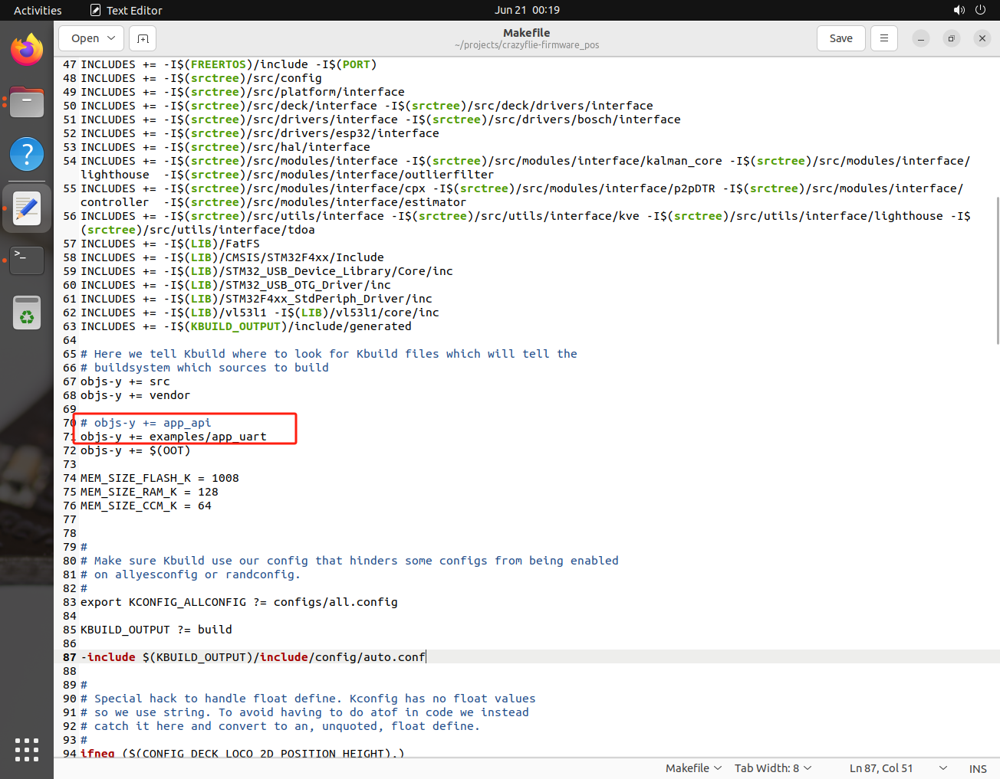

1. 如果是第一次需要提供配置文件，需要根据飞行器型号加载配置文件：

 - Crazyflie2.1 --> cf2_defconfig
 - Crazyflie bolt 1.1 --> bolt_defconfig
 - Crazyflie2.1 brushless --> cf21bl_defconfig

.. code-block:: bash

   make cf2_defconfig 
   make bolt_defconfig
   make cf21bl_defconfig

因为Crazyflie bolt 1.1板更适合装载到小车上，提供位置数据，所以以此举例:

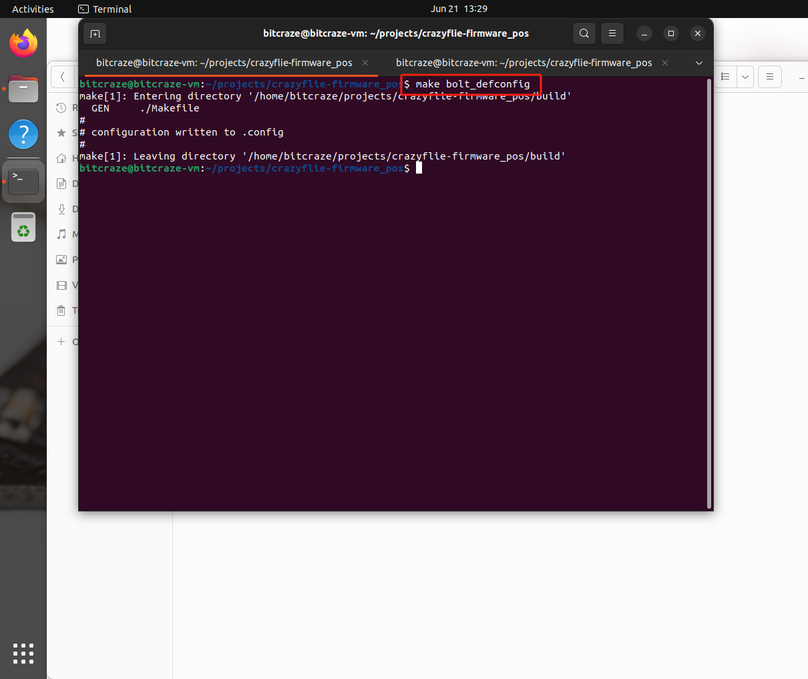

2. 修改menuconfig

.. code-block:: bash

   make menuconfig

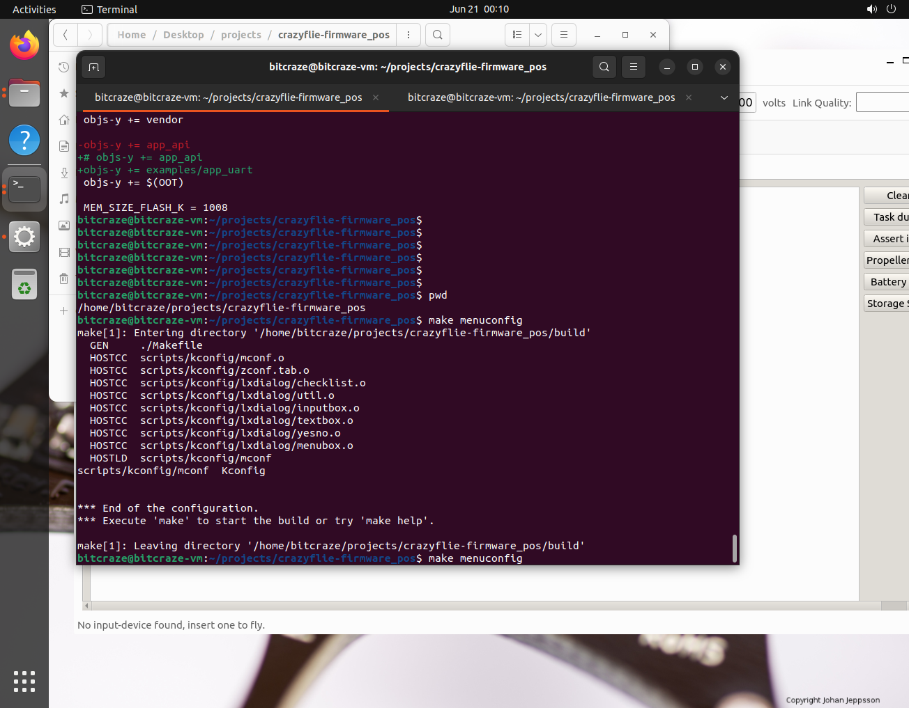

进入 App layer configuration -> Enable app entry point

   注意: 使用空格切换选项去Enable，然后选择Exit，最后保存退出

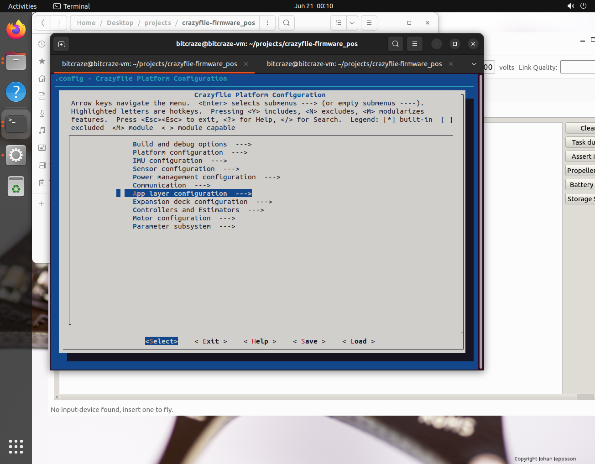

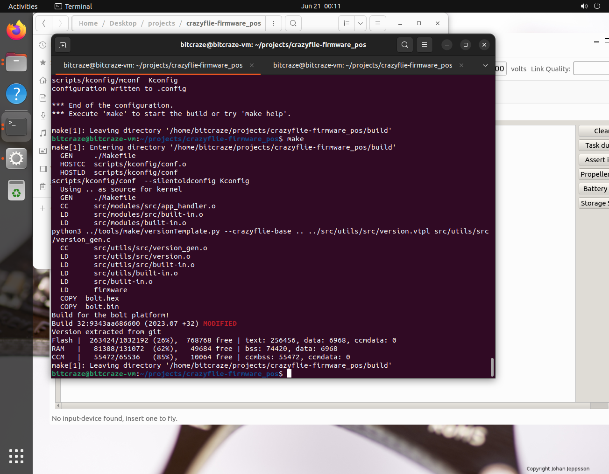

3. 编译

.. code-block:: bash

   make clean
   make

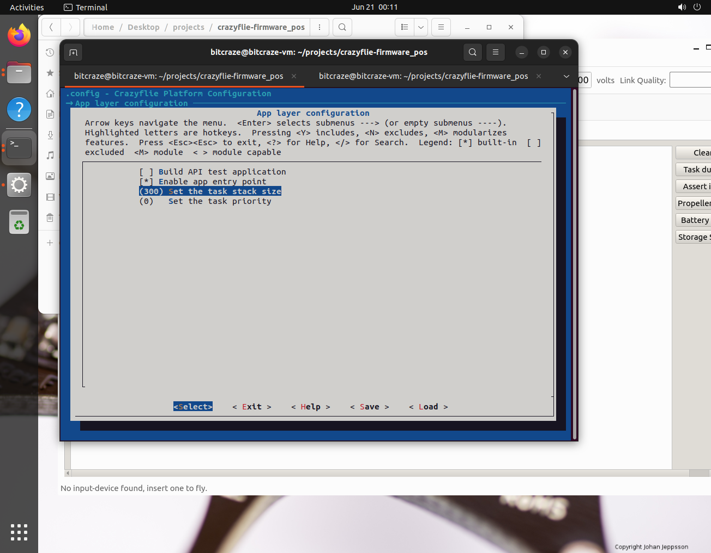

make如果没有报错，程序应该到此更改结束了。

4. 硬件连接 --- Crazyradio PA/2.0

Crazyradio PA举例，插入电脑之后，默认会在Windows的设备管理器中，首先需要让Crazyradio PA接入到VMware虚拟机中，使用lsusb查看是否接入

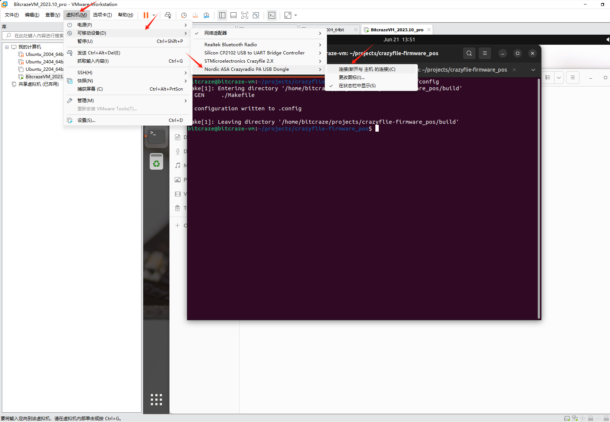

进入终端输入lsusb查看是否被识别

.. code-block:: bash

   lsusb

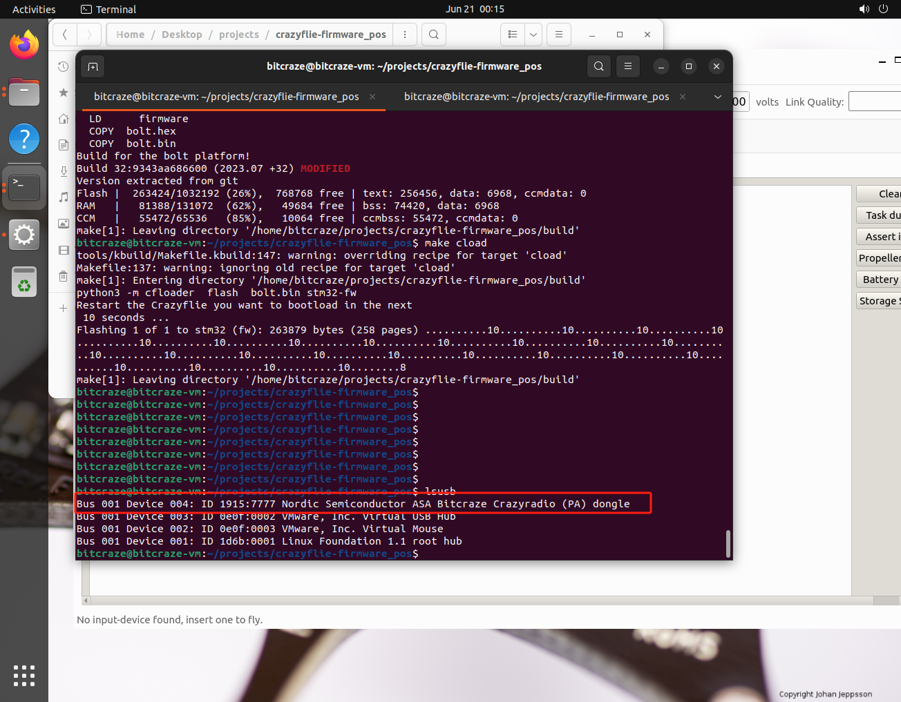

5. 硬件操作进入Bootloader --- Crazyflie 2.1/Crazyflie bolt 1.1/Crazyflie2.1 brushless

进入bootloader流程：
  
   按键按下一次断电，然后长按直到M3蓝灯闪烁，松开按键，另外一个蓝灯M1也开始闪烁，此时两个蓝灯都在闪烁，表示进入了Bootloader状态

.. raw:: html

   

      <video width="100%" height="auto" controls autoplay muted loop>
         <source src="../../../_static/develop/crazyflie_firmware_develop/0_add_appMain/enter_bootloader.mp4" type="video/mp4">
         Your browser does not support the video tag.
      </video>
   

6. 升级

.. code-block:: bash

   make cload

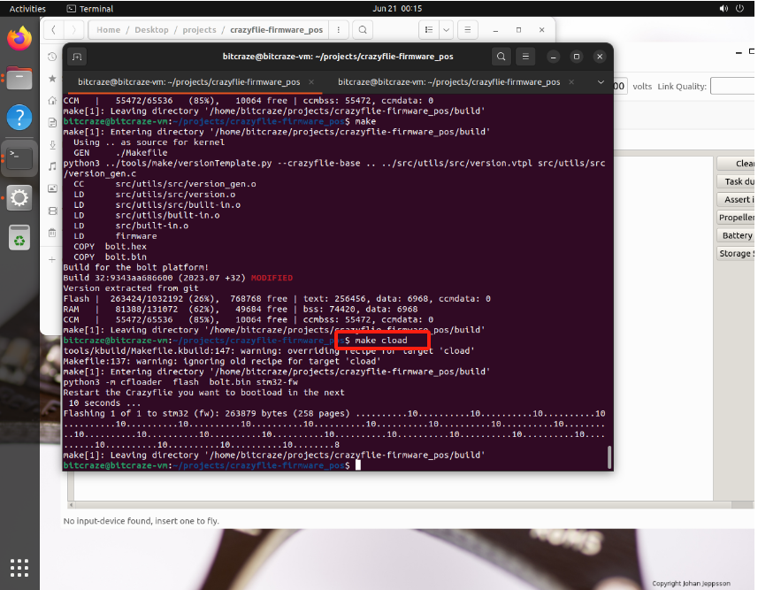

7. 硬件连接 --- 查看打印位置信息

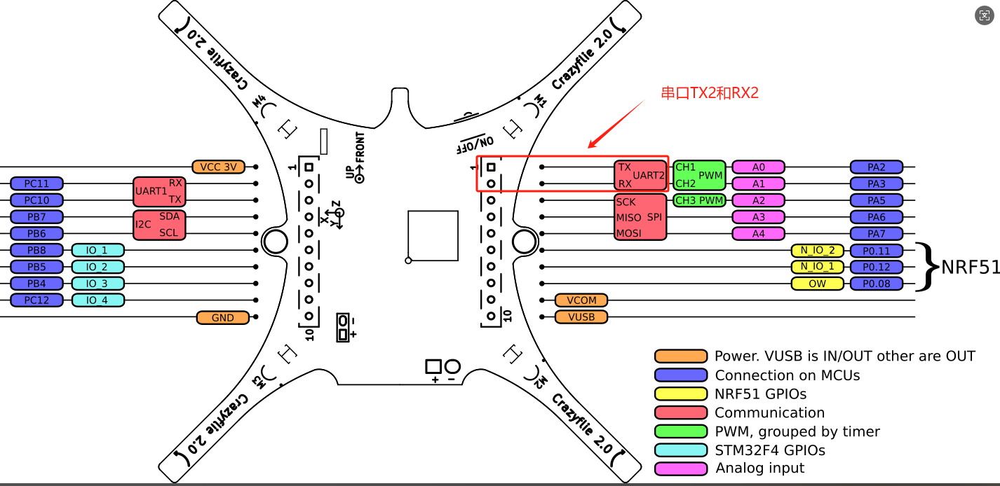

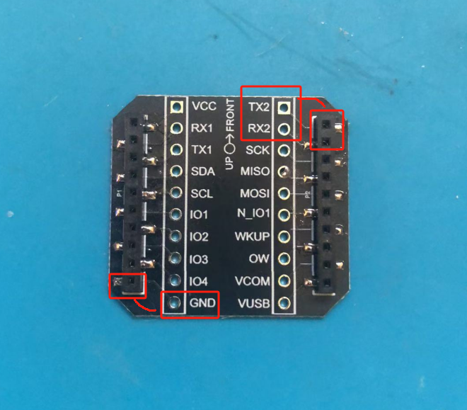

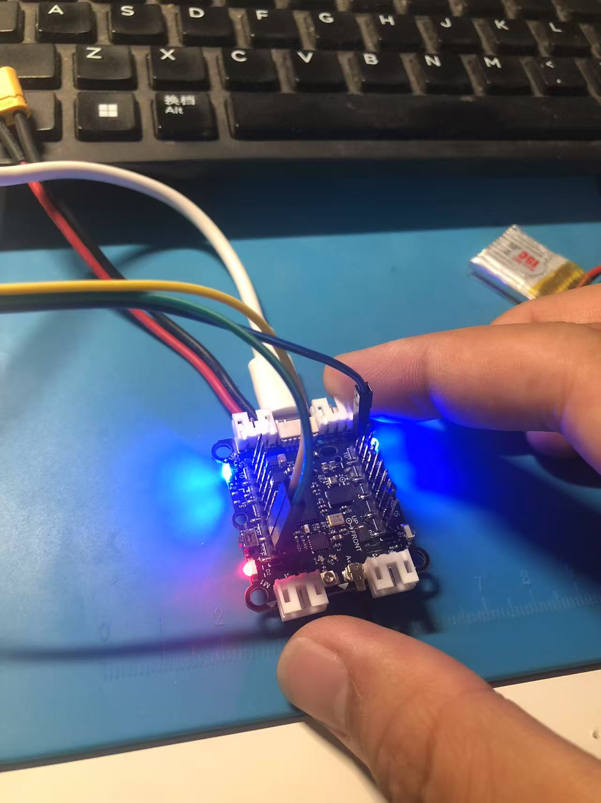

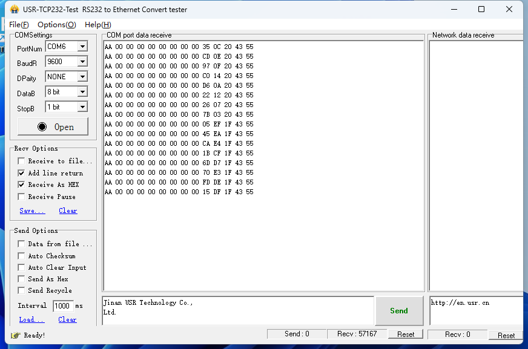
