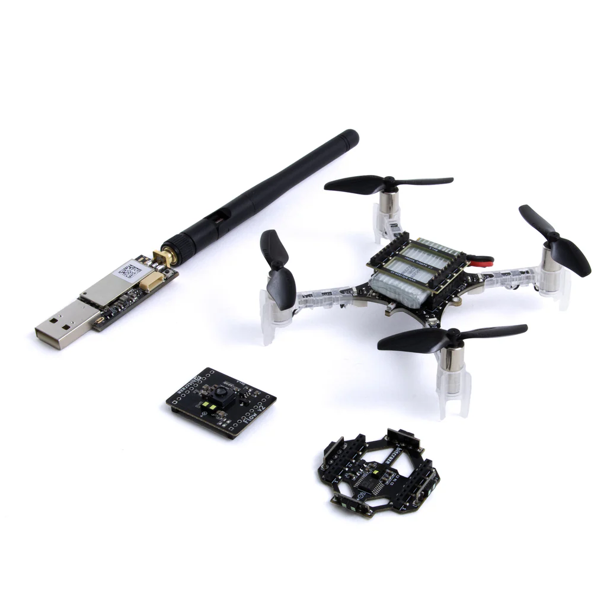
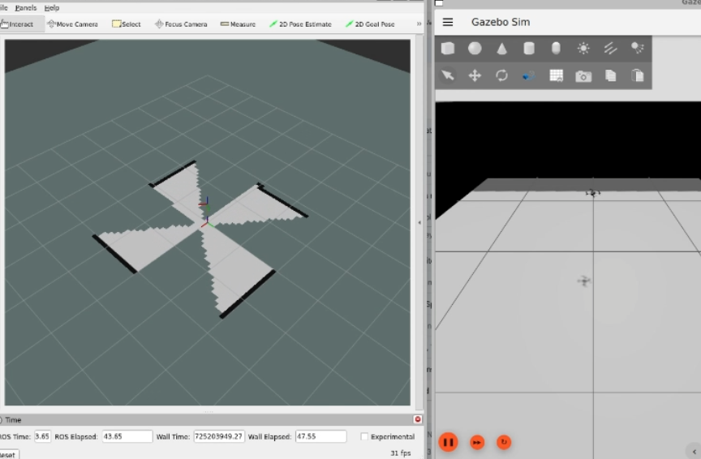
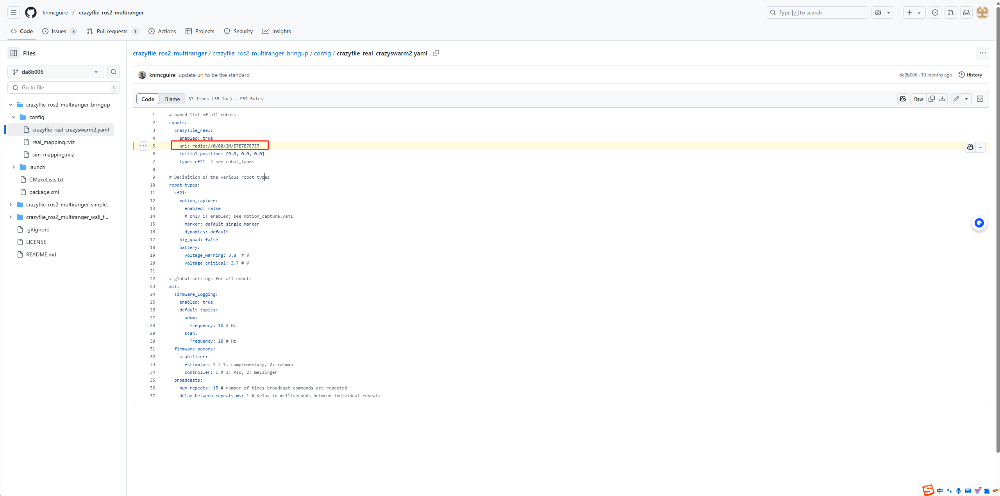
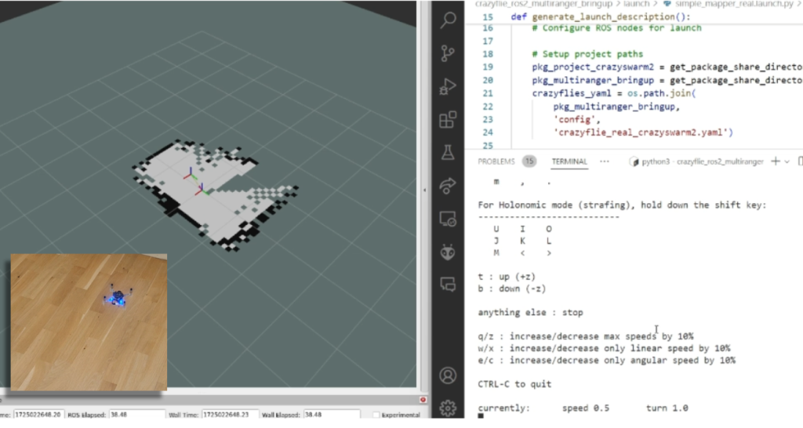
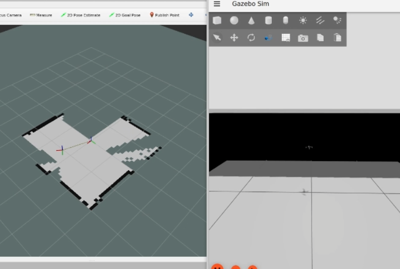
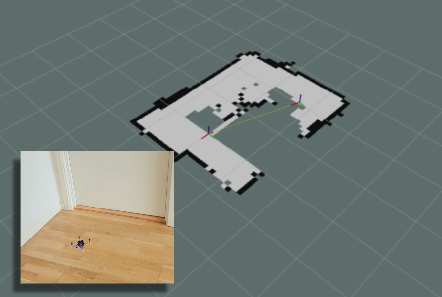

1_ROS2和Gazebo模拟仿真以及实物控制
====================================

.. contents:: 目录
    :depth: 6
    :local:
    
本教程将重点介绍如何在模拟环境中使用多测距器 ROS 2 节点进行地图绘制和沿墙行走，然后再在实际环境中进行尝试。您可以先在模拟环境中根据具体环境调整设置，然后在实际环境中使用完全相同的节点。这是 ROS 的主要优势之一，它为您提供了灵活性。

.. raw:: html

   

      <video width="100%" height="auto" controls autoplay muted loop>
         <source src="../../../_static/ros2_gazebo/Crazyflie's adventures with ROS 2 and Gazebo.mp4" type="video/mp4">
         Your browser does not support the video tag.
      </video>
   

框架介绍
----------

您需要在 Ubuntu 机器上安装由开放机器人基金会维护的ROS 2和Gazebo 模拟器。

 - 64 位 x86 设备上的 Ubuntu 22.04（非ARM）
 - `ROS 2 Humble <https://docs.ros.org/en/humble/index.html>`__ – 按照以下说明进行 `安装 <https://docs.ros.org/en/rolling/index.html>`__
 - `Gazebo Harmonic <https://gazebosim.org/docs/harmonic/getstarted/>`__ – 按照以下说明 `安装 <https://gazebosim.org/docs/latest/install_ubuntu/>`__ 。这不是 Humble 推荐的 Gazebo，但我们稍后会安装专用的 ROS 桥接器。请确保您的机器上没有安装 Gazebo Classic。

硬件准备
----------

你至少需要 STEM 范围包的组件:

 - Crazyflie 2.1+
 - Multi-ranger deck
 - Flow deck v2 (see this blogpost for tips and tricks)
 - Crazyradio 2.0/PA

如果您的计算机或定位系统有任何不同的设置，这是没问题的，因为演示应该足够简单，但是，请准备好处理本教程可能未涵盖的一些警告/错误。

这是完成本教程所需时间，取决于您的技能水平，但如果您已经有使用 ROS 2/Gazebo 和 Crazyflie 的经验，则应该需要1 小时。

如果您是第一次使用 Crazyflie，那么在进入 ROS 2 和 Gazebo 之前，最好先阅读入门教程，并使用连接了 Flowdeck 和 Multi-ranger deck 的CFclient进行连接，以检查一切是否正常。

有些事情也适用于 ROS 2！开始之前，先学习一下ROS 2 Humble 初学者教程会很有帮助。

工具安装
----------

本节将安装 4 个包：

 - `crazyflie_simulation <https://github.com/bitcraze/crazyflie-simulation>`__ ：包含 Crazyflie 的 Gazebo 模型，并使用激光雷达作为多测距仪
 - `crazyswarm2 <https://github.com/IMRCLab/crazyswarm2>`__ ：提供与 Crazyflie 的通信链接和 ROS2 集成
 - `ros_gz_crazyflie <https://github.com/knmcguire/ros_gz_crazyflie>`__ ：处理 Gazebo 和 ROS 2 之间的桥接
 - `crazyflie_ros2_multiranger <https://github.com/knmcguire/crazyflie_ros2_multiranger>`__ ：处理简单的映射和沿墙跟踪自主节点。

 为模拟和 ROS 创建工作区。您可以使用不同的目录

.. code-block:: bash

    mkdir ~/crazyflie_mapping_demo
    cd crazyflie_mapping_demo
    mkdir simulation_ws
    mkdir ros2_ws
    cd ros2_ws
    mkdir src

让我们将存储库克隆到正确的位置，从模拟开始

.. code-block:: bash

    cd ~/crazyflie_mapping_demo/simulation_ws
    git clone https://github.com/bitcraze/crazyflie-simulation.git

然后导航到 ROS2 工作区源文件夹并克隆 3 个项目：

.. code-block:: bash

    cd ~/crazyflie_mapping_demo/ros2_ws/src
    git clone https://github.com/knmcguire/crazyflie_ros2_multiranger.git
    git clone https://github.com/knmcguire/ros_gz_crazyflie
    git clone https://github.com/IMRCLab/crazyswarm2 --recursive

首先安装某些必需的 apt-get 包和 pip 库（可能需要为后者创建一个 python 环境）

.. code-block:: bash

    sudo apt-get install libboost-program-options-dev libusb-1.0-0-dev python3-colcon-common-extensions
    sudo apt-get install ros-humble-motion-capture-tracking ros-humble-tf-transformations
    sudo apt-get install ros-humble-ros-gzharmonic ros-humble-teleop-twist-keyboard
    pip3 install cflib transform3D

还要按照本指南中的说明为 Crazyradio 2.0 授予适当的权限，但如果这是您第一次使用Crazyradio 2.0，请先按照本教程操作。

进入 ros2_ws 工作区并构建包

.. code-block:: bash

    cd  ~/crazyflie_mapping_demo/ros2_ws/
    source /opt/ros/humble/setup.bash
    colcon build --cmake-args -DBUILD_TESTING=ON

构建需要几分钟时间。特别是 Crazyswarm2 会显示大量警告和 std_err，但除非软件包构建“失败”，否则请暂时忽略它，直到我们向该存储库提出修复建议。

如果所有包的构建都通过且没有失败，请继续下一步！

模拟映射
----------

本节将讲解如何使用多测距仪创建一个简单的二维环境地图。ROS 2 软件包专为多测距仪设计，但如果您愿意，它也应该兼容 NAV2。不过，目前我们将重点介绍一个不包含任何从地图推断出的定位信息的简单版本。

打开一个终端，该终端需要为 gazebo 模型和新构建的 ROS 2 包提供源代码：

.. code-block:: bash

    source ~/crazyflie_mapping_demo/ros2_ws/install/setup.bash
    export GZ_SIM_RESOURCE_PATH="/home/$USER/crazyflie_mapping_demo/simulation_ws/crazyflie-simulation/simulator_files/gazebo/"

首先，让我们先从安全开始，进行模拟。使用以下命令启动 ROS 2 启动文件：

    ros2 launch crazyflie_ros2_multiranger_bringup simple_mapper_simulation.launch.py

如果在模型上出现“没有此文件或目录”错误，请尝试在 GZ_SIM_RESOURCE_PATH 导出中输入完整路径。

Gazebo 会以 Crazyflie 为中心启动。您可以通过在实体树中右键单击 Crazyflie 并按“移动到”来获得 Crazyflie 的特写。您也可以选择跟随它，但 Gazebo 的摄像头追踪功能需要进行一些调整才能追踪像 Crazyflie 这样小的物体。此外，您将看到 RVIZ 以地图视图和预配置的变换启动。

打开另一个终端，获取已安装的 ROS 2 发行版并打开 ROS 2 teleop 键盘节点：

.. code-block:: bash

    source /opt/ros/humble/setup.bash
    ros2 run teleop_twist_keyboard teleop_twist_keyboard

使用键盘上的“t”键让 Crazyflie 起飞，并按照 teleop 指令旋转它。在 RVIZ 中，你应该可以看到正在创建的地图以及 Crazyflie 的变换移动。你应该能够看到这张图片，以及视频的这一部分。

物理映射
----------

现在您已经了解了它的要点，让我们转到真正的 Crazyflie！

首先，如果您要连接的 Crazyflie 有不同的 URI，请先更改 crazyflie_ros2_repository 中的配置文件“crazyflie_real_crazyswarm2.yaml”。Crazyswarm2 会通过这个文件来判断要连接到哪个 Crazyflie。

在 gedit 或您最喜欢的 IDE（如可视化代码）中打开配置文件：

.. code-block:: bash

    gedit ~/crazyflie_mapping_demo/ros2_ws/src/crazyflie_ros2_multiranger/crazyflie_ros2_multiranger_bringup/config/crazyflie_real_crazyswarm2.yaml

并根据需要将此行中的 URI 更改为 Crazyflie 的 URI。请注意，您需要再次重建 ros2_ws以确保此操作有效。

现在使用已安装的 ROS 2 包和 Gazebo 模型来获取终端，并启动针对现实世界 Crazyflie 的简单映射器示例的 ROS 启动。

.. code-block:: bash

    source ~/crazyflie_mapping_demo/ros2_ws/install/setup.bash
    export GZ_SIM_RESOURCE_PATH="/home/$USER/crazyflie_mapping_demo/simulation_ws/crazyflie-simulation/simulator_files/gazebo/"
    ros2 launch crazyflie_ros2_multiranger_bringup simple_mapper_real.launch.py

现在打开另一个终端，源 ROS 2 并打开 teleop：

.. code-block:: bash

    source /opt/ros/humble/setup.bash
    ros2 run teleop_twist_keyboard teleop_twist_keyboard

同样，让 Crazyflie 用“t”起飞，并按照指令控制它。

您应该能够在屏幕上看到这一点，您也可以通过视频的这一部分进行检查。

使用 ROS 2 teleop 控制时的真实 Crazyflie 映射的屏幕截图 `视频 <https://youtu.be/NiQq8sAlAz4?t=66&si=zUaPCizYgYIIiupQ>`__ : 

使用“b”使 Crazyflie 再次着陆，现在您可以使用 ctrl + c 关闭启动终端中的 ROS 2 节点。

模拟沿墙
----------

以前，您需要自己控制 Crazyflie 来创建地图，但如果可以让 Crazyflie 自己完成呢？`crazyflie_ros2_multiranger` 软件包包含一个 `crazyflie_ros2_multiranger_wall_following` 节点，它使用多测距仪的激光测距来实现自主沿墙飞行。之后，您只需安心等待，地图就会自动创建！

我们先在模拟环境中尝试一下，如果还没有的话，请打开终端并运行它（参见“简单映射器模拟”部分）。然后启动墙面跟随器 ROS 2 启动文件：

.. code-block:: bash

    ros2 launch crazyflie_ros2_multiranger_bringup wall_follower_mapper_simulation.launch.py

起飞和沿墙飞行将完全自动化。Gazebo 中的模拟 Crazyflie 将向前飞行，当它用前方距离传感器探测到墙壁时会停止，并沿着左侧的墙壁飞行。

您将在 RVIZ2 上看到完整地图的创建，如下所示，以及本部分教程  `视频 <https://youtu.be/NiQq8sAlAz4?t=112&si=Kku_ToqE2_3I16oT>`__ 。

您可以通过另一个以 ROS 2 humble 为源的终端中的以下服务调用来停止模拟的 Crazyflie。

.. code-block:: bash

    ros2 service call /crazyflie/stop_wall_following std_srvs/srv/Trigger

模拟的 Crazyflie 将停止沿墙飞行并着陆。您也可以直接关闭模拟，因为此时不会发生任何事情。

物理沿墙
----------

既然我们已经在模拟环境中证明了沿墙飞行的可行性，我们这次有足够的信心在现实世界中尝试一下！确保你的电池充满电，将 Crazyflie 放在地板上，朝向你想要的 x 轴正方向（这也是它首先飞行的方向），然后打开电源。

确保你在具有清晰墙壁和角落的房间内飞行，或者用纸板制作一些东西，例如迷你迷宫，但当前算法已优化为仅在方形房间内飞行。

像以前一样启动 ROS 2 工作区并启动墙跟随启动文件

.. code-block:: bash

    ros2 launch crazyflie_ros2_multiranger_bringup wall_follower_mapper_real.launch.py

与模拟版 Crazyflie 一样，真正的 Crazyflie 会自动起飞并自动沿墙飞行，因此确保它朝着墙壁飞行非常重要。它应该看起来像这张截图，或者你可以参考视频的这一部分来查看。

真正的 crazyflie 墙壁在绘制房间地图时能够自主跟随 `视频 <https://youtu.be/NiQq8sAlAz4?t=142&si=nfqIYECSXcM3am7Q>`__

请小心，不要在 Crazyflie 放在桌子上时意外运行此脚本！

如果您想停止 Crazyflie， 请不要 使用 ctrl-c 停止 ROS2 节点，因为它会继续飞行直到崩溃。遗憾的是，它不像模拟，您可以关闭环境而不会发生任何事情。相反，请在其他终端中使用为此创建的 ROS 2 服务：

.. code-block:: bash

    ros2 service call /crazyflie_real/stop_wall_following std_srvs/srv/Trigger

与真正的 Crazyflie 类似，它会停止沿墙飞行并着陆。现在您可以关闭 ROS 2 终端并关闭 Crazyflie。

Crazyswarm2和ROS2和Gazebo扩展
------------------------------

三个 Crazyflies 飞行器一起飞行，共同生成地图。Crazyflies 通过 ROS 2 远程操作节点控制，并通过 Crazyswarm2 服务器与计算机通信。
地图合并节点 mapMergeForMultiRobotMapping-ROS2。

环境：
 - Ubuntu 22.04
 - ROS 2 Humble

硬件：

 - 3 x Crazyflies 2.1+
 - 3 x Lighthouse decks
 - 2 x lighthouse base stations v2
 - 1 x Crazyradio 2.0/PA

参考代码仓库：

 - `Crazyswarm2 <https://imrclab.github.io/crazyswarm2/>`__
 - `mapMergeForMultiRobotMapping-ROS2 <https://github.com/abdulkadrtr/mapMergeForMultiRobotMapping-ROS2>`__

.. raw:: html

   

      <video width="100%" height="auto" controls autoplay muted loop>
         <source src="../../../_static/videos/swarm/Swarm mapping with Crazyswarm2 and Map Merging.mp4" type="video/mp4">
         Your browser does not support the video tag.
      </video>
   
