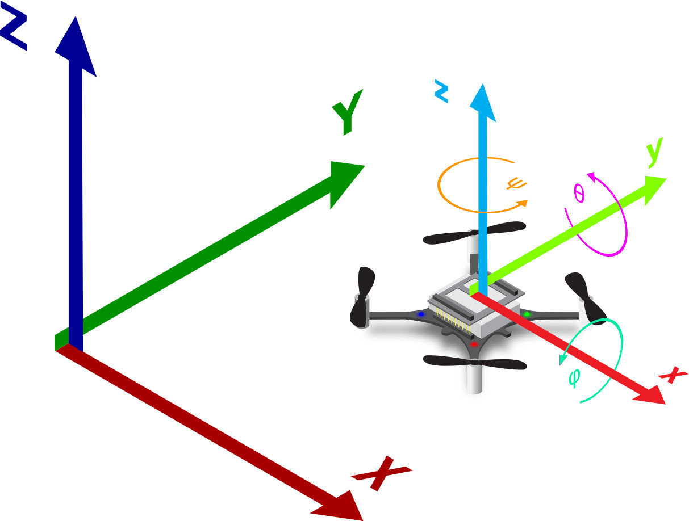
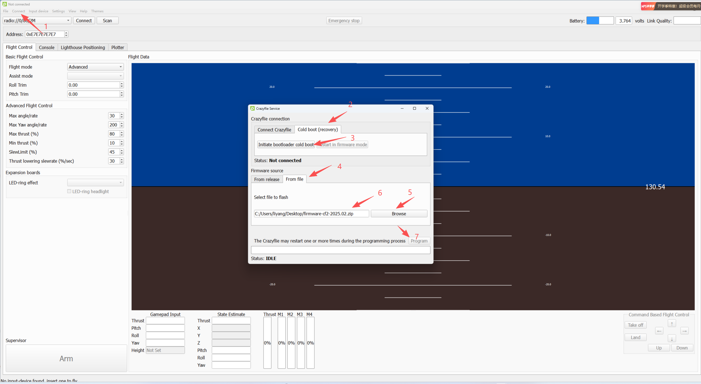
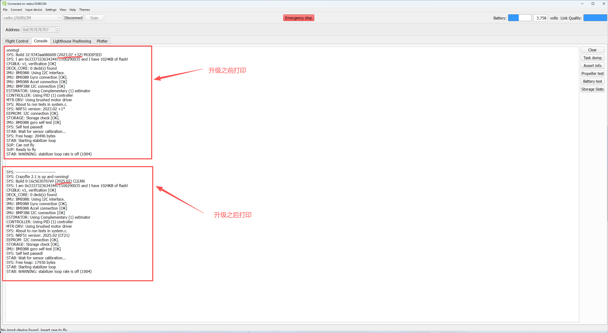

Crazyflie 2.1/Bolt/Brushless
==============================

坐标系
---------

固件升级
---------

参考 https://wiki.bitcraze.io/doc:crazyflie:client:cfloader:index

可以使用cfloader脚本 从命令行引导加载 Crazyflie。

要进入 Crazyflie 2.X 的引导加载程序，请关闭平台电源，然后按住电源按钮至少 1.5 秒（但不超过 5 秒）重新启动平台。
当右下角M2蓝灯进入闪烁状态，证明进入bootloader状态，可以松开按键，M3蓝灯也会开始闪烁。

从上位机中升级
--------------

   (1) 升级需要安装上位机 Crazyflie PC cfclients
   
   (2) 1台飞行器Crazyflie2.1

   (3) 1个CrazyradioPA或者Crazyradio2.0

   (4) 固件来源 https://github.com/bitcraze/crazyflie-release/releases

      crazyflie bolt 1.1 固件名称: firmware-bolt-2025.02.zip
   
      crazyflie 2.1 固件名称: firmware-cf2-2025.02.zip
   
      crazyflie 2.1 brushless 固件名称: firmware-cf21bl-2025.02.zip

   (5) 根据自己的飞行器对准型号，然后再升级，否则会变砖

升级文件如下，注意firmware-cf2-2023.11和firmware-cf2-2025.02比较大的区别是蓝牙协议栈，从S110替换成S130了

- `firmware-cf2-2023.11.zip <../../_static/ota/firmware-cf2-2023.11.zip>`_

- `firmware-cf2-2025.02.zip <../../_static/ota/firmware-cf2-2025.02.zip>`_

从程序中升级
--------------

当使用 Crazyflie 固件项目进行开发时，无论是crazyflie-firmware还是crazyflie2-nrf-firmware，您都可以使用以下方法刷新当前版本：

.. code-block:: c

   make cload

如果您希望 Crazyflie 在引导加载程序模式下自动重启，可以启用热启动模式。为此，请编辑文件“tool/make/config.mk”并添加 Crazyflie 的地址：

.. code-block:: c

   CLOAD_CMDS = -w radio://0/80/250K/E7E7E7E7E7

此后，“make cload”将以 bootlader 模式重新启动 Crazyflie，刷新并使用新固件重新启动它。

如果烧写操作失败或固件存在 bug，可能无法进行热启动。在这种情况下，请手动启动引导程序，并使用以下命令暂时禁用热启动：

.. code-block:: c

   make cload CLOAD_CMDS=

cfloader升级
--------------

该脚本位于crazyflie-clients-python仓库和客户端的bin目录中。以下是该脚本的使用方法：

.. code-block:: c

   crazyflie-clients-python$ bin/cfclient

   ==============================
   CrazyLoader Flash Utility
   ==============================

   Usage: bin/cfloader [CRTP options] <action> [parameters]

   The CRTP options are described above

   Crazyload option:
      info                    : Print the info of the bootloader and quit.
                              Will let the target in bootloader mode
      reset                   : Reset the device in firmware mode
      flash <file> [targets]  : flash the  binary file from the first
                              possible  page in flash and reset to firmware
                              mode.

nRF51 MCU 刷新新固件
^^^^^^^^^^^^^^^^^^^^
.. code-block:: c

   crazyflie-clients-python$ bin/cfloader flash cf2_nrf.bin nrf51-fw
   Restart the Crazyflie you want to bootload in the next  10 seconds ...  done!
   Connected to bootloader on Crazyflie 2.0 (version=0x10)
   Target info: nrf51 (0xFE)
   Flash pages: 232 | Page size: 1024 | Buffer pages: 1 | Start page: 88
   144 KBytes of flash avaliable for firmware image.
   Target info: stm32 (0xFF)
   Flash pages: 1024 | Page size: 1024 | Buffer pages: 10 | Start page: 16
   1008 KBytes of flash avaliable for firmware image.

   Flashing 1 of 1 to nrf51 (fw): 25151 bytes (25 pages) .1.1.1.1.1.1.1.1.1.1.1.1.1.1.1.1.1.1.1.1.1.1.1.1.1
   Reset in firmware mode ...

STM32 MCU 刷写新固件
^^^^^^^^^^^^^^^^^^^^^^
.. code-block:: c

   crazyflie-clients-python$ bin/cfloader flash cflie.bin stm32-fw
   Restart the Crazyflie you want to bootload in the next  10 seconds ...  done!
   Connected to bootloader on Crazyflie 2.0 (version=0x10)
   Target info: nrf51 (0xFE)
   Flash pages: 232 | Page size: 1024 | Buffer pages: 1 | Start page: 88
   144 KBytes of flash avaliable for firmware image.
   Target info: stm32 (0xFF)
   Flash pages: 1024 | Page size: 1024 | Buffer pages: 10 | Start page: 16
   1008 KBytes of flash avaliable for firmware image.

   Flashing 1 of 1 to stm32 (fw): 76435 bytes (75 pages) ..........10..........10..........10..........10..........10..........10..........10.....5
   Reset in firmware mode ...

刷写新的固件包（包含 nRF51 和 STM32 固件）
^^^^^^^^^^^^^^^^^^^^^^^^^^^^^^^^^^^^^^^^^^^^^

.. code-block:: c

   crazyflie-clients-python$ bin/cfloader flash cf2_dev_update.zip
   Restart the Crazyflie you want to bootload in the next  10 seconds ...  done!
   Connected to bootloader on Crazyflie 2.0 (version=0x10)
   Target info: nrf51 (0xFE)
   Flash pages: 232 | Page size: 1024 | Buffer pages: 1 | Start page: 88
   144 KBytes of flash avaliable for firmware image.
   Target info: stm32 (0xFF)
   Flash pages: 1024 | Page size: 1024 | Buffer pages: 10 | Start page: 16
   1008 KBytes of flash avaliable for firmware image.

   Flashing 1 of 2 to stm32 (fw): 76435 bytes (75 pages) ..........10..........10..........10..........10..........10..........10..........10.....5
   Flashing 2 of 2 to nrf51 (fw): 25151 bytes (25 pages) .1.1.1.1.1.1.1.1.1.1.1.1.1.1.1.1.1.1.1.1.1.1.1.1.1
   Reset in firmware mode ...

Crazyflie2.1/Bolt/Brushless 目录
---------------------------------

.. toctree::
   :maxdepth: 6
   :caption: Crazyflie

   crazyflie2.1/0_crazyflie2.1_introduction
   crazyflie2.1/1_crazyflie2.1_assembly
   crazyflie2.1/2_crazyflie2.1_getting_started
   crazyflie2.1/3_crazyflie2.1_address_adjust
   crazyflie2.1_Brushless/0_crazyflie2.1_brushless_introduction
   crazyflie2.1_Brushless/1_crazyflie2.1_brushless_assembly
   crazyflie2.1_Brushless/2_crazyflie2.1_brushless_getting_started
   crazyflie_bolt_1.1/0_crazyflie_bolt_1.1_introduction
   crazyflie_bolt_1.1/1_crazyflie_bolt_1.1_assembly
   crazyflie_bolt_1.1/2_crazyflie_bolt_1.1_getting_started
   crazyflie_bolt_1.1/3_crazyflie_bolt_1.1_QAV250
   crazyflie_bolt_1.1/4_crazyflie_bolt_1.1_F330
   crazyflie_bolt_1.1/5_crazyflie_bolt_1.1_F450
   crazyflie_firmware_develop/0_crazyflie_firmware_add_appMain
   crazyflie_firmware_develop/1_crazyflie_firmware_ros2_gazebo

