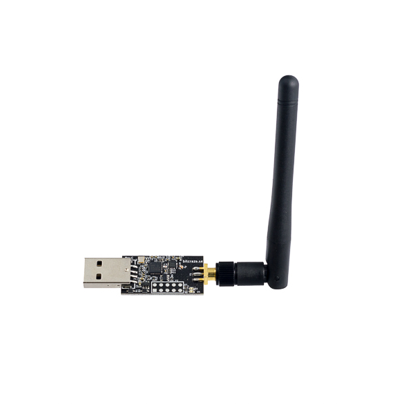
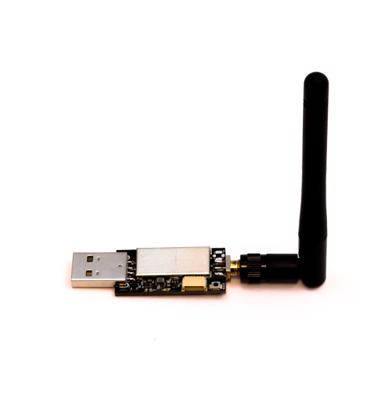
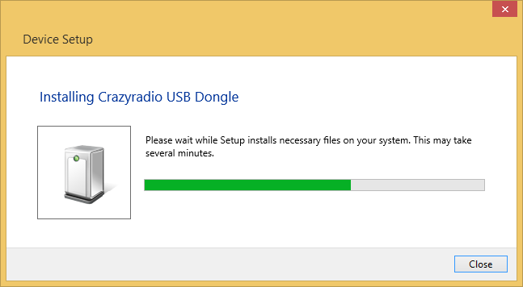
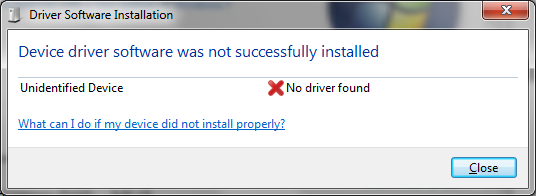
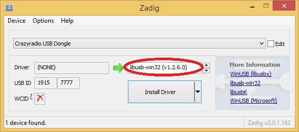
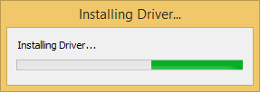
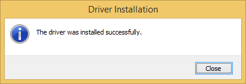
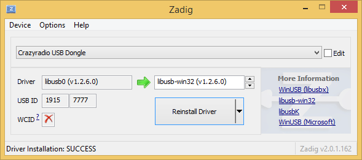
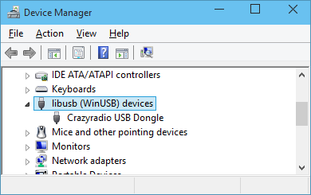
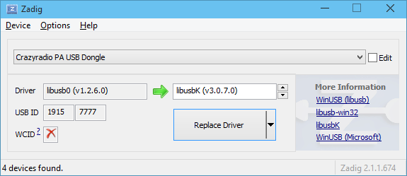

Crazyradio PA/Crazyradio2.0
============================

Crazyradio PA/Crazyradio 2.0 是Crazyflie2.x和上位机之间通信的无线设备。

大多数使用 USB 通信的 Bitcraze 产品在 Windows 上使用 libusb 驱动程序。该驱动程序允许与 USB 设备进行通信，而无需开发自定义驱动程序。本页面将解释如何使用 Zadig 工具安装 libusb 驱动程序。

Windows 驱动安装
----------------

首先，从其官方网站下载 Zadig：`Zadig <http://zadig.akeo.ie/>`_。

您也可以从以下链接下载 Zadig 驱动程序 zadig-2.9.rar：

`下载 Zadig 驱动程序 <../../_static/driver/zadig-2.9.rar>`_

将 Bitcraze 设备插入 PC。Windows 应该会显示一些安装窗口。在 Windows 8 和 10 上，它不会显示任何内容并自动关闭。在 Windows 7 上，您需要关闭安装失败的窗口。

一旦 Windows 的安装窗口关闭，启动 Zadig，您应该在列表中看到您的设备。选择设备，选择 libusb，然后点击“安装”按钮。

安装过程应该会运行并成功完成。安装通常很快，但也可能需要一些时间：

驱动程序现在已安装，您可以使用您的 USB Bitcraze 设备。

重新安装驱动程序
----------------

如果驱动程序安装错误需要重新安装，或者如果 Windows 已经为该设备安装了其他驱动程序，请插入设备，启动 Zadig，然后点击“选项/显示所有设备”。您应该能够在列表中选择该设备并重新安装 libusb 驱动程序。例如，对于 Crazyradio。

故障排除
--------

如果设备无法正常工作，请检查设备管理器中是否将其显示为 libusb 设备。如果不是，请尝试按照上述说明重新安装驱动程序。

如果设备无法正常工作，您可以尝试安装 libUSBK 驱动程序，它在某些版本的 Bitcraze 软件中表现得更好：

Ubuntu 驱动安装
----------------

正常在Ubuntu中不用安装，但是需要开通权限

以下步骤使得无需 root 身份即可通过 USB 使用 跟Crazyflie通信。

.. code-block:: bash

   sudo groupadd plugdev
   sudo usermod -a -G plugdev $USER

您需要注销并重新登录才能成为 plugdev 组的成员。

将以下内容复制粘贴到您的控制台中，这将创建文件/etc/udev/rules.d/99-bitcraze.rules：

.. code-block:: bash

   cat <<EOF | sudo tee /etc/udev/rules.d/99-bitcraze.rules > /dev/null
   # Crazyradio (normal operation)
   SUBSYSTEM=="usb", ATTRS{idVendor}=="1915", ATTRS{idProduct}=="7777", MODE="0664", GROUP="plugdev"
   # Bootloader
   SUBSYSTEM=="usb", ATTRS{idVendor}=="1915", ATTRS{idProduct}=="0101", MODE="0664", GROUP="plugdev"
   # Crazyflie (over USB)
   SUBSYSTEM=="usb", ATTRS{idVendor}=="0483", ATTRS{idProduct}=="5740", MODE="0664", GROUP="plugdev"
   EOF

您可以使用以下命令重新加载 udev 规则：

.. code-block:: bash

   sudo udevadm control --reload-rules
   sudo udevadm trigger

crazyradio
----------------

.. toctree::
   :maxdepth: 6
   :caption: Crazyradio PA/2.0

   crazyradioPA/0_crazyradioPA_introduction
   crazyradio2.0/0_crazyradio20_introduction