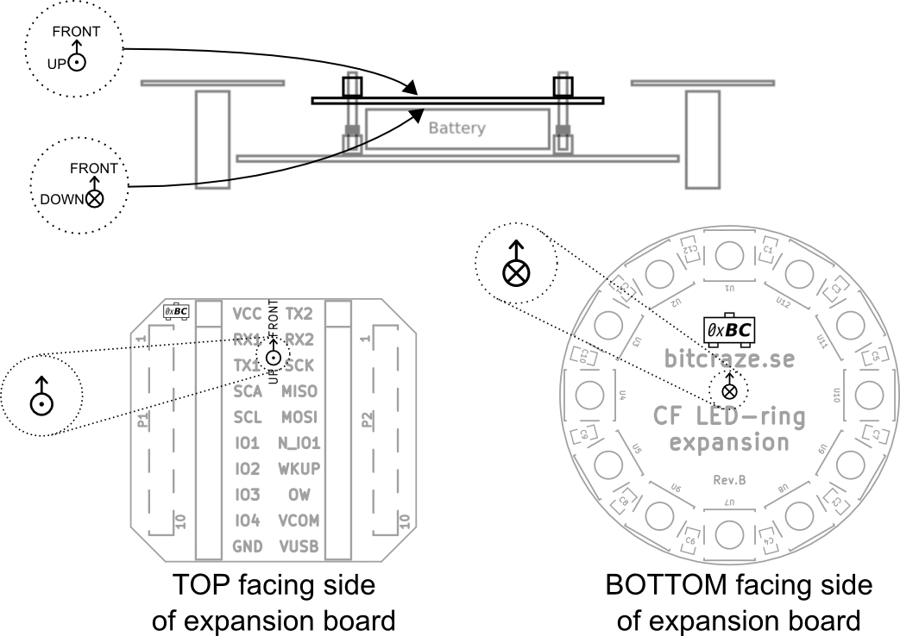
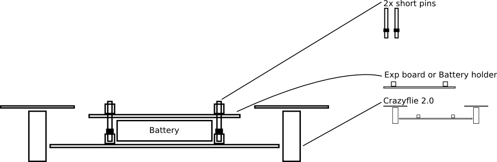
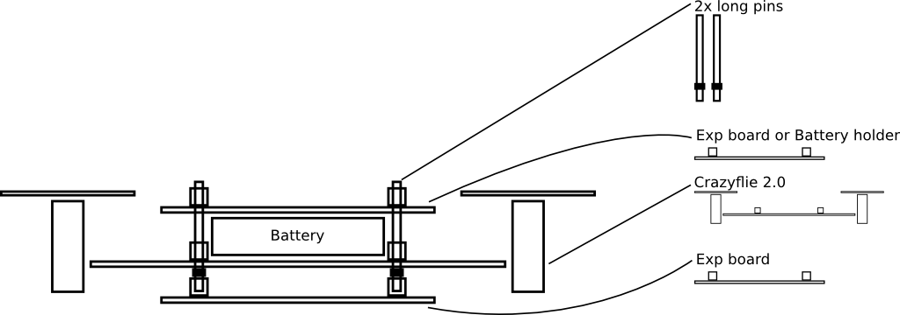
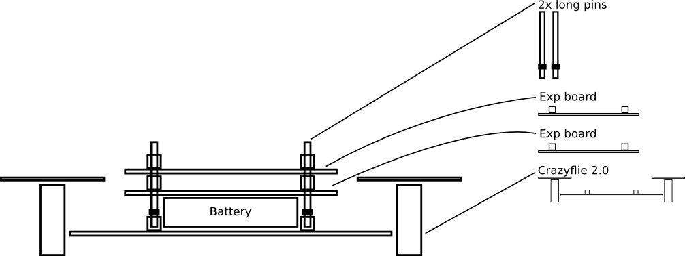
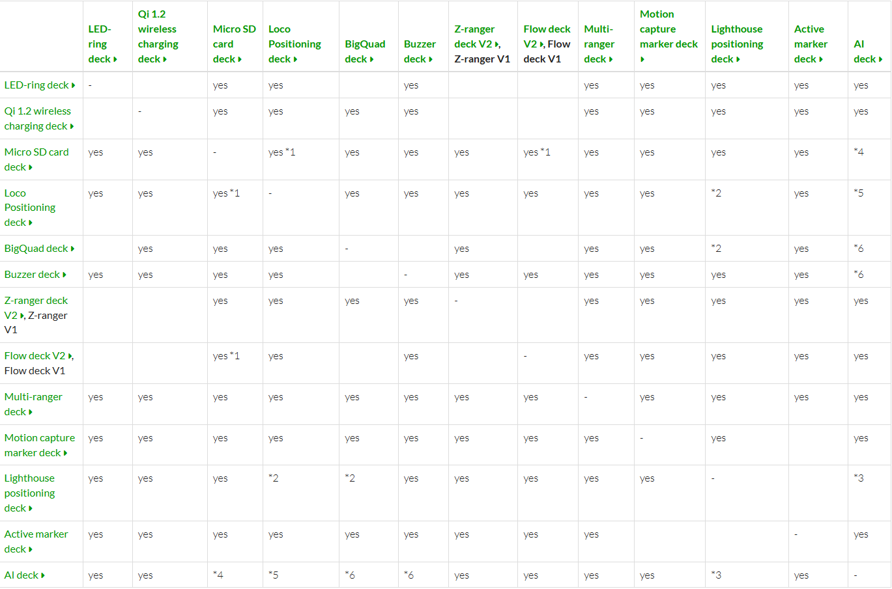

Crazyflie All Deck
===================

Deck 是为了扩展Crazyflie之外的更多功能而设计的。

扩展卡列表
----------

以下是 Crazyflie 2.x 可用的扩展卡列表：

.. list-table::
   :header-rows: 1
   :widths: 25 75

   * - 扩展板名称
     - 描述
   * - LED-ring deck
     - 具有 12 个可编程 RGB LED 和两个前置“车头灯”的视觉反馈扩展板。
   * - Buzzer deck
     - 提供蜂鸣器功能，可用于声音反馈。
   * - Qi 1.2 wireless charging deck
     - 支持 Qi 1.2 标准的无线充电扩展板。
   * - Prototyping deck
     - 用于自定义电路开发的原型扩展板。
   * - Breakout deck
     - 提供额外引脚访问的扩展板，方便连接外部设备。
   * - BigQuad deck
     - 用于构建更大四旋翼飞行器的扩展板。
   * - Micro SD card deck
     - 支持 Micro SD 卡的扩展板，可用于数据存储。
   * - Z-ranger deck V2
     - 提供精确高度控制的扩展板。
   * - Lighthouse positioning deck
     - 支持 SteamVR Lighthouse 定位系统的扩展板。
   * - Motion capture marker deck
     - 便于安装动作捕捉标记的扩展板。
   * - Active marker deck
     - 配备主动红外 LED 的动作捕捉标记扩展板。
   * - `Loco Positioning deck <./loco_deck/0_loco_deck_introduction>`__
     - 用于 Loco UWB定位系统的扩展板。
   * - `Multi-ranger deck <./Multi-ranger_deck/0_multi-ranger_deck_introduction>`__
     - 提供多方向障碍物检测的扩展板。
   * - `Flow deck V2 <./flow2_deck/0_flow2_deck_introduction>`__
     - 提供光流和高度检测的扩展板。
   * - AI deck
     - 集成 AI 功能的扩展板，适用于边缘计算任务。

附加信息
--------

扩展板模板：Crazyflie 2.0/2.1扩展端口模板

将引脚焊接到甲板上：将引脚直接焊接到甲板上的说明

机械建筑
--------

扩展板可以安装在 Crazyflie 2.x 的顶部、底部或上下两侧。Crazyflie 2.x 和扩展板均配有母头直通连接器，可与公头插针连接。插针有两种不同长度，可支持在顶部安装一块扩展板、在底部安装一块扩展板、在顶部安装一块扩展板，或顶部安装两块扩展板。除非使用其他方式（例如橡皮筋、粘性垫等）固定电池，否则顶部应始终放置一块扩展板或电池座以固定电池。

方向
--------

警告：务必以正确的方向安装扩展板。错误的方向安装扩展板可能会损坏扩展板和 Crazyflie 2.x。

所有扩展板均会显示一个描述正确方向的徽标：

顶部有一块扩展板

顶部有一块扩展板，底部有一块

顶部有两块扩展板

扩展端口引脚排列

.. figure:: ../../_static/products/crazyflie-2_1_plus/datasheet/crazyflie_2_1-deck-connector-multiplex.png
   :align: center
   :figclass: align-center

- Crazyflie 2.x 是一个 3.0V 系统，这意味着高输出将为 3.0V，但仍与 3.3V 系统兼容。
- VCC 最大供电 100mA
- VCOM 最大可提供 1.0A
- 除 PA5 和 NRF51 引脚外，所有 IO 引脚均可承受 5V
- NRF51 引脚可以与任何可用的 NRF51 外设复用。
- STM32F405RG引脚可以复用，实现更多功能。
- 有关完整规格，请参阅 NRF51 和 STM32F405 的数据表

扩展板检测
----------

扩展板通过连接到 OW 引脚的单线存储器进行检测。启动时，电源管理 MCU nRF51822 会检测并读取存储器内容。如果没有检测到不兼容情况，nRF51 将启动系统，并将存储器内容提供给正在运行应用程序代码的应用处理器 STM32F4。

甲板信息
---------

.. list-table::
   :header-rows: 1
   :widths: 10 8 10 20 8 12 10

   * - 识别码
     - PID
     - ID
     - 姓名
     - 重量
     - 功耗
     - 安装位置
   * - 0xBC
     - 0x01
     - bcLedRing
     - LED环形甲板
     - 3.3g
     - 0 - 700mA
     - 底部
   * - 0xBC
     - 0x02
     - BCQi
     - Qi 1.2 无线充电底座
     - 5g
     - 不适用
     - 底部
   * - 0xBC
     - 0x04
     - bcBuzzer
     - 蜂鸣器甲板
     - 1.8g
     - 10mA
     - 底部/顶部
   * - 0xBC
     - 0x05
     - bcBigQuad
     - BigQuad 甲板
     - 3.8g
     - 不适用
     - 底部/顶部
   * - 0xBC
     - 0x06
     - bcLoco
     - Loco 定位甲板
     - 3.3g
     - 160mA
     - 底部/顶部
   * - 0xBC
     - 0x08
     - bcUSD
     - Micro SD 卡座
     - 1.7g
     - ~30mA
     - 底部/顶部
   * - 0xBC
     - 0x09
     - bcZRanger
     - Z-ranger 卡组
     - 1.3g
     - ~15mA
     - 底部
   * - 0xBC
     - 0x0A
     - bcFlow
     - 流动甲板
     - 1.6g
     - ~40mA
     - 底部
   * - 0xBC
     - 0x0B
     - bcOA
     - 避障
     - 不适用
     - ~0.3mA
     - 顶部
   * - 0xBC
     - 0x0C
     - bcMultiranger
     - 多游侠甲板
     - 2.3g
     - ~90mA（取决于模式）
     - 顶部
   * - 0xBC
     - 0x0D
     - bcMocap
     - 动作捕捉标记台
     - 1.6g
     - 0mA
     - 顶部
   * - 0xBC
     - 0x0E
     - bcZRanger2
     - Z-ranger 甲板 V2
     - 1.3g
     - ~15mA
     - 底部
   * - 0xBC
     - 0x0F
     - bcFlow2
     - 流动甲板 V2
     - 1.6g
     - ~40mA
     - 底部
   * - 0xBC
     - 0x10
     - bcLighthouse4
     - 灯塔定位甲板
     - 2.7g
     - ~40mA
     - 顶部
   * - 0xBC
     - 0x11
     - bcActiveM
     - 活动标记甲板
     - 2.0g
     - ~40mA
     - 顶部
   * - 0xBC
     - 0x12
     - bcAI
     - AI卡组
     - 4.4g
     - 取决于甲板应用程序
     - 底部/顶部

甲板引脚分配
------------
下表列出了每套卡座使用的引脚。表中还包含尚未发布的卡座信息，这些信息可能会有所变更。

括号中的分配未连接，但可以通过焊桥或 0 欧姆电阻连接，因此属于替代连接。这样做的目的是，当您想要使用两块连接线相交的板面时，可以重新布线连接。

甲板引脚映射
^^^^^^^^^^^^^

.. list-table::
   :header-rows: 1
   :widths: 20 6 6 6 6 6 6 6 6 6 6 6 6 6 6

   * - Name
     - UART1 RX1
     - UART1 TX1
     - I2C SDA
     - I2C SCL
     - STM32 IO1
     - STM32 IO2
     - STM32 IO3
     - STM32 IO4
     - UART2 TX2
     - UART2 RX2
     - SPI SCK
     - SPI MOSI
     - SPI MISO
     - PWR
   * - LED-ring deck
     - 
     - 
     - 
     - 
     - 
     - PWM
     - PWM
     - 
     - 
     - 
     - 
     - 
     - 
     - VCOM
   * - Qi 1.2 wireless charging deck
     - 
     - 
     - 
     - 
     - 
     - 
     - 
     - CS/(MOSI)
     - 
     - 
     - 
     - 
     - CHG
     - N/A
   * - Micro SD card deck
     - *(MISO)*
     - 
     - 
     - 
     - *(CS)*
     - *(CS)*
     - *(CS)*
     - *(CS/(MOSI))*
     - 
     - 
     - SCK
     - MOSI
     - MISO
     - VCC
   * - Loco Positioning deck
     - IRQ
     - RST
     - 
     - 
     - CS
     - *(IRQ)*
     - *(RST)*
     - 
     - 
     - 
     - SCK
     - MOSI
     - MISO
     - VCOM
   * - BigQuad deck
     - *(RX1)*
     - *(TX1)*
     - *(SDA)*
     - *(SCL)*
     - 
     - PWM
     - PWM
     - *(IO)*
     - PWM
     - PWM
     - *(ADC)*
     - *(ADC)*
     - *(IO)*
     - N/A
   * - Buzzer deck
     - 
     - 
     - 
     - 
     - 
     - 
     - 
     - 
     - PWM
     - PWM
     - 
     - 
     - 
     - N/A
   * - Z-ranger deck V2, Z-ranger deck V1
     - 
     - 
     - SDA
     - SCL
     - 
     - *(VL53_IO)*
     - 
     - 
     - 
     - 
     - 
     - 
     - 
     - VCC
   * - Flow deck V2, Flow deck V1
     - 
     - 
     - SDA
     - SCL
     - *(RST/MOT/IO)*
     - CS
     - 
     - *(RST)*
     - *(MOT)*
     - 
     - SCK
     - MOSI
     - MISO
     - VCC
   * - Multi-ranger deck
     - 
     - 
     - SDA
     - SCL
     - 
     - 
     - 
     - 
     - 
     - 
     - 
     - 
     - 
     - VCOM
   * - Motion capture marker deck
     - 
     - 
     - 
     - 
     - *(BTN/IO)*
     - *(BTN/IO)*
     - 
     - 
     - 
     - 
     - 
     - 
     - 
     - N/A
   * - Lighthouse positioning deck
     - RX1
     - TX1
     - *(SDA)*
     - *(SCL)*
     - 
     - 
     - 
     - 
     - 
     - 
     - 
     - 
     - 
     - N/A
   * - Active marker deck
     - 
     - 
     - SDA
     - SCL
     - 
     - 
     - 
     - 
     - 
     - 
     - 
     - 
     - 
     - N/A
   * - AI deck
     - RX1
     - TX1
     - SDA
     - SCL
     - BOOT
     - 
     - 
     - RST
     - TX2
     - RX2
     - 
     - 
     - 
     - VCOM

兼容性矩阵
----------
平台-甲板
^^^^^^^^^^^^^

该表显示了哪个卡组可以在哪个平台上使用。

.. list-table:: 功能对比表
   :widths: 35 20 20
   :header-rows: 1
   :align: left

   * - **功能/配件**
     - **Crazylile 2.0, 2.1 (+)** 
     - **Crazylile 2.1 Brushless**
   * - LED-ring deck
     - yes
     - no
   * - Q1 1.2 wireless charging deck
     - yes
     - no
   * - Micro SD card deck
     - yes
     - yes
   * - Loco Positioning deck
     - yes
     - yes
   * - BigQuad deck
     - yes
     - yes
   * - Buzzer deck
     - yes
     - yes
   * - Z-ranger deck V2, Z-ranger deck V1
     - yes
     - yes
   * - Flow deck V2, Flow deck V1
     - yes
     - yes
   * - Multi-ranger deck
     - yes
     - yes
   * - Motion capture marker deck
     - yes
     - yes
   * - Lighthouse positioning deck
     - yes
     - yes
   * - Active marker deck
     - yes
     - yes
   * - AI deck
     - yes
     - yes

甲板 - 甲板
^^^^^^^^^^^^^

该表显示了哪些卡组可以同时使用。

注意：此矩阵适用于未修改的卡座和标准固件。某些卡座可以修改为使用扩展端口上的其他引脚，从而与标记为不兼容的卡座兼容。通常物理上相互阻塞的卡座也被标记为不兼容。

Deck
----------

.. toctree::
   :maxdepth: 2
   :caption: Crazyflie All Deck

   lighthouse_deck/0_lighthouse_deck_introduction
   loco_deck/0_loco_deck_introduction
   flow2_deck/0_flow2_deck_introduction
   Multi-ranger_deck/0_multi-ranger_deck_introduction
