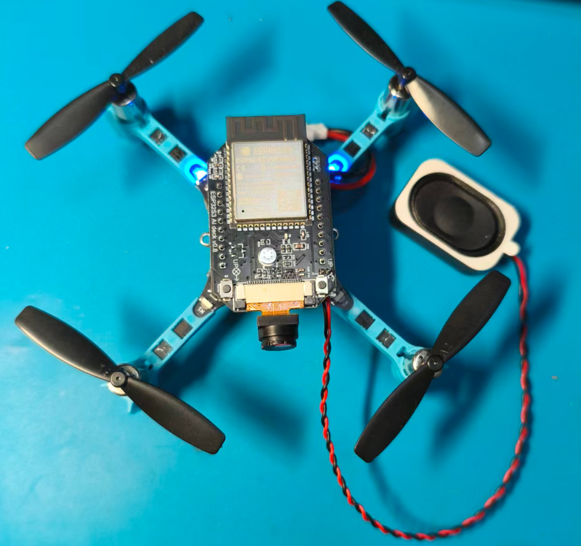
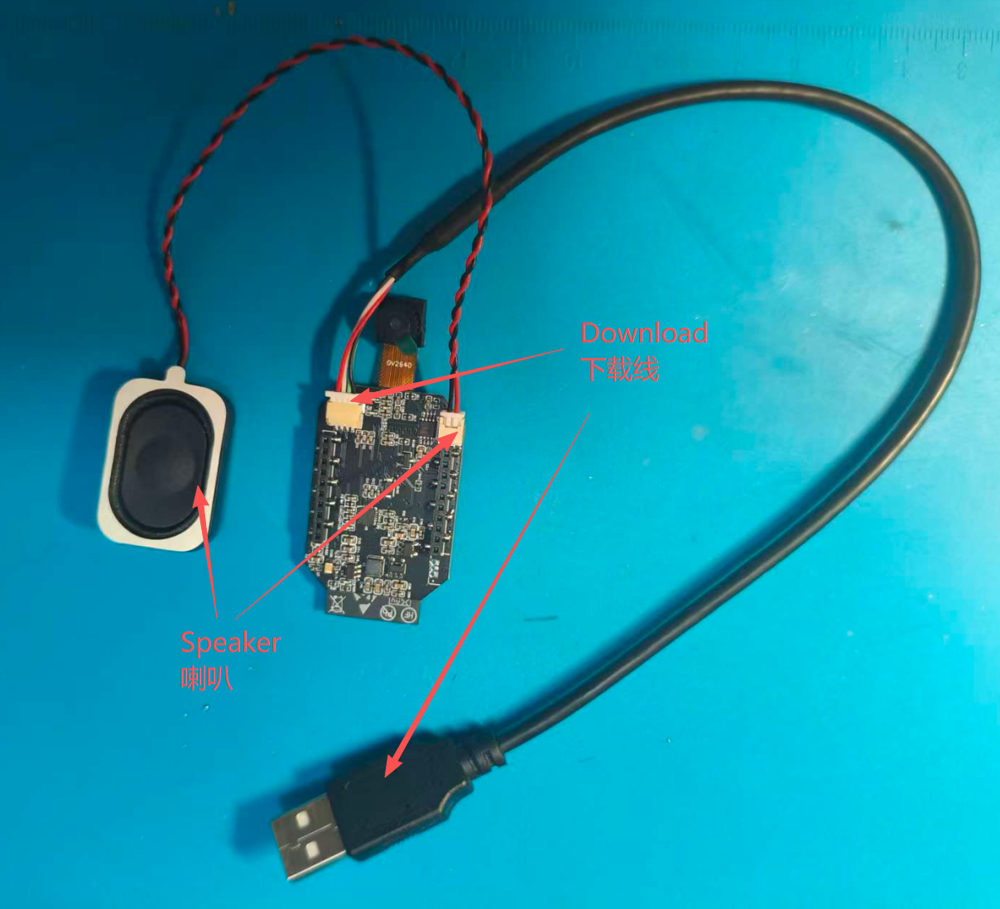
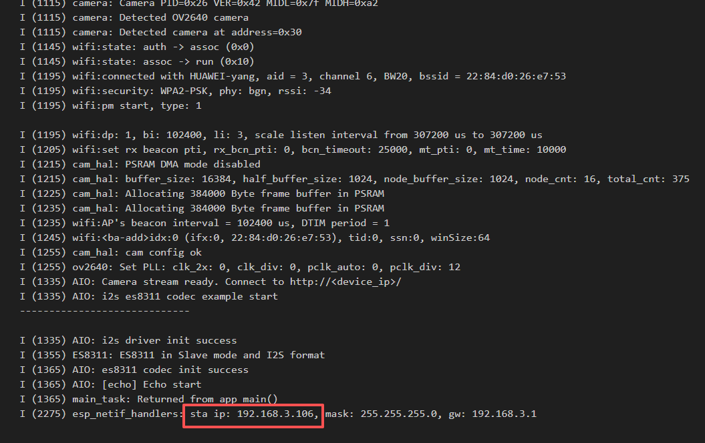
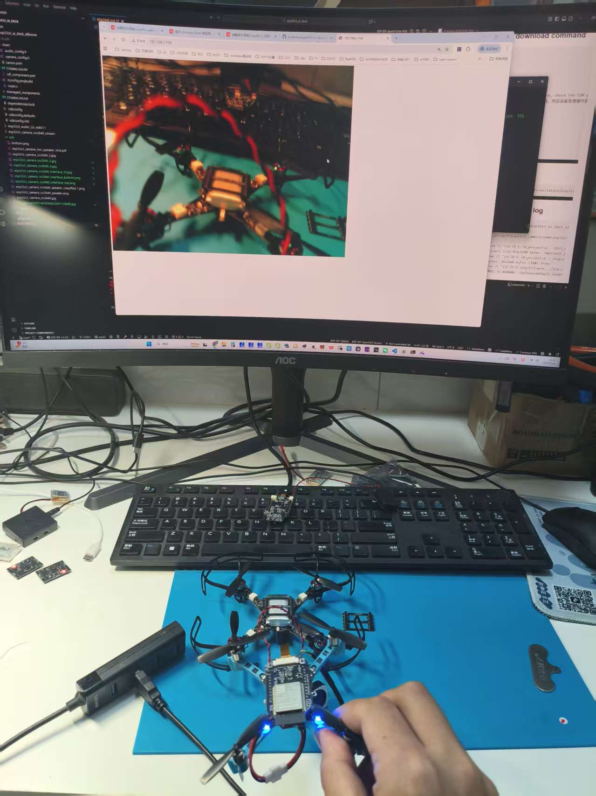
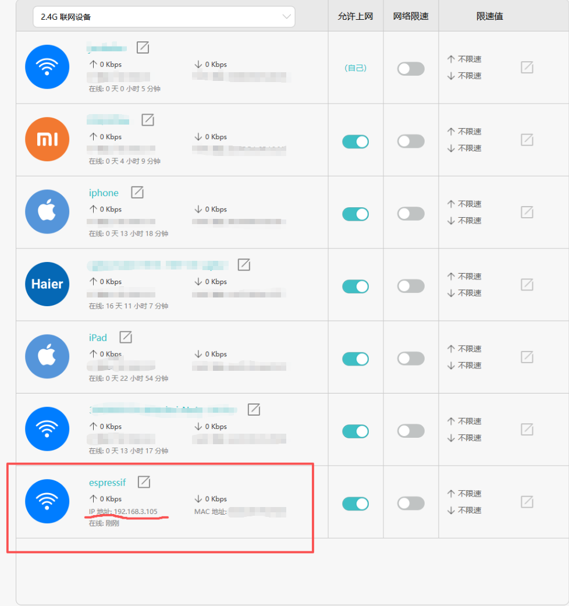
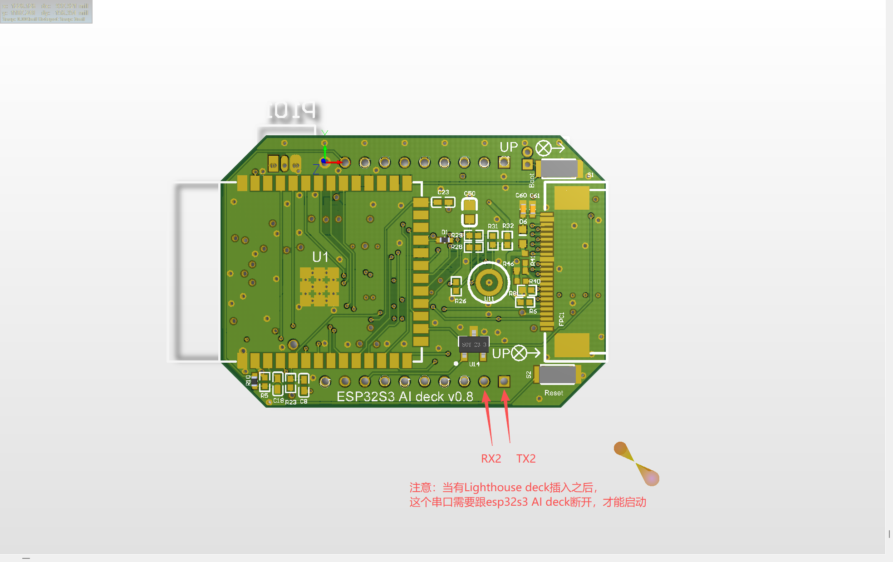

esp32s3 AI deck
================

.. contents:: 目录
    :depth: 3
    :local:

简介
----

esp32s3 AI deck support Crazyflie platform.

esp32s3 AI deck 支持 Crazyflie 飞行器平台。

Crazyflie 飞行器平台参考：`https://www.bitcraze.io/ <https://www.bitcraze.io/>`_

硬件: esp32s3 ai deck
---------------------

.. figure:: ../../../_static/images/esp32s3_ai_deck/esp32s3_camera_ov2640_speaker.png
   :align: center
   :figclass: align-center

硬件: esp32s3 ai deck + Crazyflie2.1
------------------------------------

硬件: 原理图 V0.8 -> V1.1
--------------------------

- 电源芯片 SY8088AAC 修改为 TPS63020DSJR。从锂电池供电并可升压到 5V，因此电池电压低至 3.3V 也可以工作。
- P2 连接器的 TX2 和 RX2 引脚，从 ESP32S3 TXD0/RXD0 修改为 GPIO2/GPIO3。
- U5 的 NS4150B 芯片供电，从 VBAT 修改为 VCC，USB 供电时也可测试喇叭。

原理图资料说明
~~~~~~~~~~~~~~

原理图资料目录位于 docs/source/_static/products/esp32s3_ai_deck。

- 最新版本：esp32s3_camera_mic_speaker_v1.1.pdf（推荐使用）
- 历史版本：esp32s3_camera_mic_speaker_v0.8.pdf（存在缺陷，仅供参考）

下载链接：

- `esp32s3_camera_mic_speaker_v1.1.pdf <../../../_static/products/esp32s3_ai_deck/esp32s3_camera_mic_speaker_v1.1.pdf>`_
- `esp32s3_camera_mic_speaker_v0.8.pdf <../../../_static/products/esp32s3_ai_deck/esp32s3_camera_mic_speaker_v0.8.pdf>`_

Demo 视频
---------

.. figure:: ../../../_static/images/esp32s3_ai_deck/esp32s3_camera_ov2640_allinone_test3.gif
   :align: center
   :figclass: align-center
   :alt: 视频预览

视频文件：`esp32s3_camera_ov2640_allinone_test4.mp4 <../../../_static/images/esp32s3_ai_deck/esp32s3_camera_ov2640_allinone_test4.mp4>`_

Windows 编译工具安装
---------------------

esp-idf-tools all:

- `https://dl.espressif.cn/dl/esp-idf/?idf=4.4 <https://dl.espressif.cn/dl/esp-idf/?idf=4.4>`_

esp-idf-tools-setup-offline-5.2.exe:

- `https://github.com/espressif/idf-installer/releases/download/offline-5.2/esp-idf-tools-setup-offline-5.2.exe <https://github.com/espressif/idf-installer/releases/download/offline-5.2/esp-idf-tools-setup-offline-5.2.exe>`_

esp-idf-tools-setup-offline-5.5.exe:

- `https://github.com/espressif/idf-installer/releases/download/offline-5.5/esp-idf-tools-setup-offline-5.5.exe <https://github.com/espressif/idf-installer/releases/download/offline-5.5/esp-idf-tools-setup-offline-5.5.exe>`_

esp32s3 接口
------------

.. figure:: ../../../_static/images/esp32s3_ai_deck/esp32s3_camera_ov2640_interface_top.png
   :align: center
   :figclass: align-center

代码示例
--------

esp32s3_ai_deck_allinone
~~~~~~~~~~~~~~~~~~~~~~~~

- support ov2640 camera stream to Web HTTP Server
- support sample microphone data then play speaker

esp32s3_camera_ov2640_stream
~~~~~~~~~~~~~~~~~~~~~~~~~~~~~

- support ov2640 camera stream to Web HTTP Server

esp32s3_audio_i2s_es8311
~~~~~~~~~~~~~~~~~~~~~~~~~

- support audio play music
- support sample microphone data then play speaker

默认 Wi-Fi 配置
---------------

.. code-block:: c

    #define WIFI_SSID "HUAWEI-yang"
    #define WIFI_PASS "justinlee"

Camera Frame Size 配置
----------------------

在 camera_config.h 中配置 ``.frame_size = FRAMESIZE_QVGA``，可以修改摄像头画面大小。

一般 ``FRAMESIZE_QVGA = 320x240`` 可达到约 25 到 30 FPS。

可选分辨率如下：

.. code-block:: c

    FRAMESIZE_96X96,     // 96x96
    FRAMESIZE_QQVGA,     // 160x120
    FRAMESIZE_128X128,   // 128x128
    FRAMESIZE_QCIF,      // 176x144
    FRAMESIZE_HQVGA,     // 240x176
    FRAMESIZE_240X240,   // 240x240
    FRAMESIZE_QVGA,      // 320x240
    FRAMESIZE_320X320,   // 320x320
    FRAMESIZE_CIF,       // 400x296
    FRAMESIZE_HVGA,      // 480x320
    FRAMESIZE_VGA,       // 640x480
    FRAMESIZE_SVGA,      // 800x600
    FRAMESIZE_XGA,       // 1024x768
    FRAMESIZE_HD,        // 1280x720
    FRAMESIZE_SXGA,      // 1280x1024
    FRAMESIZE_UXGA,      // 1600x1200
    // 3MP Sensors
    FRAMESIZE_FHD,       // 1920x1080
    FRAMESIZE_P_HD,      //  720x1280
    FRAMESIZE_P_3MP,     //  864x1536
    FRAMESIZE_QXGA,      // 2048x1536
    // 5MP Sensors
    FRAMESIZE_QHD,       // 2560x1440
    FRAMESIZE_WQXGA,     // 2560x1600
    FRAMESIZE_P_FHD,     // 1080x1920
    FRAMESIZE_QSXGA,     // 2560x1920
    FRAMESIZE_5MP,       // 2592x1944
    FRAMESIZE_INVALID

esp32s3 编译和下载命令
----------------------

.. code-block:: bash

    # create compile platform
    # 建立编译环境
    idf.py fullclean
    idf.py set-target esp32s3
    idf.py menuconfig
    idf.py build

    # push Boot button, hold it then push Reset button,
    # check the COM port and flash
    # 先按住 Boot 按键并保持，然后按下 Reset 按键，
    # 在设备管理器查看端口号后执行烧录
    idf.py -p COM6 flash

    # COM monitor 115200
    # 查看串口打印信息
    idf.py -p COM6 monitor

    # flash and UART monitor
    # 下载和串口监控同时执行
    idf.py -p COM6 flash monitor

esp32s3 Flash 下载工具
----------------------

- `https://docs.espressif.com/projects/esp-test-tools/en/latest/esp32s3/production_stage/tools/flash_download_tool.html <https://docs.espressif.com/projects/esp-test-tools/en/latest/esp32s3/production_stage/tools/flash_download_tool.html>`_

esp32s3_ai_deck_allinone: Camera Stream 到 Web HTTP Server
-----------------------------------------------------------

- From UART log, get the IP address, open a browser (recommend Chrome), enter the IP and press Enter.
- 从串口 log 中获取 IP 地址，打开浏览器（推荐 Chrome），输入 IP 地址并回车。

- 在浏览器输入 IP 地址后可以查看视频流，例如 192.168.3.106。

.. figure:: ../../../_static/images/esp32s3_ai_deck/esp32s3_camera_ov2640_allinone_test2.png
   :align: center
   :figclass: align-center

- 如果可以登录路由器，也可查看 esp32s3 ai deck 的 IP 地址。注意需使用 2.4G 频段，esp32s3 不支持 5G Wi-Fi 频段。

esp32s3 ai deck 和其他 deck 的兼容问题
--------------------------------------

当 Lighthouse deck 插入后，esp32s3 ai deck 的 TX2 和 RX2 接口需要与飞行器断开，才能启动。

esp32s3_ai_deck_allinone UART 日志
----------------------------------

.. code-block:: text

    E:\0_project\esp32s3_camera\code\esp32s3_ai_deck\esp32s3_ai_deck_allinone>idf.py -p COM81 flash
    Executing action: flash
    Running ninja in directory E:\0_project\esp32s3_camera\code\esp32s3_ai_deck\esp32s3_ai_deck_allinone\build
    Executing "ninja flash"...
    [1/5] C:\WINDOWS\system32\cmd.exe /C "cd /D E:\0_project\e...32s3_ai_deck_allinone/build/esp32s3_eye_ov2640_stream.bin"
    esp32s3_eye_ov2640_stream.bin binary size 0xe7a90 bytes. Smallest app partition is 0x100000 bytes. 0x18570 bytes (10%) free.
    [1/1] C:\WINDOWS\system32\cmd.exe /C "cd /D E:\0_project\e.../esp32s3_ai_deck_allinone/build/bootloader/bootloader.bin"
    Bootloader binary size 0x5260 bytes. 0x2da0 bytes (36%) free.
    [4/5] C:\WINDOWS\system32\cmd.exe /C "cd /D H:\esp32\Espre.../esp-idf-v5.5/components/esptool_py/run_serial_tool.cmake"
    esptool.py --chip esp32s3 -p COM81 -b 460800 --before=default_reset --after=hard_reset write_flash --flash_mode dio --flash_freq 80m --flash_size 2MB 0x0 bootloader/bootloader.bin 0x10000 esp32s3_eye_ov2640_stream.bin 0x8000 partition_table/partition-table.bin
    esptool.py v4.9.1
    Serial port COM81
    Connecting...
    Chip is ESP32-S3 (QFN56) (revision v0.2)
    Features: WiFi, BLE, Embedded PSRAM 8MB (AP_3v3)
    Crystal is 40MHz
    USB mode: USB-Serial/JTAG
    MAC: 30:ed:a0:1f:2f:d0
    Uploading stub...
    Running stub...
    Stub running...
    Changing baud rate to 460800
    Changed.
    Configuring flash size...
    Flash will be erased from 0x00000000 to 0x00005fff...
    Flash will be erased from 0x00010000 to 0x000f7fff...
    Flash will be erased from 0x00008000 to 0x00008fff...
    SHA digest in image updated
    Compressed 21088 bytes to 13422...
    Writing at 0x00000000... (100 %)
    Wrote 21088 bytes (13422 compressed) at 0x00000000 in 0.2 seconds (effective 774.1 kbit/s)...
    Hash of data verified.
    ...
    I (2275) esp_netif_handlers: sta ip: 192.168.3.106, mask: 255.255.255.0, gw: 192.168.3.1

Support this project
--------------------

If this repo helps your work, you can support development via GitHub Sponsors:

- `https://github.com/sponsors/bitdeckai <https://github.com/sponsors/bitdeckai>`_
