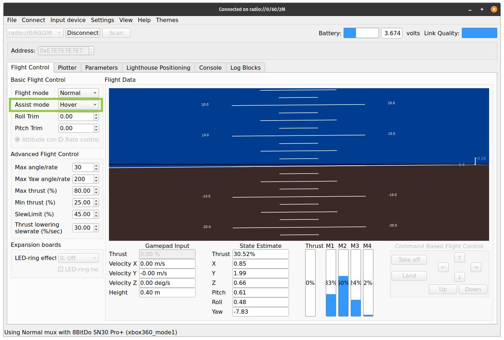
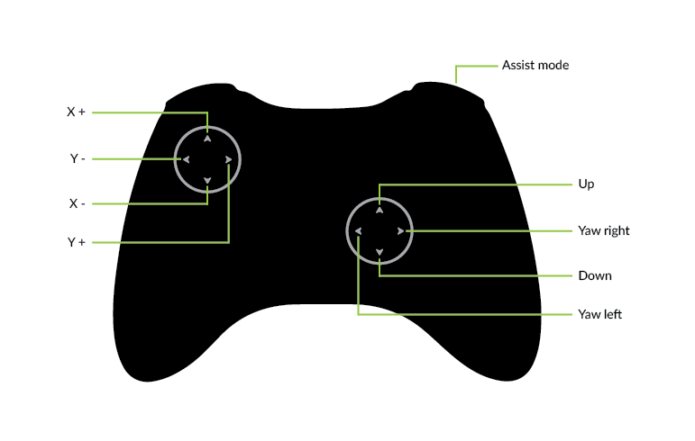
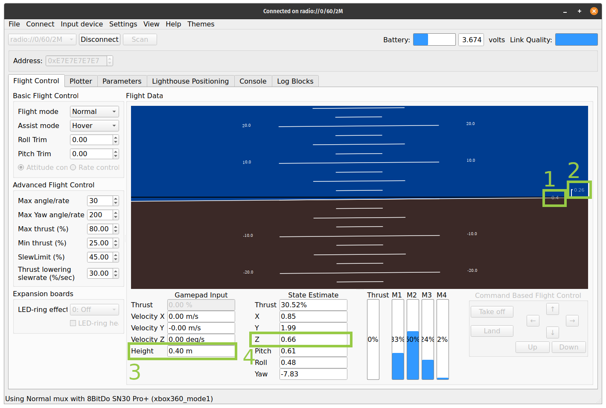
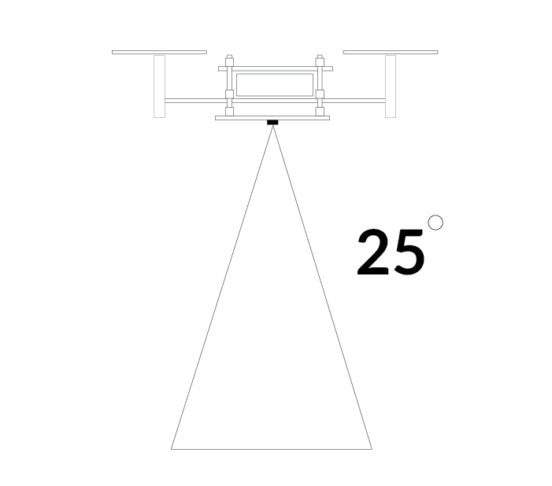

Flow2 deck
===============

Flow deck V2 让 Crazyflie 2.x 能够了解自己何时朝任何方向移动。借助 Flow 平台，Crazyflie 2.x 能够悬停并充当初学者的辅助工具，从而创建一个非常稳定的飞行平台。

有关如何安装扩展卡的更多信息，请参阅扩展卡入门教程。

为了能够使用Flow deck V2 您需要将 Crazyflie 更新到最新固件。有关如何更新固件的更多信息，请参阅我们的 Crazyflie 2.x 入门教程中Crazyflie 部分中的更新固件。您还需要最新版本的Crazyflie 客户端。

悬停模式
----------

使用Flow deck V2 您需要使用 Python 客户端并与您的 Crazyflie 建立连接。有关更多信息，请参阅Crazyflie 2.0 或 Crazyflie 2.1(+) 入门。

(1) 在客户端中，进入辅助模式并在下拉菜单中选择悬停模式。同时确保已配置辅助模式按钮。

(2) 将 Crazyflie 2.x 放置在有足够飞行空间的水平表面上。确保 Crazyflie 指向远离您的方向，蓝色 LED 位于背面，因此在开始飞行时请让它们指向您的方向。

(3) 按住游戏手柄上的辅助模式按钮以激活悬停模式。Crazyflie 现在将起飞并悬停在 40 厘米的高度。

(4) 现在，您可以使用 x/y 摇杆飞行，如下图所示。按 X+ 键将使 Crazyflie 沿系统的 X+ 轴移动，另一个轴也是如此。

(5) 您可以使用上下操纵杆来上下移动。高度限制在 0.2m 到 3.0m 范围内（Flow deck v1 / Z-ranger deck v1 为 1.0m）。如果您碰巧超过 1.0 米，crazyflie 可能会悬在那里而不会下降，在这种情况下，您可以使用上下操纵杆强制 Crazyflie 下降，或者释放辅助模式按钮手动接管。

(6) 如果出现失控情况，请松开操纵杆和辅助模式按钮，让 Crazyflie 坠落到地面。每次重新激活悬停模式时，高度设定点都会重置为 40 厘米。

用户界面指南
-----------------

以下是用户界面的简短说明。

(1) 设定点高度（米）
(2) 高度误差（以米为单位）。即设定点和测量高度之间的差异。
(3) 设定点高度（米）
(4) 测量高度（米）

测量详细信息
-----------------

当传感器测量到地面的距离时，它不会使用单个点。相反，检测将使用一个锥体（见下文），传感器将报告最近的检测。这意味着 Crazyflie 越高，检测区域就越大。例如，如果 Crazyflie 靠近墙壁，那么它可能是一个问题，那么它将报告到墙壁的距离而不是地板的距离。

flow2 deck 视频展示
-------------------

.. raw:: html

   

      <video width="100%" height="auto" controls autoplay muted loop>
         <source src="../../../_static/videos/flow2deck_the_flow2_deck_in_action.mp4" type="video/mp4">
         Your browser does not support the video tag.
      </video>
   

资料下载
--------

- `数据手册 <../../../_static/products/flow-deck-2/datasheet/flow_deck_2-datasheet.pdf>`_

- `原理图 <../../../_static/products/flow-deck-2/electronics/flow-deck-v2-reva.pdf>`_