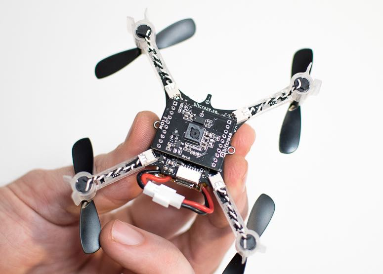
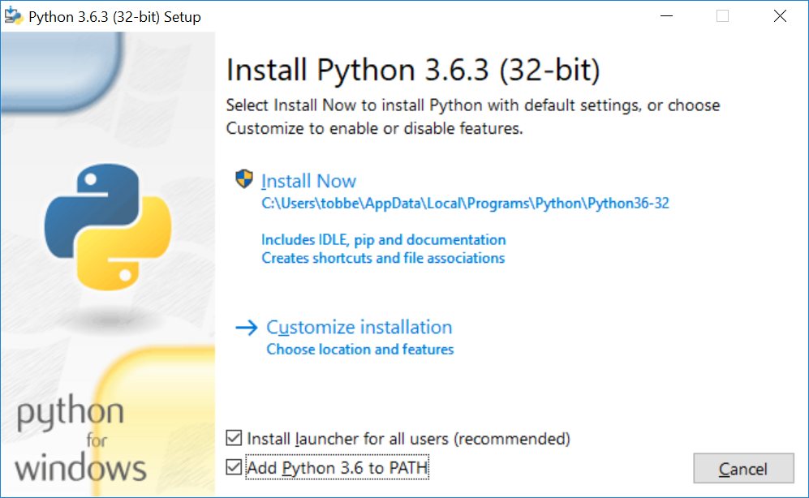
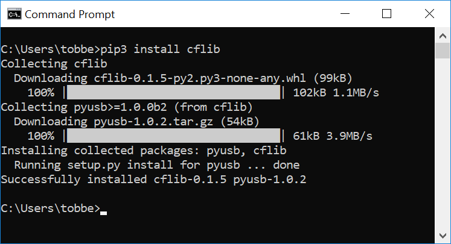

Flow deck v2 STEM
===========================

.. contents:: 目录
    :depth: 2
    :local:

STEM（科学技术工程数学）无人机套件基于 Crazyflie 2.x 和Flow deck V2 。它是一种自主无人机，可以通过简单的 Python 脚本进行控制，以在 3 维空间中探索和操作机器人。

本入门指南将帮助您设置系统并进行首次自主飞行。

硬件清单
--------

- 1 x Crazyflie 2.1
- 1 x Crazyradio 2.0 或 Crazyradio PA
- 1 x Flow V2 deck 

先决条件
--------

本入门指南假设您已经组装了 Crazyflie 2.x。如果不是这种情况，请按照Crazyflie 2.0 或 Crazyflie 2.1(+) 入门指南进行操作

本指南还要求您将 Crazyflie 更新到最新固件。有关如何更新固件的更多信息，请参阅Crazyflie 2.x 入门教程中Crazyflie 部分中的更新固件。

安装 Flow V2 deck
-----------------

安装Flow deck V2 使用 Crazyflie 2.x 套件附带的长针头将其放置在 Crazyflie 2.x 下方。

有关如何安装扩展卡的更多信息，请参阅扩展卡入门教程。

安装 Python 和 cflib
--------------------

Windows 安装
^^^^^^^^^^^^^^^

用于控制 Crazyflie 2.x 的后端库称为 cflib，用 python 3 编写。要使用它，您必须在计算机上安装 Pyhton 3，可以在此处下载。

使用标准设置安装 python，为了方便起见，勾选添加到 PATH 复选框。

安装 python 3 后，打开命令提示符并使用 pip 安装 cflib。

pip3 install cflib在命令提示符中输入

Ubuntu 安装
^^^^^^^^^^^^^^^

以下说明已在 Ubuntu 22.04 上测试过。

要安装 Python、pip 和 Crazyflie 库，请运行以下命令：

.. code-block:: bash

    sudo apt-get install python3 python3-pip idle3
    pip3 install cflib

您的用户需要访问 USB 设备才能使用 Crazyradio，请运行以下几行以授予访问权限。运行该命令后，需要再次插入 Crazyradio 以使规则生效。

.. code-block:: bash

    sudo groupadd plugdev
    sudo usermod -a -G plugdev $USER
    echo 'SUBSYSTEM=="usb", ATTRS{idVendor}=="1915", ATTRS{idProduct}=="7777", MODE="0664", GROUP="plugdev"' | sudo tee /etc/udev/rules.d/99-crazyradio.rules

运行你的第一个飞行脚本
--------------------------

现在，当所有设置和安装完成之后，启动 Python 编辑器 IDLE3。选择文件->新建并将下面的脚本复制/粘贴到新脚本中。使用合适的名称保存脚本。

.. code-block:: python

    """
    This script shows a simple scripted flight path using the MotionCommander class.

    Simple example that connects to the crazyflie at `URI` and runs a
    sequence. Change the URI variable to your Crazyflie configuration.
    """
    import logging
    import time

    import cflib.crtp
    from cflib.crazyflie.syncCrazyflie import SyncCrazyflie
    from cflib.positioning.motion_commander import MotionCommander

    URI = 'radio://0/80/250K'

    # Only output errors from the logging framework
    logging.basicConfig(level=logging.ERROR)

    if __name__ == '__main__':
        # Initialize the low-level drivers (don't list the debug drivers)
        cflib.crtp.init_drivers(enable_debug_driver=False)

        with SyncCrazyflie(URI) as scf:
            # Arm the Crazyflie
            scf.cf.platform.send_arming_request(True)
            time.sleep(1.0)

            # We take off when the commander is created
            with MotionCommander(scf) as mc:
                print('Taking off!')
                time.sleep(1)

                # There is a set of functions that move a specific distance
                # We can move in all directions
                print('Moving forward 0.5m')
                mc.forward(0.5)
                # Wait a bit
                time.sleep(1)

                print('Moving up 0.2m')
                mc.up(0.2)
                # Wait a bit
                time.sleep(1)

                print('Doing a 270deg circle');
                mc.circle_right(0.5, velocity=0.5, angle_degrees=270)

                print('Moving down 0.2m')
                mc.down(0.2)
                # Wait a bit
                time.sleep(1)

                print('Rolling left 0.2m at 0.6m/s')
                mc.left(0.2, velocity=0.6)
                # Wait a bit
                time.sleep(1)

                print('Moving forward 0.5m')
                mc.forward(0.5)

                # We land when the MotionCommander goes out of scope
                print('Landing!')

按 F5 运行脚本。

注意：如果您打开了 Python 客户端，请确保 Crazyflie 已与其断开连接。Crazyradio 不支持同时连接多个程序，如果 Crazyflie 仍连接到 Python 客户端，脚本将不起作用。

输出应与此类似。

.. code-block:: bash

    Connecting to radio://0/80/250K
    Connected to radio://0/80/250K
    Taking off!
    Moving forward 0.5m
    Moving up 0.2m
    Doing a 270deg circle
    Moving down 0.2m
    Rolling left 0.2m at 0.6m/s
    Moving forward 0.5m
    Landing!

视频展示
--------

.. raw:: html

   

      <video width="100%" height="auto" controls autoplay muted loop>
         <source src="../../../_static/videos/stem_drone_bundle.mp4" type="video/mp4">
         Your browser does not support the video tag.
      </video>
   
