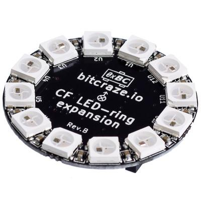

LED-ring deck
===============

.. contents:: 目录
    :depth: 4
    :local:

简介
-----

使用 Crazyflie 2.x LED 环扩展板，以自定义图案点亮黑暗。它配备 12 个朝下的强光 RGB LED 灯，您可以在固件中创建自定义图案，并通过电脑控制。另外两个可开启和关闭的强光前置 LED 灯，可用作前照灯。

注意：此平台默认与 Crazyflie 2.1 Brushless 不兼容。您需要进行软件修改。

特征
----

- DC-DC 升压/降压可提供稳定的 LED 灯，不受电池电压影响
- 使用 Crazyflie 2.X 固件创建自定义模式
- 12 个 RGB LED 模块朝下
- 2 个朝前的强光 LED
- 使用单线存储器自动检测扩展板

机械规格
--------

- 重量：3.3克
- 尺寸（宽x高x深）：33x33x5.5mm
- 设计用于朝下安装在 Crazyflie 下方

电气规格
--------

- DC-DC 升压/降压转换器可在 2-5.5V 输入下提供高达 1A 的电流，电压为 3.8V
- 12 个可独立寻址的 RGB LED 模块朝下（W2812B）
- 2 个朝前的强白光 LED，发光强度超过 1800 mcd
- 用于自动扩展板检测的 1-wire 存储器
- 典型功耗：330mA @ 5.0V 和 680mA @ 3.0V

使用方法
--------

可以从CFclient 的 Flight 选项卡中选择不同的 LED 模式。

一旦选择了正确的模式，就可以飞了！

.. raw:: html

   

      <video width="100%" height="auto" controls autoplay muted loop>
         <source src="../../../_static/videos/led_ring_deck/Bitcraze Move-in AW 2019 demo - Bitcraze (1080p, h264).mp4" type="video/mp4">
         Your browser does not support the video tag.
      </video>
   

资料下载
--------

- `led_ring_deck 数据手册 <../../../_static/products/led-ring-deck/datasheet/led_ring_deck-datasheet.pdf>`_

- `led_ring_deck 原理图 <../../../_static/products/led-ring-deck/electronics/led-ring_revb.pdf>`_
