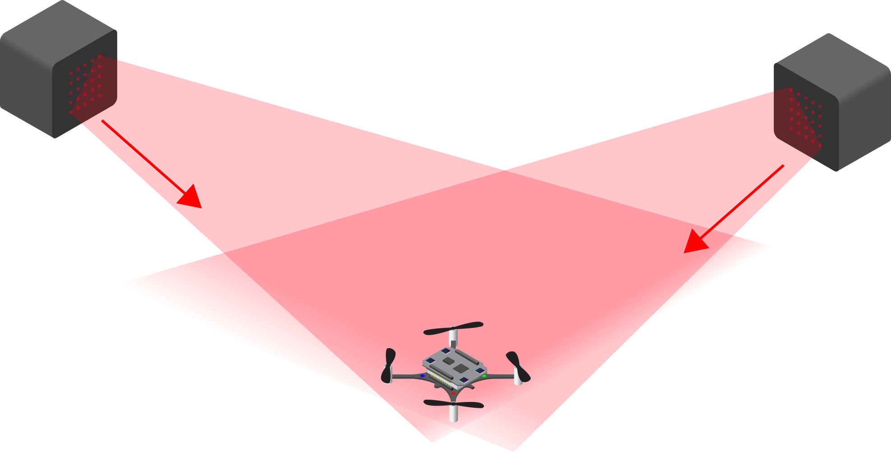
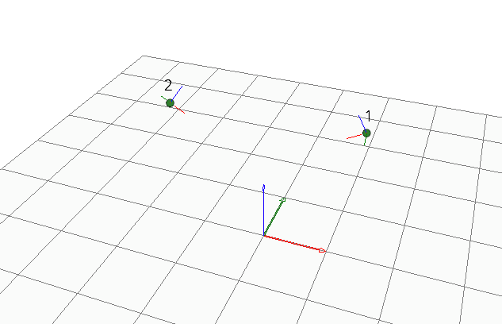

Lighthouse Deck
===============

灯塔定位系统是一种基于光学的定位系统，可以让物体在室内实现高精度自主定位。该系统能够实现接近动作捕捉系统的跟踪精度，但成本要低得多，而且具有一个重要优势：位置信息是在被跟踪设备上直接获取的，而不是在基础设施中获取。对于像 Crazyflie 这样的飞行机器人来说，这意味着位置信息可以直接用于自主飞行，无需通过无线电传输来获取低延迟的可靠位置数据。

Lighthouse 基站
----------------

该系统使用 SteamVR 基站作为光学信标，使 Crazyflie 能够计算其位置，精度优于分米级，可达到毫米级精度。

基站由旋转的光鼓组成，在房间内发射激光。Crazyflie 或任何需要定位的物体都有一个光接收器（光电二极管），用于接收旋转的激光，然后能够测量基站和接收器之间的角度。通过使用多个接收器，可以计算出物体相对于基站的位置和方向。如果我们知道基站的位置和方向，就最终可以确定 Crazyflie 的位置和方向。

V1 和 V2

灯塔定位系统使用灯塔基站作为信标。基站有两代产品，都受支持：V1 和 V2。

灯塔 V1 使用两个旋转光鼓，而灯塔 V2 只使用一个，但在同一个光鼓上有两个倾斜的光平面。灯塔 V1 系统最多可以使用 2 个基站，而灯塔 V2 系统设计上最多可支持 16 个基站。Crazyflie 固件目前标准支持最多 4 个基站，通过手动配置固件可以启用更多基站。

========  ===========  ===========  ================================
特性      灯塔 V1      灯塔 V2      备注
========  ===========  ===========  ================================
范围        ~6米        6米          V1范围取决于环境，V2设计范围为6米
定位频率  30Hz(2基站)  ~50Hz        V2频率与基站数量无关
基站数量   1-2         1-4          V2硬件最多支持16个，可在固件中配置
水平视角   120°        150°         -
垂直视角   120°        110°         -
========  ===========  ===========  ================================

.. raw:: html

   

      <video width="100%" height="auto" controls autoplay muted loop>
         <source src="../../../_static/videos/lh2_sweeps.mp4" type="video/mp4">
         Your browser does not support the video tag.
      </video>
   

   
系统几何结构
----------------

为了能够测量位置和方向，Crazyflie 需要知道灯塔基站在房间中的位置和方向，这被称为系统几何结构。几何结构可以由 Crazyflie 客户端自动获取并存储在 Crazyflie 中。它也可以保存到文件中，这样就可以将相同的几何信息写入多个 Crazyflie，从而实现在同一个跟踪空间中飞行多个 Crazyflie 集群。

   :align: center
   :alt: lighthouse 定位系统
   :figclass: align-center

系统性能
----------------
作为一个光学系统，灯塔定位系统要求 Crazyflie 与至少一个基站之间有直接的光学视线。范围和视场将决定可跟踪的空间。

由于灯塔定位扩展板的几何结构特点，在基站高度以下约 50 厘米的范围内，跟踪效果最佳。

在 5x5 米的空间内，我们测得相对精度优于毫米级，绝对精度优于分米级。这意味着返回起飞/降落板可以达到毫米级精度，但当飞到空间极端角落时，可能会有几厘米的偏差。

这是一个仅限室内使用的定位系统。它不适合在室外使用，而且由于使用红外光，直射阳光可能会对其性能产生负面影响。

系统组件
----------------
要使用灯塔定位系统，需要在所有需要被跟踪的 Crazyflie 2.1 和 Crazyflie 2.1+ 上安装灯塔定位扩展板。

房间内必须安装两个或更多的灯塔基站。