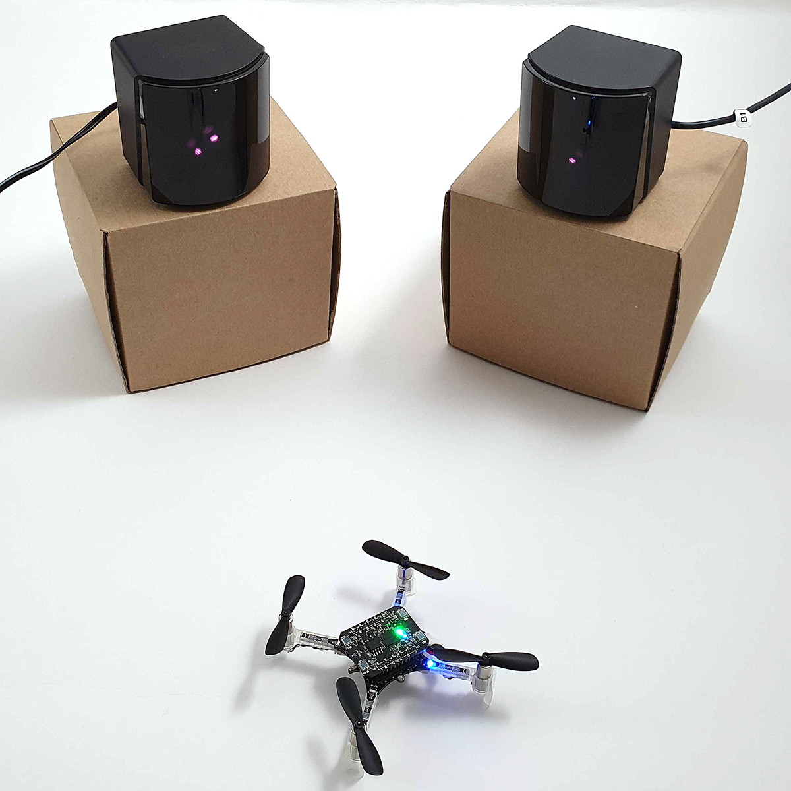
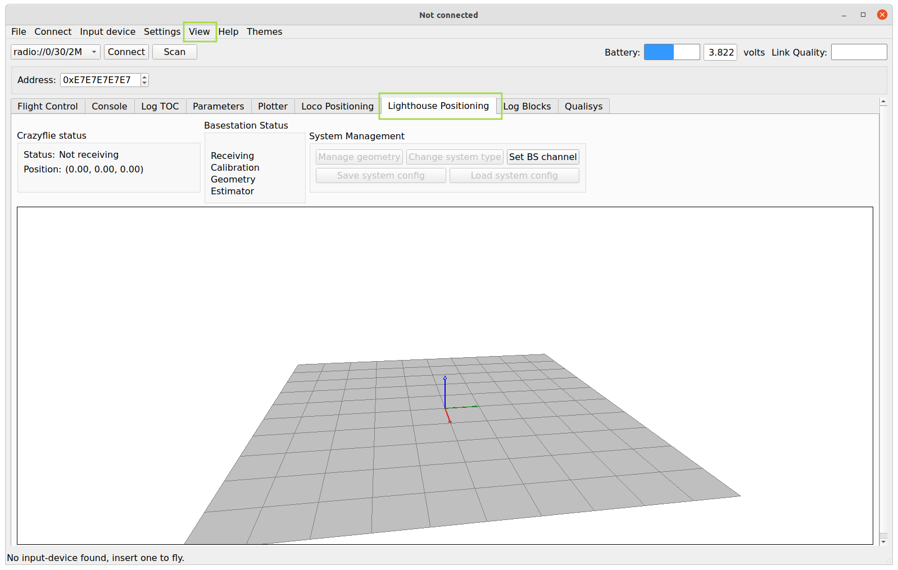
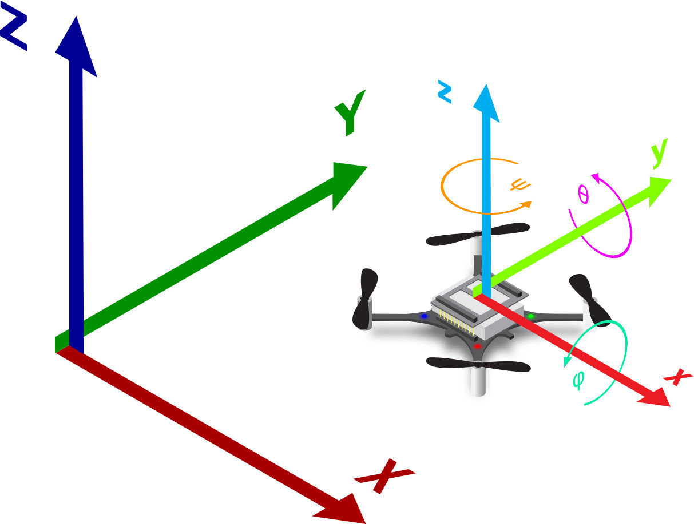
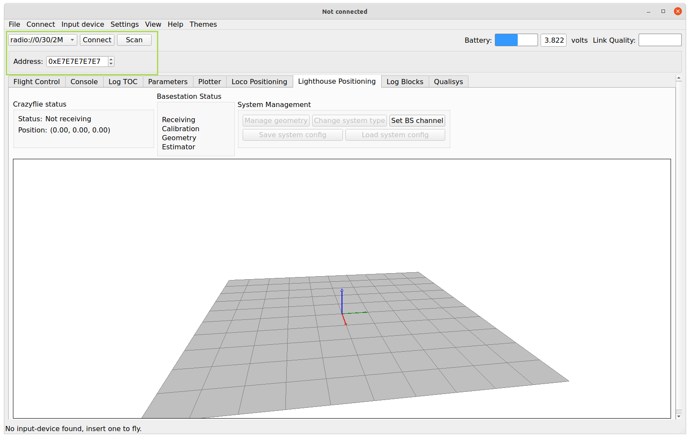
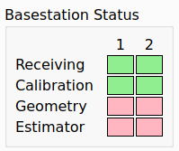
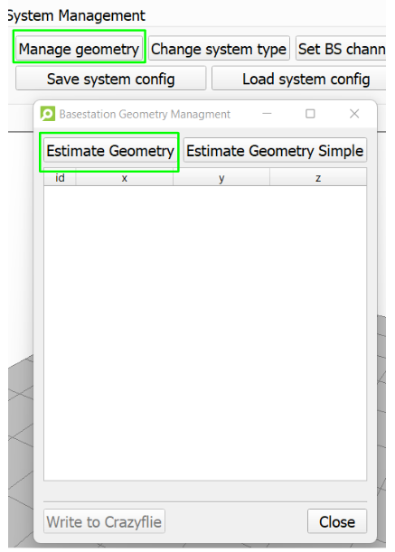
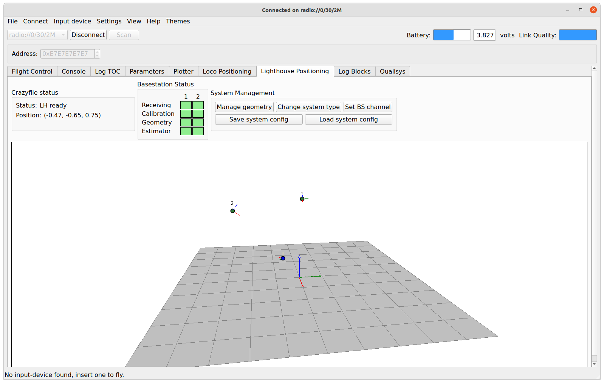
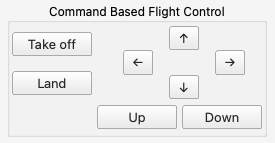

Lighthouse 入门指南
===================

灯塔定位系统是一种基于光学的定位系统，可以让物体在室内实现高精度自主定位。该系统能够实现接近动作捕捉系统的跟踪精度，但成本要低得多，而且具有一个重要优势：位置信息是在被跟踪设备上直接获取的，而不是在基础设施中获取。对于像 Crazyflie 这样的飞行机器人来说，这意味着位置信息可以直接用于自主飞行，无需通过无线电传输来获取低延迟的可靠位置数据。

硬件准备
-----------

请确保您已准备好以下硬件：

* 1 x Crazyflie 2.1+
* 1 x 灯塔定位扩展板
* 2-4个灯塔基站 V2.0（推荐）或 2 个灯塔基站 V1.0
* 1 x Crazyradio 2.0 或 Crazyradio PA

软件准备
-----------

请确保已安装以下软件：

* 最新版本的 `Crazyflie 客户端 <https://github.com/bitcraze/crazyflie-clients-python/releases>`__

准备 Crazyflie
--------------

首先，请确保 Crazyflie 和灯塔定位扩展板的固件都是最新的。

安装灯塔定位扩展板
^^^^^^^^^^^^^^^^^^

关于如何在 Crazyflie 上安装灯塔定位扩展板，请参考 `扩展板入门教程 <https://www.bitcraze.io/documentation/tutorials/getting-started-with-expansion-decks/>`_。在使用长引脚接头（公长扩展连接器）安装灯塔定位扩展板时要特别注意，确保它们不会阻挡基站的激光扫描，因为这可能会影响无人机的性能。

更新 Crazyflie 和灯塔定位扩展板固件
^^^^^^^^^^^^^^^^^^^^^^^^^^^^^^^^^^^

.. note::
   灯塔定位扩展板的固件会在通过客户端刷新 Crazyflie 固件时一同更新，刷新时必须安装扩展板。

.. note::
   客户端的刷新程序最近有所更改，如果您熟悉旧的程序，请查看最新文档。

请按照 `固件升级说明 <https://www.bitcraze.io/documentation/repository/crazyflie-clients-python/master/userguides/userguide_client/#firmware-upgrade>`_ 进行操作。

准备基站
-----------

在设置系统之前，您需要配置基站的通道（也称为模式）。V1 和 V2 基站的配置程序有所不同。

Linux 系统配置
^^^^^^^^^^^^^^^

确保有串口写入权限
"""""""""""""""""""

在 Linux 系统中，默认情况下非 root 用户没有串口的读写权限。因此，如果您使用的是 Linux 系统，需要确保您的用户具有正确的访问权限。这可以通过将用户添加到 dialout 组并重启来实现。在 Linux 中添加用户到组需要使用 usermod 命令，该命令需要 root 权限：

.. code-block:: bash

   $ sudo usermod -aG dialout [username]

请将上述命令中的 [username] 替换为您的用户名，运行命令后重启计算机，然后您就将拥有在 Linux 上写入串口的正确权限。

打开 Crazyflie 客户端
-----------------------

1. 启动 Crazyflie 客户端
2. 点击灯塔定位标签页

.. note::
   如果看不到灯塔定位标签页，请在菜单中选择：查看 -> 标签页 -> 灯塔定位标签页

配置基站通道（模式）
---------------------

在设置系统之前，您需要配置基站的通道（也称为模式）。V1 和 V2 基站的配置程序有所不同。

.. tabs::

   .. tab:: 灯塔 V2

      V2 基站通过 Crazyflie 客户端配置，两个基站的频道必须分别设置为 1 和 2。

      .. figure:: ../../../_static/images/tutorials/getting_started_with_lighthouse/two_basestations_back.jpg
         :align: center
         :alt: 灯塔定位标签页

      1. 使用电源适配器为其中一个基站供电，并通过 Micro-USB 线将其连接至电脑。
      
      2. 点击 Crazyflie 客户端中的 **Set BS Channel** 按钮，打开基站配置工具。
      
      3. 扫描基站并查看 **当前频道**。如果基站从未使用过，该值可能为 0。
      
      4. 在 **更改频道** 中输入目标频道（1 至 4），点击 **Set Channel** 按钮。每个基站应具有唯一频道。
      
      5. 在断开连接并重复另一基站配置前，请等待显示 **success!** 提示。

      .. figure:: ../../../_static/images/tutorials/getting_started_with_lighthouse/2a_client_basestation_dialog.png
         :align: center
         :alt: 基站配置对话框
      

   .. tab:: 灯塔 V1

      对于 V1 基站，需通过基站背面的小按钮切换模式：
      - 使用同步线时，模式应设为 'A' 和 'b'
      - 未使用同步线时，模式应设为 'b' 和 'c'

飞行区域设置基站
------------------

在基站的通道正确设置后，您可以通过墙壁支架或相机支架将它们安装在飞行区域。两个基站的最大飞行区域约为 4 x 4 x 2.0 米，但只要 Crazyflie 距离至少一个基站不超过 6 米，就应该可以正常工作。请注意，灯塔传感器安装在灯塔定位扩展板的顶部，基站必须位于 Crazyflie 之上才能接收到信号。

请确保您的飞行区域满足以下条件：

* 基站应至少比 Crazyflie 的飞行区域高出 40 厘米，原因是灯塔定位扩展板上传感器的放置。
* 确保区域内没有镜子或大型反射物体。
* 确保没有直射阳光。

      .. figure:: ../../../_static/images/tutorials/getting_started_with_lighthouse/setup_arena.png
         :align: center
         :alt: 设置飞行区域

准备系统
--------

这将解释如何获取校准和几何数据，并设置您的 Crazyflie 以在灯塔定位系统中飞行。
  

坐标系统的原点
^^^^^^^^^^^^^^^^^^^

将带有灯塔定位扩展板的 Crazyflie 放置在您希望作为全局坐标系统原点的地面上。请查看《Crazyflie 2.x 的坐标系统》。

Crazyflie 2.x 系列中使用的坐标系统。全局坐标系统 (X, Y, Z) 采用东-北-上 (ENU) 约定，固定在机体上的（局部）坐标系统 (x, y, z) 也是如此。姿态角滚转、俯仰和偏航 (φ, θ, ψ) 的旋转规则如下：

* 滚转和偏航是顺时针围绕轴旋转，从原点看（右手法则）。
* 俯仰是逆时针围绕轴旋转，从原点看（左手法则）。

连接到 Crazyflie 客户端
^^^^^^^^^^^^^^^^^^^^^^^^

打开 CF 客户端并连接到 Crazyflie 2.x。

如果尚未完成，请将 Crazyflie 2.x 配置为 2Mbit 无线电模式。

选择系统类型
^^^^^^^^^^^^

Crazyflie 需要知道使用的基站类型，以便能够正确解码激光扫描。

点击“更改系统类型”按钮，选择适合您系统的类型。系统类型将存储在 Crazyflie 中，并将在下次启动时使用。

等待基站的校准
^^^^^^^^^^^^^^

确保 Crazyflie 正在接收两个基站的激光扫描角度，并已接收到校准数据。

对于校准数据，您可能需要等待 20 秒。

估算几何结构
^^^^^^^^^^^^

一旦您接收到校准数据，就可以估算基站的位置。

1. 通过按下“管理几何结构”打开基站几何管理对话框。

2. 在对话框中，按下“估算几何结构”（而不是“简单管理几何结构”）。请按照向导的指示进行几何结构的估算。

3. 如果几何结构合理，请按“写入 Crazyflie”，否则请移动您的 Crazyflie 并再次按“估算几何结构”。

这里还有一个视频，演示了几何估算的过程，以防您迷路或没有得到好的结果：

.. raw:: html

   

      <video width="100%" height="auto" controls autoplay muted loop>
         <source src="../../../_static/videos/base_station_wizard_tutorial.mp4" type="video/mp4">
         Your browser does not support the video tag.
      </video>
   

检查定位
^^^^^^^^

灯塔定位扩展板的 LED 现在应该是全绿的，您应该能够看到基站及其通道的可视化，以及 Crazyflie 本身作为一个蓝点。

通过在手中移动 Crazyflie 来进行位置估算的合理性检查。

测试飞行
^^^^^^^^^^

现在系统已经设置好，让我们进行一次简短的测试飞行！

切换到飞行控制标签
^^^^^^^^^^^^^^^^^^^

在 Crazyflie 客户端中点击“飞行控制”标签。

找到控制按钮
^^^^^^^^^^^^^

在右下角，您将找到用于简单命令飞行的按钮。

起飞并飞行
^^^^^^^^^^^

点击“起飞(Takeoff)”按钮开始飞行，并使用其他控制按钮进行移动。

灯塔系统支持超过 4 个基站
^^^^^^^^^^^^^^^^^^^^^^^^^^

使用 V2.0 基站，可以飞行超过 4 个基站，但需要对 Crazyflie 的固件进行更改。请查看配置固件以接受超过 4 个灯塔基站的说明。

我们已经测试了 4 个灯塔基站，覆盖约 8x8x3 米的飞行空间。软件支持最多 16 个基站，这应该使得可以添加更多基站以覆盖多个房间，甚至更大的飞行空间，但这在很大程度上是未经测试的实验功能。请注意，灯塔扩展板一次只能与最多 4 个可见基站一起工作，如果使用超过 4 个基站，它们必须以满足此条件的方式进行设置。

固件默认编译时支持 4 个基站。本指南将概述设置更大系统所需的步骤。请首先查阅我们网站上的“灯塔系统入门指南”，以便对基本使用有一个良好的理解。

1. 确保所有基站都有唯一的通道，如 1、2、3、4、5 等。使用 Python 客户端中灯塔标签的“Set BS channel”按钮来完成此任务。

2. 在放置灯塔基站时，确保它们必须重叠，但避免在一个位置放置过多基站。灯塔扩展板无法同时处理超过 4 个可见基站。

3. 重新刷新 Crazyflie，以支持更多基站。运行 `make menuconfig` 并进入扩展板配置菜单，将最大基站数量设置为所需值。注意：更多基站会使用更多的 RAM。构建代码并将其刷新到 Crazyflie，查看此仓库中的文档以获取构建和刷新说明。