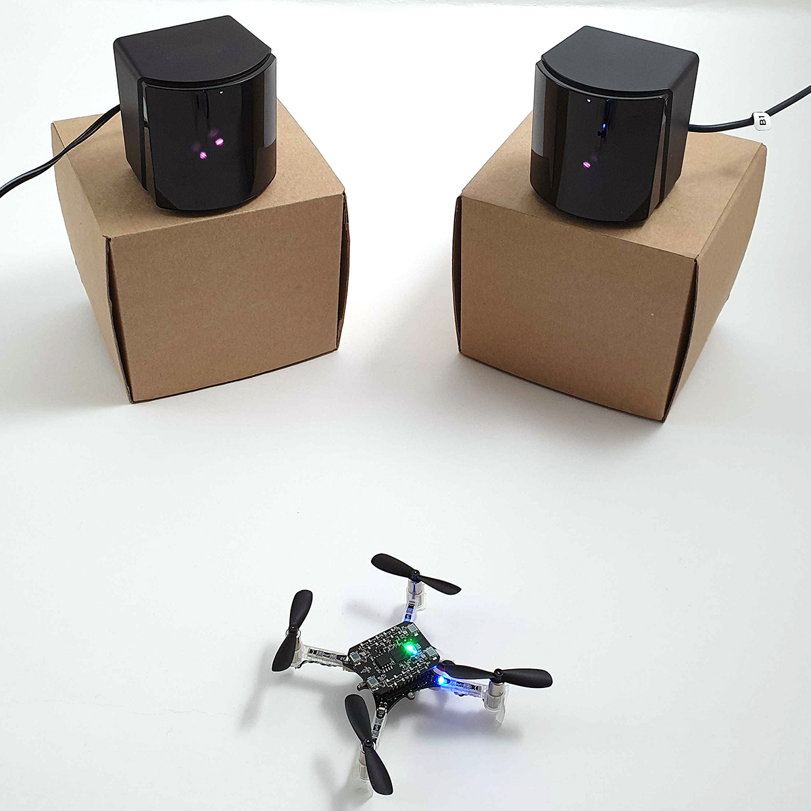
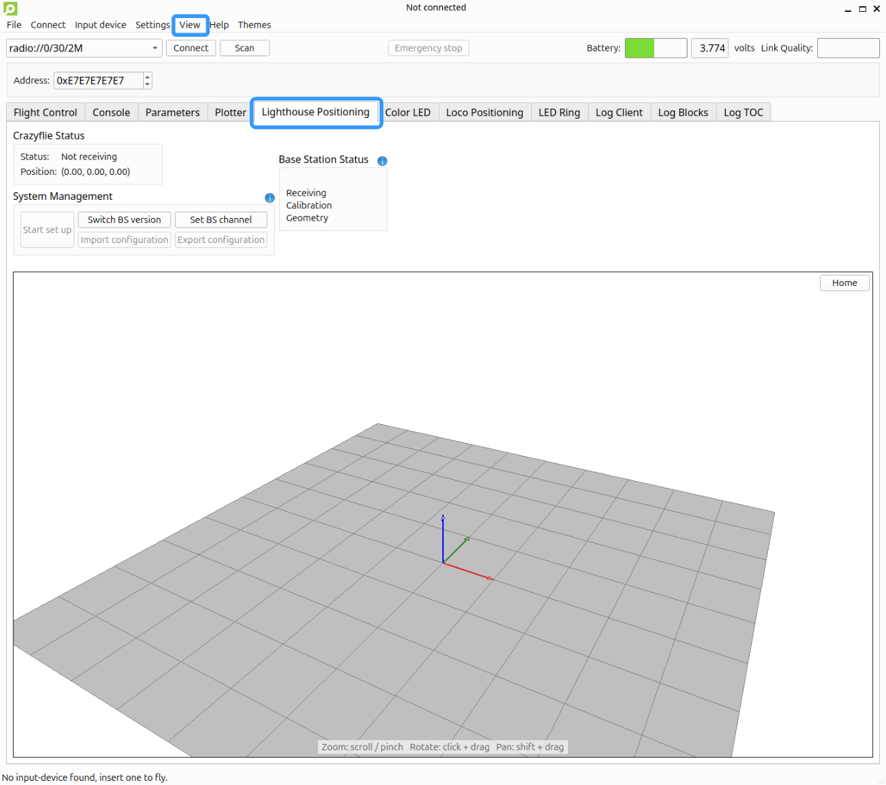
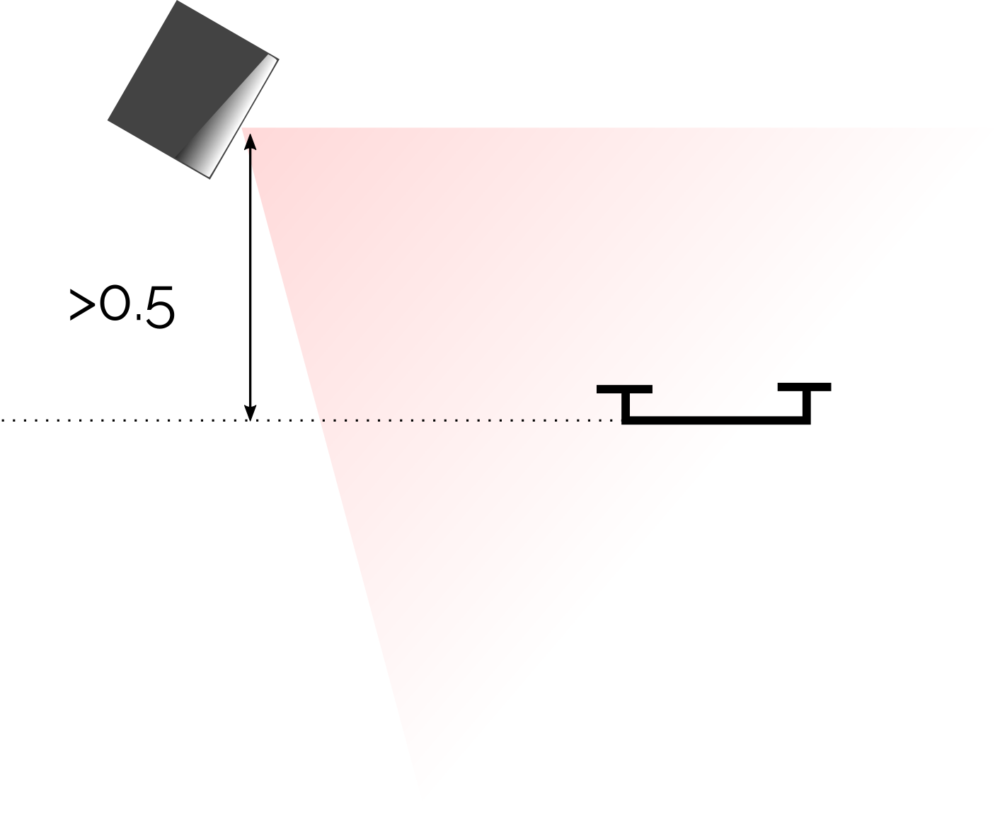
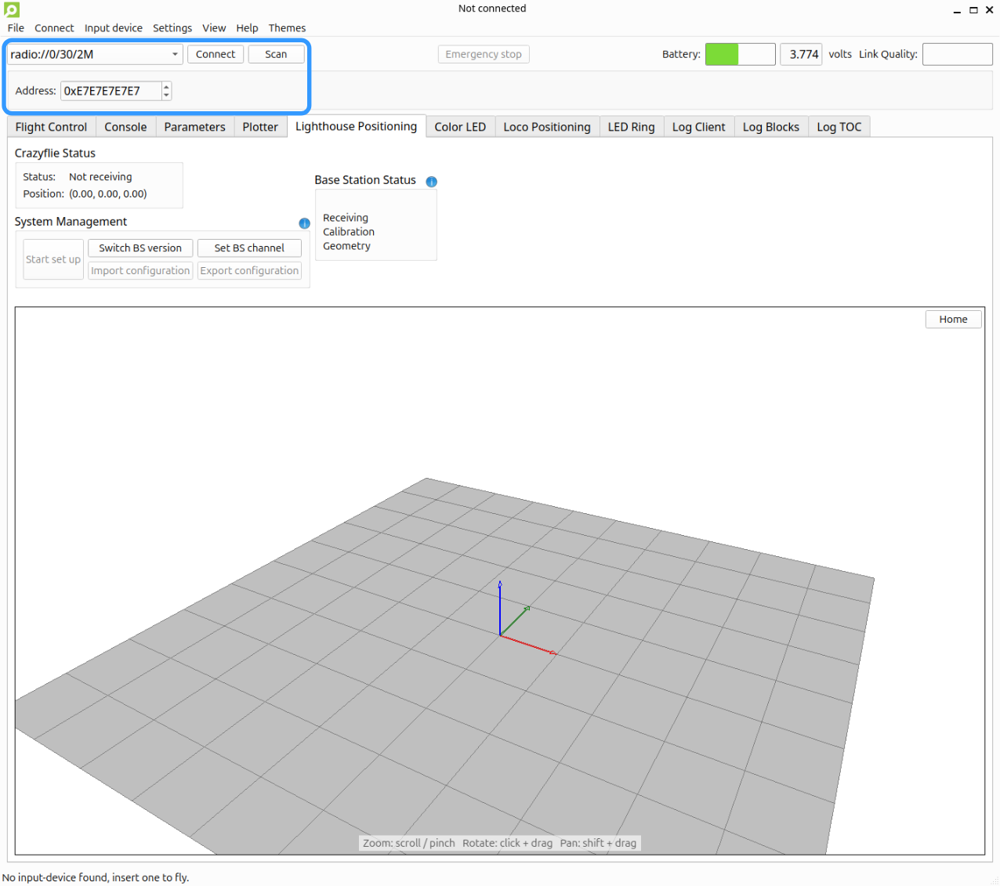
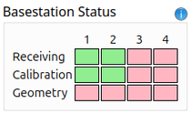
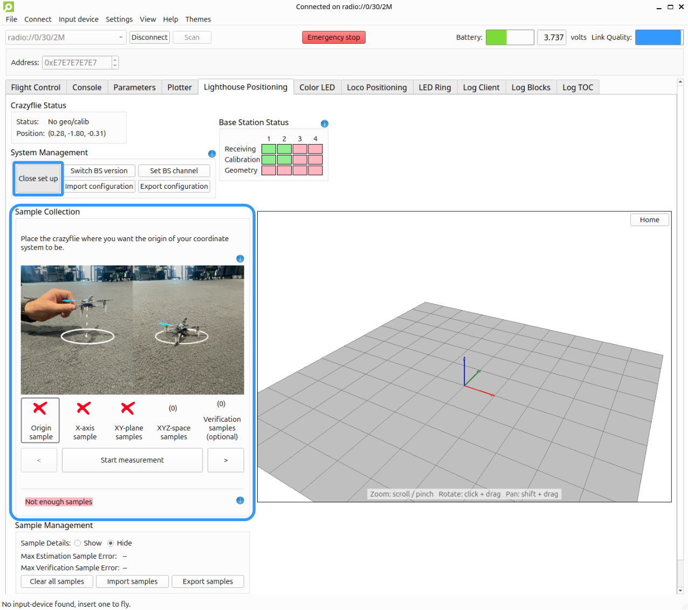
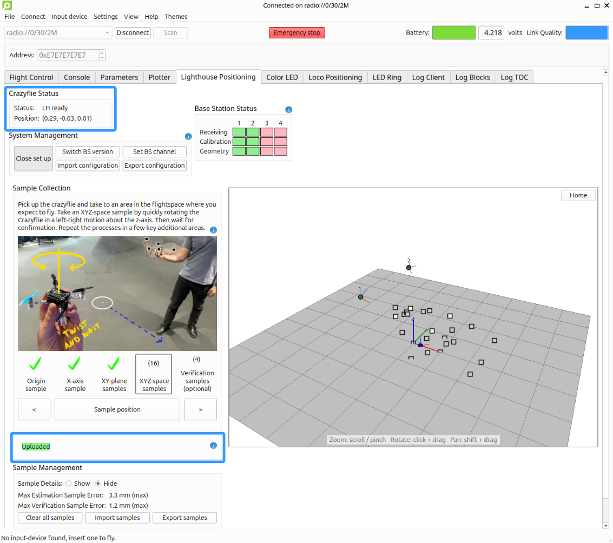
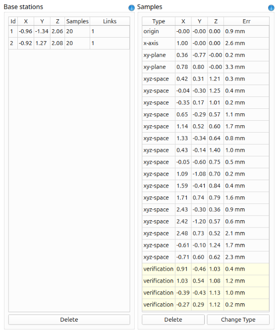
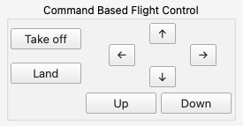

Lighthouse 入门指南 2608 Release
========================================

.. contents:: 目录
   :depth: 2
   :local:

灯塔定位系统使用 Valve 公司推出的 SteamVR 基站，以及安装在 Crazyflie 上的 Lighthouse 定位扩展板。该系统使 Crazyflie 能够在全局坐标系中估算自身位置和姿态。

引言
----

灯塔定位系统是一种基于光学的室内定位方案。它可以实现接近动作捕捉系统的跟踪精度，同时成本更低，并且关键优势在于：定位数据是在被跟踪设备本身上直接计算的，而不需要依赖基础设施来提供位置估计。对 Crazyflie 这样的飞行机器人来说，这意味着它能够直接使用实时位姿进行自主飞行，而无需通过无线连接获取低延迟可靠的位置信息。

视频教程
--------

本教程也有对应视频版本。页面上的文字教程内容更详细。如果在操作中遇到问题，或者想了解完整流程，建议同时参考视频与文本说明。

.. raw:: html

   

      <video width="100%" height="auto" controls autoplay muted loop>
         <source src="../../../_static/videos/base_station_wizard_tutorial_2608.mp4" type="video/mp4">
         Your browser does not support the video tag.
      </video>
   

硬件准备
--------

请确认你已经准备好以下设备：

* 一台 Crazyflie2.1 平台（https://www.bitcraze.io/documentation/system/platform/#family-tree）
* 一块 Lighthouse 定位扩展板（https://www.bitcraze.io/products/lighthouse-positioning-deck/）
* 2~4 个 Lighthouse V2.0 基站（推荐，https://store.bitcraze.io/products/lighthouse-v2-base-station），或 2 个 Lighthouse V1.0 基站
* 一个 Crazyradio PA/Crazyradio 2.0（https://www.bitcraze.io/products/crazyradio-2-0/）或 Crazyradio PA（https://www.bitcraze.io/products/crazyradio-pa/）

软件准备
--------

请确认已安装最新版本的 `Crazyflie 客户端 <https://github.com/bitcraze/crazyflie-clients-python/releases>`_，并按照 `安装说明 <https://www.bitcraze.io/documentation/repository/crazyflie-clients-python/master/installation/install/>`_ 完成安装。

准备 Crazyflie
--------------

首先请确认 Crazyflie 和 Lighthouse 扩展板的固件都是最新版本。

安装 Lighthouse 扩展板
^^^^^^^^^^^^^^^^^^^^^^

如果你需要在 Crazyflie 上安装 Lighthouse 定位扩展板，请参考 `扩展板入门教程 <https://www.bitcraze.io/documentation/tutorials/getting-started-with-expansion-decks/>`_。在使用长引脚（公长扩展连接器）安装扩展板时，需要特别注意：确保长引脚不会挡住基站激光扫描到传感器的路径，否则可能影响无人机性能。

更新 Crazyflie 与 Lighthouse 扩展板固件
^^^^^^^^^^^^^^^^^^^^^^^^^^^^^^^^^^^^^^^^^

.. note::
   当从客户端刷写 Crazyflie 固件时，Lighthouse 扩展板固件会一并更新。刷写过程中，扩展板必须安装在 Crazyflie 上。

请按照 `固件升级说明 <https://www.bitcraze.io/documentation/repository/crazyflie-clients-python/master/userguides/userguide_client/#firmware-upgrade>`_ 进行操作。

准备基站
--------

在建立系统之前，需要先配置基站的通道（也称为模式）。V1 和 V2 基站的配置方式略有不同。

确保你有串口写权限
^^^^^^^^^^^^^^^^^^

在 Linux 上，非 root 用户通常默认不能访问串口设备。如果你使用的是 Linux 系统，需要确认当前用户拥有必要权限。可以通过把当前用户加入 `dialout` 组并重启电脑来实现。添加用户到组需要使用 `usermod` 命令，该命令需要 root 权限：

.. code-block:: bash

   $ sudo usermod -aG dialout [username]

将上面 `[username]` 替换为你自己的用户名。运行后重启电脑，你就会拥有串口写权限。

打开 Crazyflie 客户端并查看 Lighthouse 标签页
^^^^^^^^^^^^^^^^^^^^^^^^^^^^^^^^^^^^^^^^^^^^^^^^^

你可以在菜单中选择：查看 -> 标签页 -> Lighthouse Positioning 来打开 Lighthouse 标签页。

配置基站通道
^^^^^^^^^^^^

.. tabs::

   .. tab:: Lighthouse V2

      V2 基站通过 Crazyflie 客户端进行配置。每个基站的通道必须设置为 1 到支持数量之间的唯一值。

      .. figure:: ../../../_static/images/tutorials/getting_started_with_lighthouse_2608/two_basestations_back.jpg
         :align: center
         :alt: V2 基站

      按照以下步骤对每个基站进行设置：

      1. 给其中一个基站接通电源，并用 Micro-USB 线将其连接到电脑。
      2. 在 Crazyflie 客户端的 Lighthouse 标签中点击 **Set BS Channel**，打开基站配置工具。
      3. 扫描基站并查看 **Current channel**。如果这是新基站，值可能是 0。
      4. 在 **Change Channel** 中输入目标通道（通常是 1 到 4），然后点击 **Set Channel**。每个基站都应设置为唯一通道。
      5. 等待出现 **success!** 提示后再断开连接，并重复以上步骤设置下一台基站。

      .. figure:: ../../../_static/images/tutorials/getting_started_with_lighthouse_2608/2a_client_basestation_dialog_2608.png
         :align: center
         :alt: 基站配置对话框

   .. tab:: Lighthouse V1

      对于 V1 基站，需要通过基站背面的按钮切换模式。

      * 使用同步线时，模式应设置为 'A' 和 'b'
      * 不使用同步线时，模式应设置为 'b' 和 'c'

在飞行区域中放置基站
^^^^^^^^^^^^^^^^^^^^

在正确设置基站通道后，可以使用墙壁支架或三脚架将它们安装到飞行区域中。每个基站只需要电源，USB 连接不是必须的。两台基站构成的最大飞行区域约为 4 x 4 x 2 米，但只要 Crazyflie 与至少一台基站的距离不超过 6 米，就能接收到定位数据。需要注意的是，Lighthouse 传感器安装在 Lighthouse 定位扩展板的顶部，因此基站必须位于 Crazyflie 上方才能被接收。

请确保飞行区域满足以下条件：

* 基站应至少高出 Crazyflie 预计飞行区域 50 厘米以上。
* 移除区域内的镜子和大型反射物体。
* 避免直射阳光。
* 确保整个飞行区域内基站与 Crazyflie 有清晰视线。

准备系统
--------

这一节说明如何采集校准和几何数据，并配置 Crazyflie，使其能在 Lighthouse 定位系统中飞行。

连接到 Crazyflie 客户端
^^^^^^^^^^^^^^^^^^^^^^^

打开 CF 客户端并连接到 Crazyflie。

选择系统类型
^^^^^^^^^^^^

Crazyflie 需要知道使用的是哪种类型的基站，才能正确解码光扫描信号。

点击 **Switch BS version** 按钮，然后选择适合你当前系统的版本。这个设置会存储在 Crazyflie 中，并在下一次启动时自动使用。

等待基站校准
^^^^^^^^^^^^^

将 Crazyflie 放置在飞行区域中，并确保它对所有基站都有清晰视线。等待大约 20 秒，让校准数据被接收。

估算几何结构
^^^^^^^^^^^^

一旦收到校准数据，就可以开始估算基站的位置。几何估算过程需要采集一系列样本，最终生成一个配置文件，并存储在 Crazyflie 中，用于估计其位置。

1. 在 **System Management** 区域中点击 **Start set up**，展开设置部分。
2. 按照 **Sample Collection** 部分的步骤收集估算样本，以及可选的验证样本。使用左右箭头按钮在不同步骤之间切换。

采样步骤说明：

* **Origin sample**：将 Crazyflie 放到你希望作为坐标系原点的位置，然后按 **Start measurement**。
* **X-axis sample**：将 Crazyflie 放到沿正 X 轴方向 1 米的位置，然后按 **Start measurement**。
* **XY-plane samples**：将 Crazyflie 放到 XY 平面上（地面位置，不要沿 X 轴），然后按 **Start measurement**。可以重复多次，以获得更精确的近似结果。
* **XYZ-space samples**：将 Crazyflie 移动到飞行空间中的某一位置。记录样本时，快速绕 Z 轴左右旋转，然后保持静止直到确认。也可以在保持静止时点击 **Sample Position** 按钮。
* **Verification samples (optional)**：这些样本不会参与几何估算，但可用于检查估算样本之间区域的精度。如果验证样本误差较大，可在该位置附近增加更多 XYZ 空间样本后重新估算几何结构。

几何结构会自动估算并上传到 Crazyflie。当状态标签变为绿色并显示 **Uploaded** 时，表示完成。

检查定位
^^^^^^^^

现在扩展板上的 LED 应该已经变绿，3D 可视化界面中应该能够看到基站及其通道，以及 Crazyflie 作为蓝点显示。

将 Crazyflie 放置到不同位置进行位置估计的 sanity check。估计位置应保持相对稳定，不应出现异常漂移或跳跃。

Sample details
^^^^^^^^^^^^^^

这部分适合希望查看并进一步优化几何配置的用户，而不必重做整个估算过程。

在 **Sample Management** 区域中选择 **Show** 后，会显示 **Base stations** 和 **Samples** 两张表格。

* **Base stations** 表格显示每个基站的估计位置，以及它连接到其它基站的样本数量。最低要求是每个基站至少与一个其他基站有连接；连接越多，系统越稳健。
* **Samples** 表格列出所有采集到的样本（包括估算样本和验证样本）及其误差。误差衡量的是在该采样位置，多个基站对 Crazyflie 位置估计的一致程度：误差低说明几何结构拟合良好，误差高（大于 10 mm）说明基站之间存在明显分歧。

建议：

* 对于误差高的估算样本，最有效的修正方法是删除该样本。
* 对于误差高的验证样本，建议在该区域附近增加更多 XYZ 空间样本，并重新估算几何结构。验证误差能更真实地反映实际定位精度，因为这些位置通常未参与几何估算。

有关每个按钮的完整说明，请参考 `cfclient Lighthouse 标签页用户指南 <https://www.bitcraze.io/documentation/repository/crazyflie-clients-python/master/userguides/userguide_client/lighthouse_tab/>`_。

测试飞行
--------

现在系统已经设置完成，让我们做一次简短的测试飞行。

切换到飞行控制标签
^^^^^^^^^^^^^^^^^^

在 Crazyflie 客户端中点击 **Flight control** 标签。

找到控制按钮
^^^^^^^^^^^^^

在右下角，你会看到用于简单命令式飞行的按钮。

起飞并飞行
^^^^^^^^^^

点击 **Take off** 按钮开始飞行，并使用其他控制按钮进行移动。

下一步
------

* 对于 V2.0 基站，可以用超过 4 个基站，但需要修改 Crazyflie 固件。请参考 `配置固件以支持超过 4 个 Lighthouse 基站的说明 <https://www.bitcraze.io/documentation/repository/crazyflie-firmware/master/functional-areas/lighthouse/multi_base_stations/>`_。
* 详细了解 Lighthouse 标签页中每个按钮的含义，可参考 `cfclient Lighthouse 标签页用户指南 <https://www.bitcraze.io/documentation/repository/crazyflie-clients-python/master/userguides/userguide_client/lighthouse_tab/>`_。
* 更深入理解 Lighthouse 定位系统理论和高级指南，请参考 `Lighthouse 系统文档 <https://www.bitcraze.io/documentation/repository/crazyflie-firmware/master/functional-areas/lighthouse/>`_。