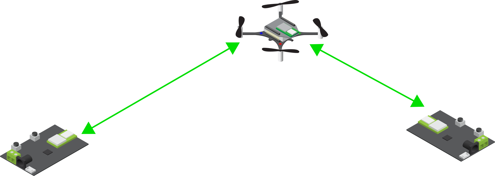

Loco deck
===============

.. contents:: 目录
    :depth: 2
    :local:
    
Loco 定位系统是一种基于超宽带无线电的本地定位系统，用于查找空间中物体的绝对 3D 位置。它在许多方面类似于微型 GPS 系统。

锚点和标签
----------

该系统的基础是一组放置在房间内的锚点（相当于 GPS 中的卫星），它们是参考点。该系统的另一部分是一个或多个标签（相当于 GPS 接收器），它们固定在要跟踪的物体上。通过在锚点和标签之间发送短高频无线电消息，系统可以测量每个锚点到标签的距离，并根据该信息计算标签的位置。

标签中包含计算位置所需的所有信息，这使得 Crazyflie 能够在机上进行位置估算，而许多其他定位系统则在外部计算机中计算位置并将其发送到 Crazyflie。

通过为 Crazyflie 2.x 添加位置信息，它能够自主飞行而无需手动控制。这开启了一系列令人兴奋的用例和应用。

定位模式
----------

Loco 定位系统实现三种不同的定位模式，双向测距 (TWR)、到达时间差 2 (TDoA 2)和到达时间差 3 (TDoA 3)。

在TWR 模式下，标签会按顺序 ping 锚点，这样它就可以测量标签与锚点之间的距离。使用此信息，理论上至少需要 4 个锚点才能计算标签的 3D 位置，但更现实的数字是 6 个，以增加冗余度和准确性。

此模式是最准确的模式，当标签或 Crazyflie 离开锚点界定的空间时也能正常工作。标签以时隙方式主动与锚点通信，在此模式下，只能定位一个标签或 Crazyflie，最多可定位 8 个锚点。

在TDoA 2 模式下，锚点系统会持续发送同步数据包。监听这些数据包的标签可以通过测量数据包到达的时间差来计算与两个锚点的相对距离。根据 TDoA 信息，可以计算空间中的 3D 位置。在此模式下，标签只是被动监听，因此新标签不会给系统增加任何负载，这使得可以同时定位任意数量的标签或 Crazyflies。这使其成为群集的理想模式。

与 TWR 相比，TDoA 2 在定位工作空间方面限制更多，理想情况下，标签应始终位于锚点系统界定的空间内或非常接近该空间。这意味着 TDoA 2 在飞行空间角落放置 8 个锚点时效果最佳。在这个空间中，准确度和精确度与 TWR 相当。

在此模式下，锚点系统是时隙化和同步的，锚点数量限制为 8 个。

TDoA 3 模式与 TDoA 2 有许多相似之处，支持任意数量的标签或 Crazyflies。主要区别在于 TDoA 2 的时隙方案已被随机传输计划所取代，这使得添加更多锚点成为可能。通过添加更多锚点，系统可以扩展到更大的空间或跨越多个房间，而所有锚点之间没有视线。这也使其更加强大，可以动态处理锚点的丢失或添加。

长距离模式
----------

TDoA3 可用于长距离模式。长距离模式下比特率会降低，从而增加范围，但不幸的是，这也会使位置更加嘈杂。锚点和 Crazyflie 都必须配置为长距离模式。

定位精度
----------
Loco 定位系统基于 Decawave DWM1000 芯片，精度在 10 厘米范围内。3D 定位性能取决于系统设置和环境。

Loco 定位系统主要设计用于室内使用。

系统组件
----------

该系统的关键部件是Loco定位平台 以及Loco 定位节点。

Loco 定位 平台是具有 Loco 定位标签功能的 Crazyflie 2.x 扩展平台。

Loco定位节点是 Loco 定位系统中的多功能节点，它可以充当锚点或标签。最常见的是，它用作锚点，是系统参考基础的一部分。或者，当它可以连接到要跟踪的对象（例如机器人）时，也可以在标签模式下运行。

资料下载
--------

- `loco-node 数据手册 <../../../_static/products/loco-node/datasheet/loco_node-datasheet.pdf>`_
- `loco-node 原理图(rev. D) <../../../_static/products/loco-node/electronics/loco_node_revd.pdf>`_
- `loco-node 原理图(rev. E) <../../../_static/products/loco-node/electronics/loco_node_reve.pdf>`_

- `loco-deck 数据手册 <../../../_static/products/loco-deck/datasheet/loco_deck-datasheet.pdf>`_
- `loco-deck 原理图(rev. D) <../../../_static/products/loco-deck/electronics/loco_deck_revd.pdf>`_

使用手册
----------------

.. toctree::
   :maxdepth: 2
   :caption: Loco User Manual

   1_loco_deck_assembly
   2_loco_deck_getting_started