Loco 定位系统入门指南
======================

.. contents:: 目录
    :depth: 2
    :local:
    
Loco定位系统可以配置为两种模式：双向测距 (TWR) 模式和到达时间差 (TDoA) 模式。TWR 模式下的设置过程更为简单，如果您打算在 TDoA 模式下使用系统，我们也建议您使用此模式，因为设置后切换到 TDoA 很容易。本指南介绍了使用 TWR 模式的过程，最后介绍了如何切换到 TDoA 模式。

为了说明锚点的放置，我们记录了两个参考系统，一个有 6 个锚点，一个有 8 个。6 个锚点设置主要用于 TWR 使用，而我们建议在 TDoA 模式下使用 8 个锚点。

硬件准备
--------

请确保您已准备好以下硬件：

* 1 个 Crazyflie 2.1+
* 1 个 Loco deck 节点
* 6~8 个 Loco node 锚点
* 1 个 Crazyradio 2.0 或 Crazyradio PA

更新固件
--------

要使用 Loco 定位系统，您需要将 Crazyflie 更新到最新固件。有关如何更新固件的更多信息，请参阅Crazyflie 2.0 或 Crazyflie 2.1(+) 入门指南中Crazyflie部分 中的更新固件。

您还需要最新版本的Crazyflie 客户端。

用于安装Loco 定位甲板 查看扩展卡入门教程。

准备Loco node 锚点
------------------
在设置系统之前，您需要更新固件并配置节点。

下载 Loco 定位配置工具
^^^^^^^^^^^^^^^^^^^^^^

Windows安装 下载并运行， `Loco Positioning configuration tool <https://github.com/bitcraze/lps-tools/releases>`_  来安装Loco 定位配置工具。

下载 Loco 定位节点固件
^^^^^^^^^^^^^^^^^^^^^^
要获取最新的 Loco 定位节点固件，请点击 `此处 <https://github.com/bitcraze/lps-node-firmware/releases>`_ 
并下载“lps-node-firmware.dfu”文件。

更新节点
^^^^^^^^
    
(1) 要更新节点，请先打开 Loco Positioning 配置工具。通过 USB 连接到计算机时，按住节点上的 DFU 按钮。这将以 DFU 模式启动节点。
    
(2) 如果您使用的是 Windows，第一次使用时将无法识别该节点。您需要按照说明使用 Zadig 安装其 USB 驱动程序。在 DFU 模式下，该节点将在 Zadig 中显示为“STM32 BOOTLOADER”。

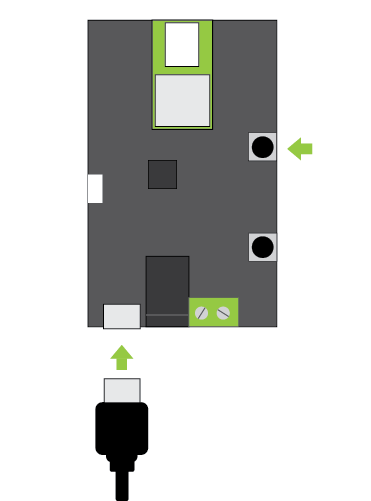

(3) 单击浏览并选择 Loco 定位节点固件

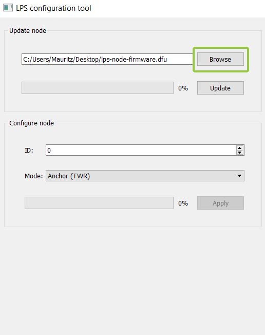
   

(4) 更新节点。

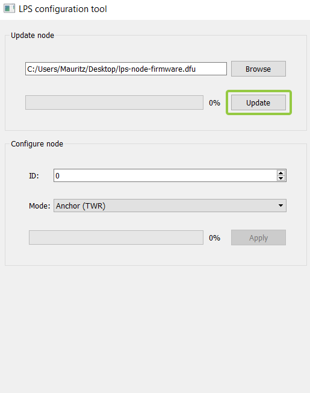

(5) 更新完成后按重置。

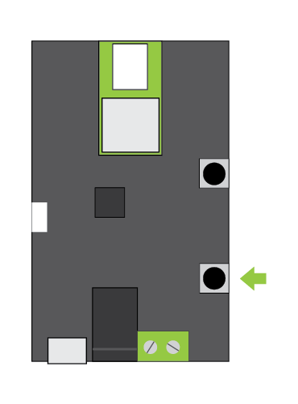

(6) 断开节点与 USB 的连接，然后对所有节点重复相同的步骤，然后再配置它们。

将节点配置为锚点
^^^^^^^^^^^^^^^^

现在是时候设置节点的模式，将它们变成锚点，并为每个锚点设置单独的 ID。锚点的编号应从 0 开始向上。

提示：为了便于识别锚点并方便将来管理系统，用锚点的 ID 标记锚点可能是个好主意。

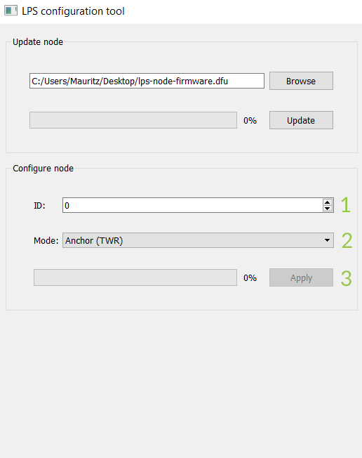

(1) 将第一个锚点连接到 USB（无需按任何按钮）
(2) 选择合适的ID
(3) 选择“锚（TWR）”模式
(4) 单击“应用”将设置写入锚点
(5) 对所有锚点重复此过程

将锚点放置在房间里
--------------------

锚点位置
^^^^^^^^

为了获得良好的结果，锚点的放置有一些经验规则：

(1) 锚点应均匀分布在飞行体周围，且间隔至少 2 米。
(2) 锚点应与飞行体积处于视线范围内。
(3) 锚天线应放置在距离任何墙壁、天花板或金属物体 15 厘米的位置，以避免干扰反射。在我们的参考设置中，我们通过使用这些 3D 打印支架来实现这一点。在存储库中单击“Raw”，然后选择“另存为”并将文件另存为 stl 文件。

在我们的 8 个锚点参考设置中，我们将节点放置在一个框的角落，因为 TDoA 的位置估计在凸包内效果最佳。ID 的顺序对于 TDoA2 很重要，但对于 TDoA3 可以忽略。

8 锚点
^^^^^^^
在我们的 8 个锚点参考设置中，我们将节点放置在一个框的角落，因为 TDoA 的位置估计在凸包内效果最佳。ID 的顺序对于 TDoA2 很重要，但对于 TDoA3 可以忽略。

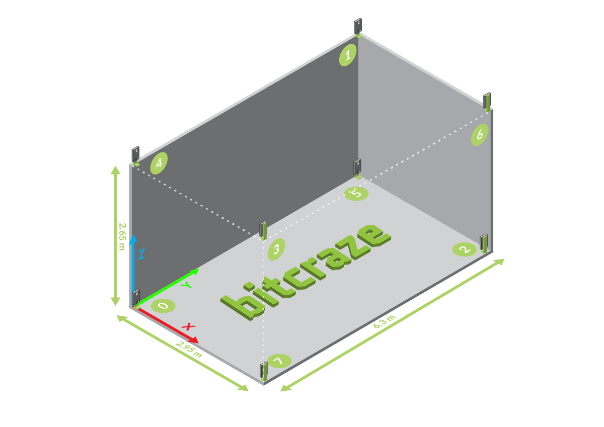

6 锚点
^^^^^^^
在我们的 6 个锚点参考设置中，我们在飞行区域上方放置了 3 个锚点，在飞行区域下方放置了 3 个锚点，形状呈倒三角形。

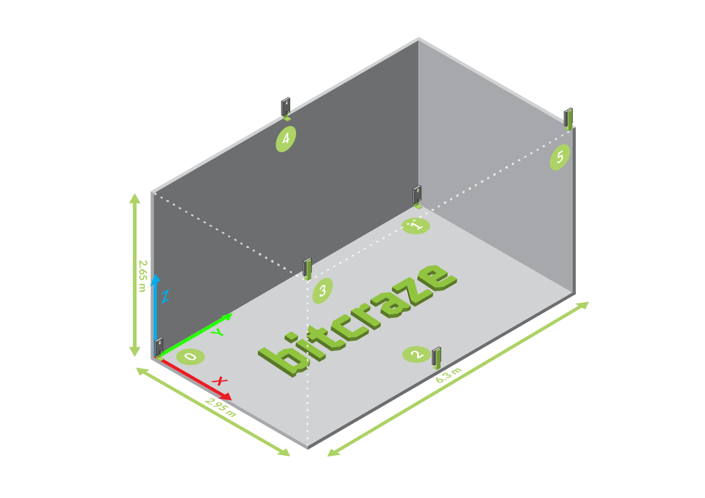

如果您有超过 8 个锚点，我们建议您先设置一个包含 8 个锚点的系统，然后将系统切换到 TDoA3 以向系统添加更多锚点。有关更多信息，请参阅tdoa3 设置页面。

锚点供电
^^^^^^^^^^

锚可以通过三种不同的方式供电。

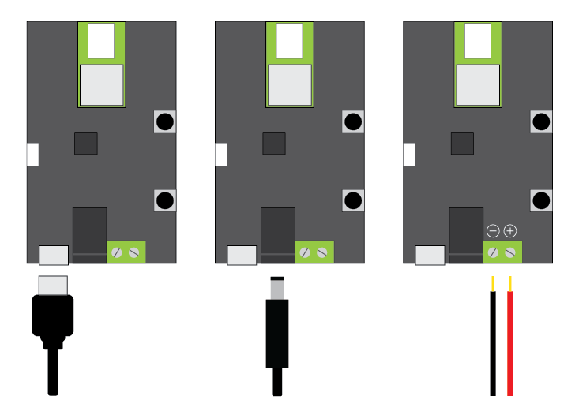

(1) Micro USB。适用于使用外部电池或电源适配器的固定和便携式设置。
(2) 筒形插孔。适用于使用电源适配器的固定和便携式设置。
(3) 螺丝端子。适合固定安装和串联。电缆尺寸最大可达 0.5mm2。

它们可以同时连接，因此在连接微型 USB 电缆进行更新或更改配置时，锚点仍可通过螺丝端子供电。所有电源选项均可处理 5-12V，电源应能够提供至少 150mA 的电流。

配置并验证系统
--------------

以下部分将显示 8 个锚点系统，但对于 6 个锚点设置，其过程非常相似，其中锚点 6 和 7 将变灰。

打开 Crazyflie 客户端
^^^^^^^^^^^^^^^^^^^^^

现在，当所有东西都安装好并通电后，就可以配置系统了，这可以通过 Crazyflie 客户端完成。客户端和锚点之间的通信通过 Crazyflie 和 Loco 定位平台进行中继。

(1) 将您的 Crazyflie 2.x 放置在飞行区域的中心。
(2) 打开 CF 客户端并连接到 Crazyflie 2.x
(3) 如果尚未完成，请将 Crazyflie 2.x配置为2Mbit无线电模式。这可减少对 UWB 无线电的干扰。如果更改配置，则需要重新启动 Crazyflie 2.x。

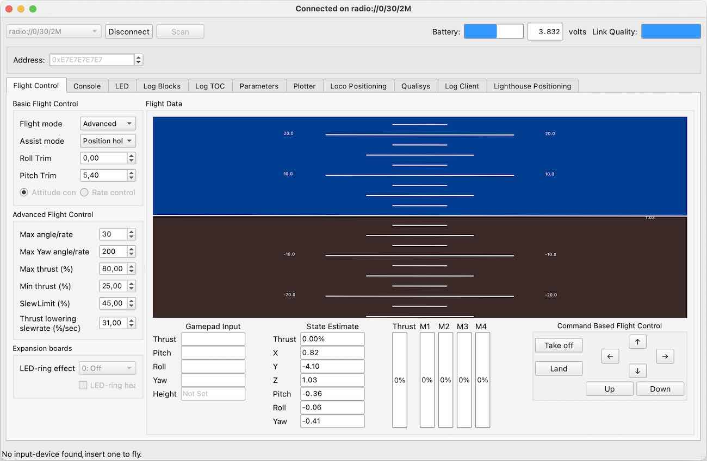

单击 Loco 定位选项卡
^^^^^^^^^^^^^^^^^^^^^

选择“Loco定位”选项卡。

您可能需要在菜单“视图”->“选项卡”->“Loco 定位选项卡”中检查它以使其可见。

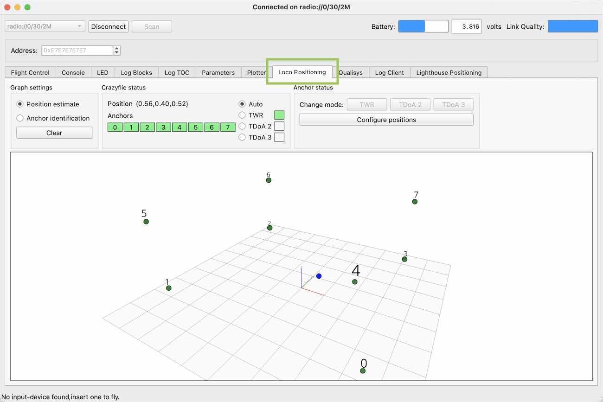

检查锚点状态
^^^^^^^^^^^^

在锚点测距状态框中，检查绿色框的数量是否与锚点的数量相同。

红色框表示 Crazyflie 2.x 无法与该锚点通信，并且无法获取任何测距数据。如果是这种情况，请验证锚点是否配置正确、是否通电且是否在视线范围内。

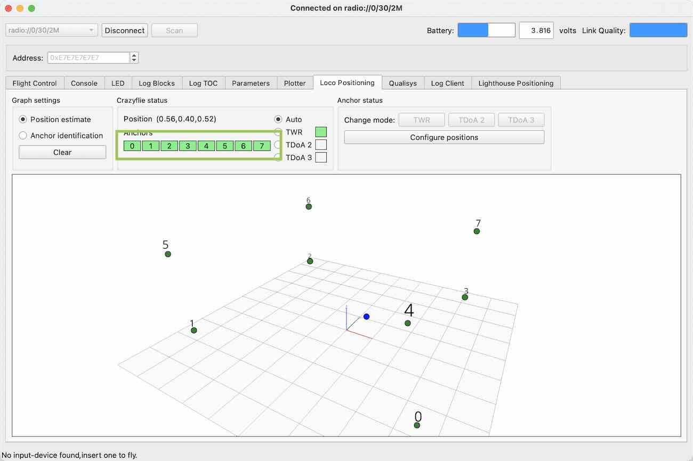

输入锚点位置
^^^^^^^^^^^^

要开始配置锚点位置，您需要单击“配置位置”按钮。

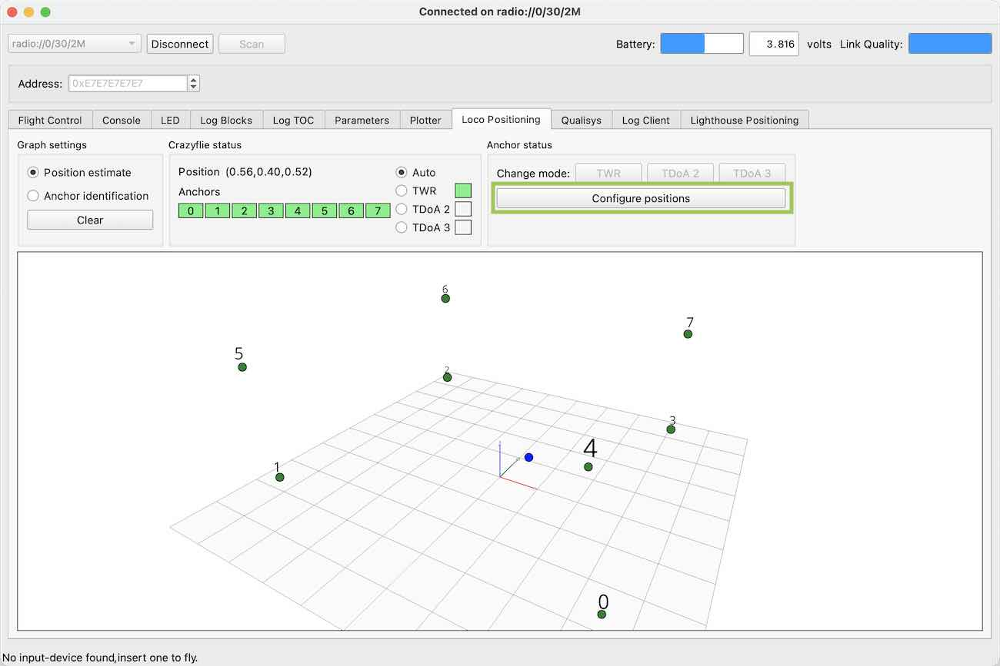

弹出窗口，点击“从锚点获取”按钮获取锚点列表，并用当前锚点存储的值填充位置。

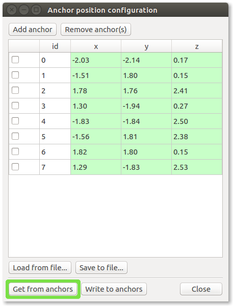

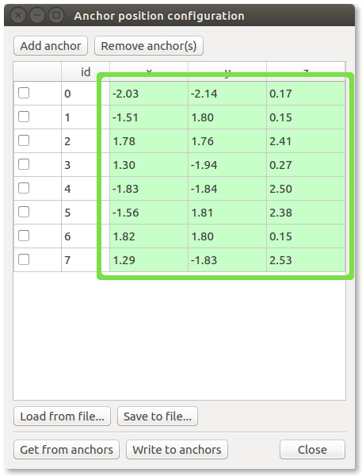

尚未存储位置的锚点将不会出现在列表中，在这种情况下，您必须通过单击“添加锚点”按钮手动添加它们。

输入系统中锚点的位置（坐标）。注意：以米为单位。

当您输入新值时，该框将变为红色，表示它与锚点中存储的当前值不同。

将位置写入锚点
^^^^^^^^^^^^^^

(1) 要保存锚点中的新锚点位置，请按“写入锚点”按钮
(2) 确认锚点位置框从红色变为绿色，这表示新位置已写入锚点并以红色返回客户端。读回过程可能需要长达 5 秒的时间，请耐心等待。如果 5 到 10 秒后没有发生任何变化，则写入可能并未对所有锚点起作用，请单击“写入锚点”按钮尝试再次写入。

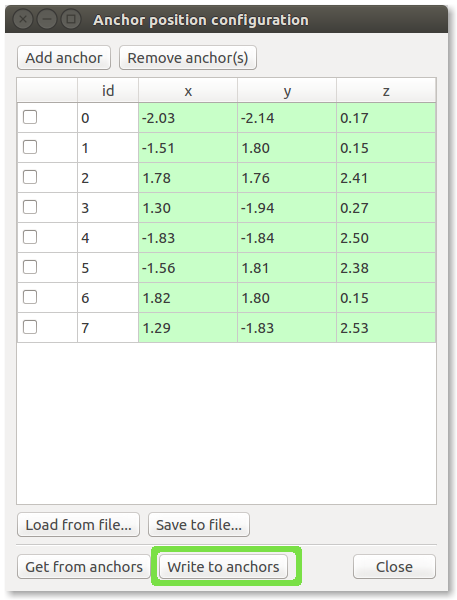

验证锚点位置
^^^^^^^^^^^^
验证锚点位置有助于排除以后定位问题。3D 图形显示锚点和 Crazyflie 的位置。红线表示 X 轴，绿线表示 Y 轴，蓝线表示 Z 轴。可以使用鼠标旋转、移动和缩放图形。

(1) 将图形设置模式切换为“锚点识别”
(2) 将 Crazyflie 移至靠近一个锚点的位置
(3) 验证图中是否指示了正确的锚点
(4) 对所有锚点重复此过程，并更正任何错误配置的锚点地址

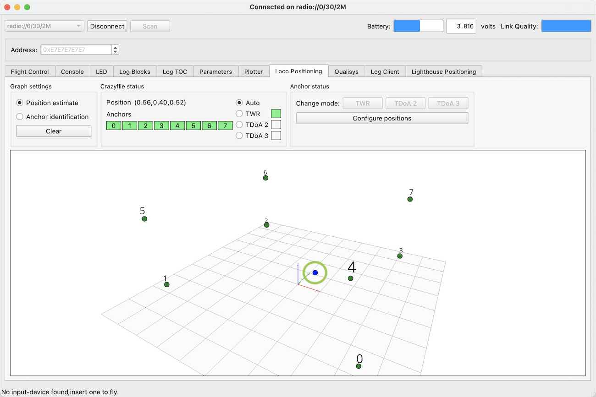

验证估计位置
^^^^^^^^^^^^
(1) 将图形设置模式切换回“位置估计”
(2) 移动 CF 并验证图形中的运动是否与物理运动相对应

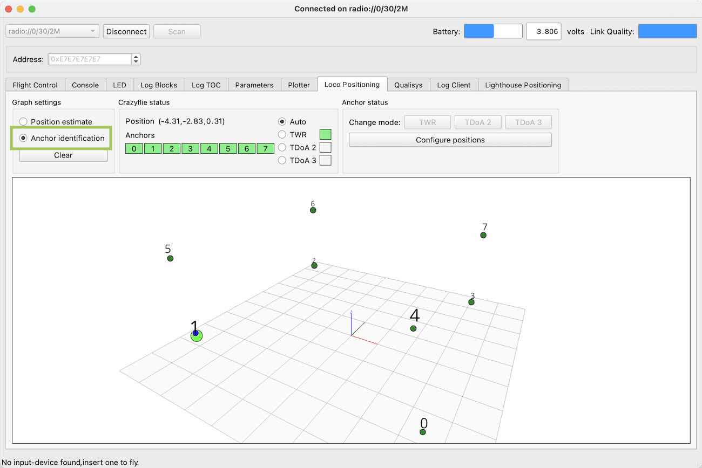

校准完成
^^^^^^^^

恭喜，Loco 定位系统现已校准！

将系统模式切换为 TDoA
---------------------

如果您打算在 TDoA 模式下使用系统来飞行多架 Crazyflie，那么现在是时候更改系统模式了。TDoA 测距协议有两个版本。

(1) TDoA 2 可与 8 个锚点配合使用。
(2) TDoA 3 更加稳健，对锚点数量没有任何限制，因此可以用于更大的系统。与 TDoA2 相比，估计的位置可能略有噪声。

强制 Crazyflie 使用 TWR 模式
^^^^^^^^^^^^^^^^^^^^^^^^^^^^
在 crazyflie 状态部分勾选TWR单选按钮。

这将启用锚点状态部分中的“TDoA2”和“TDoA3”按钮。

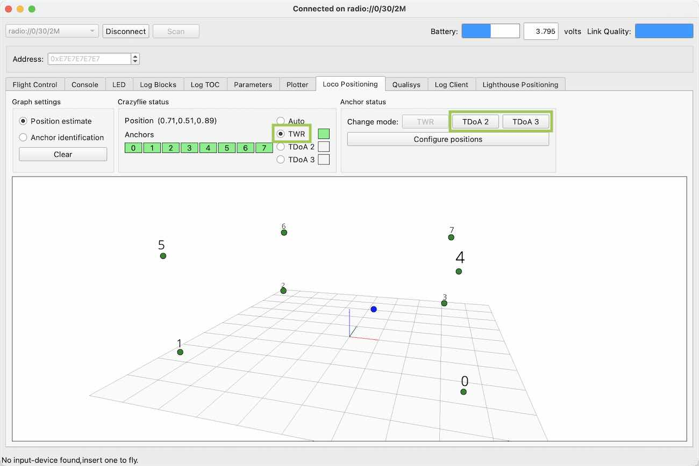

将锚点切换为 TDoA 模式
^^^^^^^^^^^^^^^^^^^^^^
单击“TDoA 2”或“TDoA 3”按钮可将锚点切换为其中一种 TDoA 模式。

几秒钟后，所有锚点状态框都应变为红色，表明 Crazyflie 2.x 不再从锚点接收 TWR 数据。

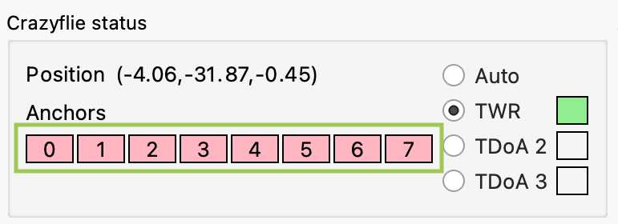

有关系统模式切换和故障排除的详细信息，请参阅文档

将 Crazyflie 切换回自动模式
^^^^^^^^^^^^^^^^^^^^^^^^^^^

最后一步，通过勾选 Crazyflie 状态部分中的自动单选按钮来确认 TDoA 模式，并验证 TDoA2 框是否变为绿色。

当 Crazyflie 切换到 TDoA 模式并开始从锚点接收数据时，锚点框也应该变成绿色。

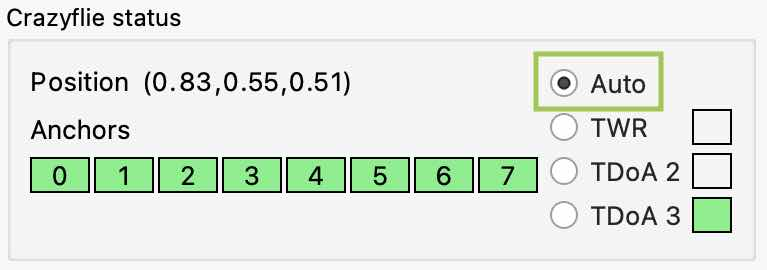

如果不是所有的锚框都变成绿色，请参阅故障排除文档。