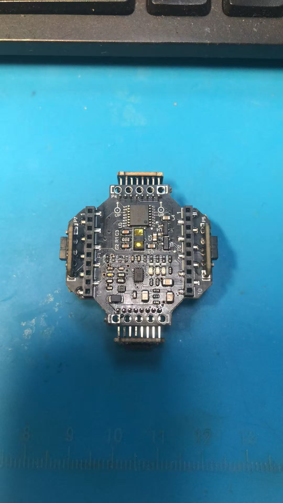
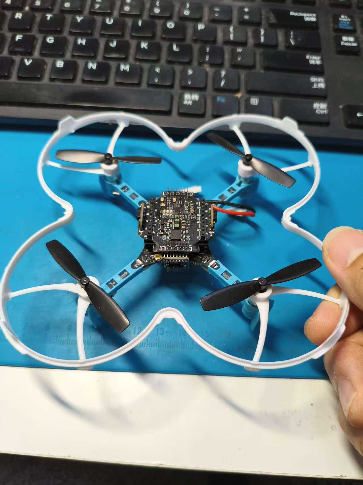
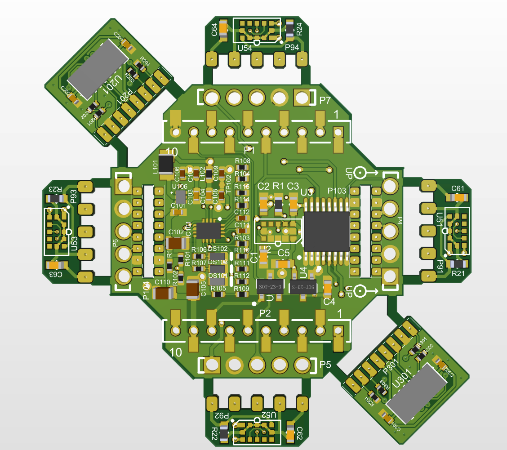
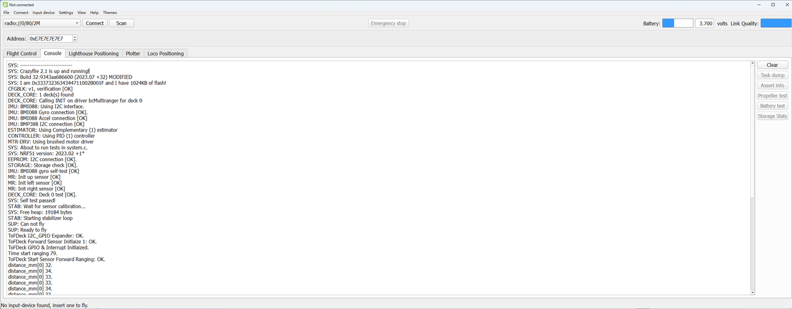
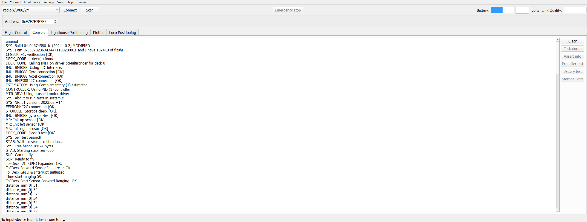

Matrix Ranger deck
==================

.. contents:: 目录
    :depth: 4
    :local:

简介
----

Matrix Ranger deck 基于多像素 ToF 深度传感方案，为 Crazyflie 2.x 提供前后双向测距能力，面向室内自主导航与避障应用。

该方案参考了 ETH Zurich 的 Matrix_ToF_Drones 项目，核心思路是在极低算力与载荷约束下，利用多区域深度信息替代高计算量视觉方案，提升纳米无人机的实时避障能力。

    https://github.com/ETH-PBL/Matrix_ToF_Drones

包括5个传感器：

 - 前向多区域 ToF 测距传感器 VL53L5CX，支持 8x8 区域测距；
 - 后向多区域 ToF 测距传感器 VL53L5CX，支持 8x8 区域测距；
 - 左右上三个方向仍然是类似Mulitiranger deck的单点ToF测距传感器VL53L1X，支持单点测距；

安装到 Crazyflie 2.1 后，展示如下：

应用与演示
----------

- PBL Event: catch me if you can: https://youtu.be/FyipTqjBGuM
- Towards Reliable Obstacle Avoidance for Nano-UAVs: https://youtu.be/m9-spY1ruAQ
- Enabling Obstacle Avoidance for Nano-UAVs with a multi-zone depth sensor and a model-free policy: https://youtu.be/eR2RfNcEVSU

硬件架构
--------

Matrix Ranger deck 采用双 VL53L5CX（8x8 多区域 ToF）方案，结合 Crazyflie 平台实现前向与后向深度感知。

关键器件如下：

- VL53L5CX，多区域 ToF 测距传感器（支持 8x8/4x4 区域）
- VL53L1X，单点 ToF 测距传感器（支持单点测距）
- TPS62233，3MHz 小型降压转换器
- TCA6408A，低压 8-bit I2C/SMBus IO 扩展器
- PCA9534，低压 8-bit I2C/SMBus IO 扩展器

传感器典型工作距离约 2 cm 到 4 m，在更远距离上精度会下降。与常见纯视觉方案相比，该架构可在更低计算负载下提供稳定的避障输入。

数据与算法说明
--------------

项目在受控环境与开放空间中采集了飞行数据，包含：

- Crazyflie 状态估计（姿态、速度、位置）
- 多像素 ToF（8x8）
- 灰度相机图像
- 动捕系统姿态与位置数据（部分实验）

这些数据被用于训练与验证避障策略，并支持离线可视化与复现实验流程。

固件适配
--------

针对 Crazyflie 固件，仓库提供了适配版本与参考实现，可用于快速验证 Matrix Ranger deck 方案。当前文档提供两个常用版本的固件包：

- crazyflie-firmware-2023.07_matrix_ranger_deck.zip
- crazyflie-firmware-2024.10.2_matrix_ranger_deck.zip

代码太大了，无法上传，有需求直接找作者获取。

在完成固件编译环境配置后，可参考 Crazyflie 官方流程进行构建与烧录。

crazyflie-firmware-2023.07_matrix_ranger_deck.zip 固件修改之后，Console显示如下：

crazyflie-firmware-2024.10.2_matrix_ranger_deck.zip 固件修改之后，Console显示如下：

资料下载
--------

- `Matrix Ranger deck 原理图 <../../../_static/products/matrix_ranger_deck/matrix_ranger_deck_v1.0.pdf>`_

参考资料
--------

- 项目主页: https://github.com/ETH-PBL/Matrix_ToF_Drones
- Crazyflie 2.1: https://www.bitcraze.io/products/crazyflie-2-1/
- Flow deck v2: https://store.bitcraze.io/collections/decks/products/flow-deck-v2
- Crazyflie Client: https://www.bitcraze.io/documentation/repository/crazyflie-clients-python/master/
- Crazyflie Firmware 构建与烧录: https://www.bitcraze.io/documentation/repository/crazyflie-firmware/master/building-and-flashing/build/

