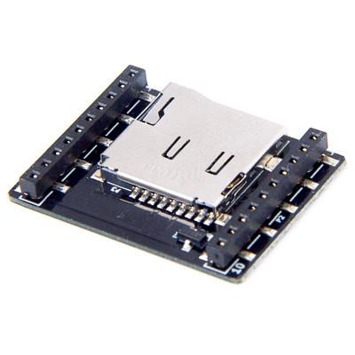

microSD deck
===============

.. contents:: 目录
    :depth: 4
    :local:

简介
-----

Micro SD 卡座 Crazyflie 新增 Micro SD 卡读卡器，支持读取和写入 SD 卡文件。
标准固件支持 SD 卡高速记录（最高 1 kHz），记录速率高于实时无线电传输速率。
记录完成后，可将 SD 卡移至计算机进行数据分析。
此外，还可以从应用程序（或任何其他固件代码）访问文件系统，以实现需要使用文件的用例。

特征
----

- 通过单线存储器自动检测甲板

机械规格
--------

- 重量：1.7 克
- 尺寸（宽x高x深）：21x28x4 mm
- 设计用于安装在 Crazyflie 2.X 上方或下方

电气规格
--------

- 可以使用电路板底部的焊桥切换用于 SPI 片选的引脚。
- 默认情况下使用 GS4 (IO4)，但可以剪断此线并焊接另一个焊桥，以选择另一个 IO (IO1-3) 用于片选。

文件系统
--------

卡座中使用的 SD 卡必须格式化为 FAT32 文件系统（exFAT 不起作用）。

数据记录
--------
该固件包含开箱即用的数据记录功能。您可以通过将配置文件放入 µSD 卡来启用和配置该功能。该文件是一个简单的文本文件，示例文件为 config.txt。文件格式如下：

.. code-block:: bash

  1     # version
  512   # buffer size in bytes
  log   # file name
  0     # enable on startup (0/1)
  on:fixedFrequency
  100     # frequency in Hz
  1     # mode (0: disabled, 1: synchronous stabilizer, 2: asynchronous)
  log entry 1
  log entry 2
  log entry 3
  ...
  on:myEvent1
  log entry 4
  log entry 5
  ...
  on:myEvent2
  ...

config.txt文件举例如下: 

.. code-block:: bash

  1     # version
  512   # buffer size in bytes
  log   # file name
  0     # enable on startup (0/1)
  on:fixedFrequency
  250     # frequency
  1     # mode (0: disabled, 1: synchronous stabilizer, 2: asynchronous)
  acc.x
  acc.y
  acc.z
  gyro.x
  gyro.y
  gyro.z
  baro.asl
  baro.temp
  baro.pressure
  stabilizer.roll
  stabilizer.pitch
  stabilizer.yaw
  stabilizer.thrust
  ctrltarget.roll
  ctrltarget.pitch
  ctrltarget.yaw
  range.zrange
  on:activeMarkerModeChanged

配置文件支持记录日志变量以及事件触发器。对于固定频率记录，频率是一个以赫兹为单位的整数值，例如 250 表示每 4 毫秒写入一个数据块。缓冲区大小用于将写入卡和数据记录分离。更高的频率需要更大的缓冲区，否则可能会丢失一些数据。Crazyflie 控制台将显示由于缓冲区大小不足而必须丢弃的事件数量：

.. code-block:: bash

  uSD: Wrote 161378 B to: log00 (2237 of 2237 events)

一般来说，使用 512 字节的缓冲区，以 1kHz 的频率记录 10 个变量效果良好。但您可能需要多尝试几次才能了解具体情况。文件名长度应不超过 10 个字符，并会自动添加一个流水号（例如，如果文件名为 log，则文件编号为 log00、log01、log02 等）。日志条目是固件中日志变量的名称。该config.txt文件在启动时只会读取一次，因此请确保在启动前插入 µSD 卡。如果一切正常，系统将创建一个 µSD 任务并分配缓冲区空间。如果 malloc 失败，Crazyflie 将卡在 LED M1 和 M4 常亮状态。如果enable on startupinconfig.txt设置为 1，则在传感器校准后会自动开始数据记录。否则，可以通过将usd.logging参数设置为 1 来启动记录。日志文件将按 00-99 的升序排列，以便记录多个日志，而无需创建新的配置文件。只需重置 Crazyflie 即可启动新文件。需要通过将参数设置usd.logging为 0 来明确停止日志记录，这将使用 CRC32 保护日志文件数据。

数据分析
--------

出于性能原因，日志文件是二进制文件，使用以下格式（版本 2）：

.. code-block:: bash

  uint8_t 0xBC header
  uint16_t version
  uint16_t num_event_types
  for each event type:
    uint16_t event_id
    eventName<null>
    uint16_t num_variables
    varname1(vartype1)<null>varname2(vartype2)<null>...<null>varnameN(vartypeN)<null>
  for each event:
    uint16_t event_id
    uint64_t timestamp (in microseconds)
    data (length defined by TOC event type)
    
这里的 vartype 是单个字符，我们支持这里定义的字符子集。我们提供了一个辅助脚本来解码数据：

.. code-block:: bash

  import cfusdlog
  logData = cfusdlog.decode(fileName)

其中 fileName 是来自 µSD 卡的文件。为了方便起见，我们还提供了一个example.py 文件，用于演示如何访问和绘制数据。

.. code-block:: python

  # -*- coding: utf-8 -*-
  """
  example on how to plot decoded sensor data from crazyflie
  @author: jsschell
  """
  import cfusdlog
  import matplotlib.pyplot as plt
  import re
  import argparse

  parser = argparse.ArgumentParser()
  parser.add_argument("filename")
  args = parser.parse_args()

  # decode binary log data
  logData = cfusdlog.decode(args.filename)

  #only focus on regular logging
  logData = logData['fixedFrequency']

  # set window background to white
  plt.rcParams['figure.facecolor'] = 'w'
      
  # number of columns and rows for suplot
  plotCols = 1
  plotRows = 1

  # let's see which keys exists in current data set
  keys = ""
  for k, v in logData.items():
      keys += k

  # get plot config from user
  plotGyro = 0
  if re.search('gyro', keys):
      inStr = input("plot gyro data? ([Y]es / [n]o): ")
      if ((re.search('^[Yy]', inStr)) or (inStr == '')):
          plotGyro = 1
          plotRows += 1

  plotAccel = 0
  if re.search('acc', keys):
      inStr = input("plot accel data? ([Y]es / [n]o): ")
      if ((re.search('^[Yy]', inStr)) or (inStr == '')):
          plotAccel = 1
          plotRows += 1

  plotBaro = 0
  if re.search('baro', keys):
      inStr = input("plot barometer data? ([Y]es / [n]o): ")
      if ((re.search('^[Yy]', inStr)) or (inStr == '')):
          plotBaro = 1
          plotRows += 1

  plotCtrl = 0
  if re.search('ctrltarget', keys):
      inStr = input("plot control data? ([Y]es / [n]o): ")
      if ((re.search('^[Yy]', inStr)) or (inStr == '')):
          plotCtrl = 1
          plotRows += 1

  plotStab = 0
  if re.search('stabilizer', keys):
      inStr = input("plot stabilizer data? ([Y]es / [n]o): ")
      if ((re.search('^[Yy]', inStr)) or (inStr == '')):
          plotStab = 1
          plotRows += 1
      
  # current plot for simple subplot usage
  plotCurrent = 0

  # new figure
  plt.figure(0)

  if plotGyro:
      plotCurrent += 1
      plt.subplot(plotRows, plotCols, plotCurrent)
      plt.plot(logData['timestamp'], logData['gyro.x'], '-', label='X')
      plt.plot(logData['timestamp'], logData['gyro.y'], '-', label='Y')
      plt.plot(logData['timestamp'], logData['gyro.z'], '-', label='Z')
      plt.xlabel('timestamp [ms]')
      plt.ylabel('Gyroscope [°/s]')
      plt.legend(loc=9, ncol=3, borderaxespad=0.)
  
  if plotAccel:
      plotCurrent += 1
      plt.subplot(plotRows, plotCols, plotCurrent)
      plt.plot(logData['timestamp'], logData['acc.x'], '-', label='X')
      plt.plot(logData['timestamp'], logData['acc.y'], '-', label='Y')
      plt.plot(logData['timestamp'], logData['acc.z'], '-', label='Z')
      plt.xlabel('timestamp [ms]')
      plt.ylabel('Accelerometer [g]')
      plt.legend(loc=9, ncol=3, borderaxespad=0.)
  
  if plotBaro:
      plotCurrent += 1
      plt.subplot(plotRows, plotCols, plotCurrent)
      plt.plot(logData['timestamp'], logData['baro.pressure'], '-')
      plt.xlabel('timestamp [ms]')
      plt.ylabel('Pressure [hPa]')
      
      plotCurrent += 1
      plt.subplot(plotRows, plotCols, plotCurrent)
      plt.plot(logData['timestamp'], logData['baro.temp'], '-')
      plt.xlabel('timestamp [ms]')
      plt.ylabel('Temperature [degC]')

  if plotCtrl:
      plotCurrent += 1
      plt.subplot(plotRows, plotCols, plotCurrent)
      plt.plot(logData['timestamp'], logData['ctrltarget.roll'], '-', label='roll')
      plt.plot(logData['timestamp'], logData['ctrltarget.pitch'], '-', label='pitch')
      plt.plot(logData['timestamp'], logData['ctrltarget.yaw'], '-', label='yaw')
      plt.xlabel('timestamp [ms]')
      plt.ylabel('Control')
      plt.legend(loc=9, ncol=3, borderaxespad=0.)

  if plotStab:
      plotCurrent += 1
      plt.subplot(plotRows, plotCols, plotCurrent)
      plt.plot(logData['timestamp'], logData['stabilizer.roll'], '-', label='roll')
      plt.plot(logData['timestamp'], logData['stabilizer.pitch'], '-', label='pitch')
      plt.plot(logData['timestamp'], logData['stabilizer.yaw'], '-', label='yaw')
      plt.plot(logData['timestamp'], logData['stabilizer.thrust'], '-', label='thrust')
      plt.xlabel('timestamp [ms]')
      plt.ylabel('Stabilizer')
      plt.legend(loc=9, ncol=4, borderaxespad=0.)

  plt.show()

资料下载
--------

- `sd_card_deck 数据手册 <../../../_static/products/sd-card-deck/datasheet/sd_card_deck-datasheet.pdf>`_

- `sd_card_deck 原理图 <../../../_static/products/sd-card-deck/electronics/sdcard_revd.pdf>`_

使用手册
----------------

.. toctree::
   :maxdepth: 6
   :caption: microSD deck 用户手册

   1_microSD_deck_assembly