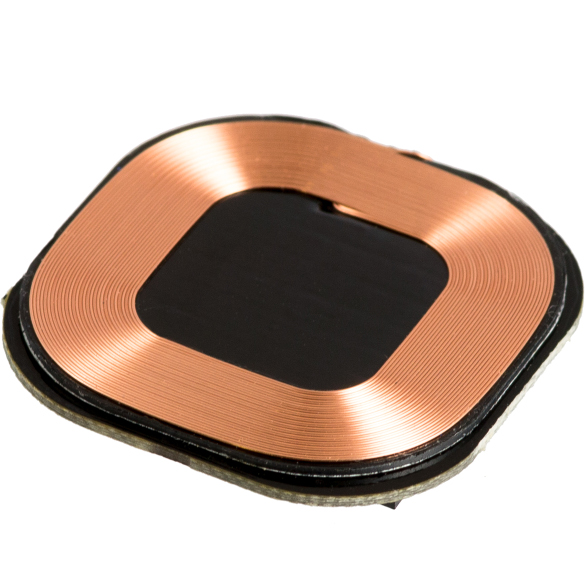

qi-deck-1_2 deck
==================

.. contents:: 目录
    :depth: 4
    :local:

简介
-----

想要在不连接 μUSB 线缆的情况下为 Crazyflie 充电？那么 Qi 1.2 感应充电扩展板是一个不错的选择。它支持 Qi 标准，可与您手机或平板电脑的 Qi 充电器配合使用。它还支持最新的 WPC V1.2 规范，能够为 Crazyflie 提供高达 1A 和 5V 的电流。

特征
----

- 兼容 WPC v1.2 Qi 标准
- 使用单线存储器自动检测扩展板

机械规格
--------

- 重量：5.0克
- 尺寸（宽x高x深）：30x30x5mm
- 设计用于安装在 Crazyflie 2.X 下方

电气规格
--------

- 用于自动扩展板检测的 1-wire 存储器
- 支持Qi无线充电标准（WPC v1.2 Qi）
- 可在 5V 电压下提供高达 1A 的电流
- 基于 TI BQ51013B

使用方法
--------

将甲板安装在 Crazyflie 下方并将其放在 Qi 充电器上为电池充电。

资料下载
--------

- `qi-deck-1_2 数据手册 <../../../_static/products/qi-deck-1_2/datasheet/qi_deck_1_2-datasheet.pdf>`_

- `qi-deck-1_2 原理图 <../../../_static/products/qi-deck-1_2/electronics/qi_1_2-revc.pdf>`_
