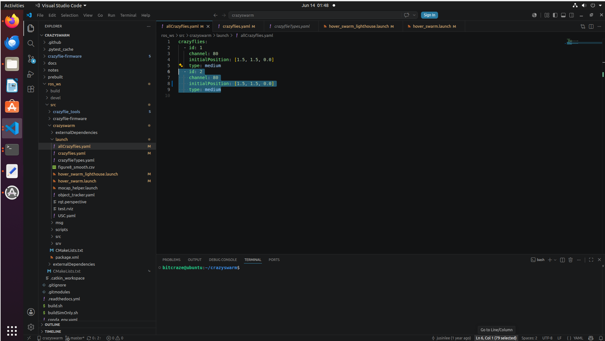
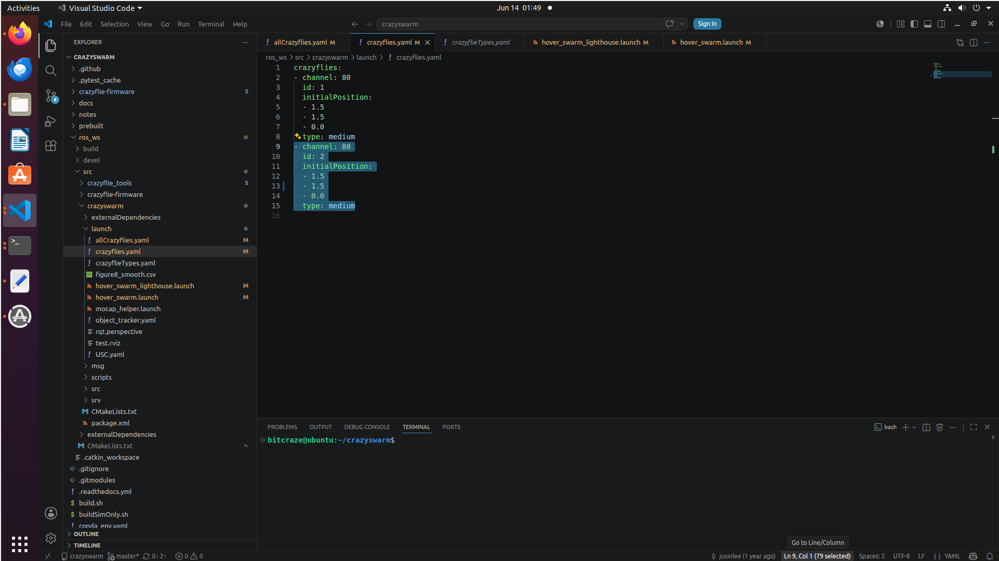
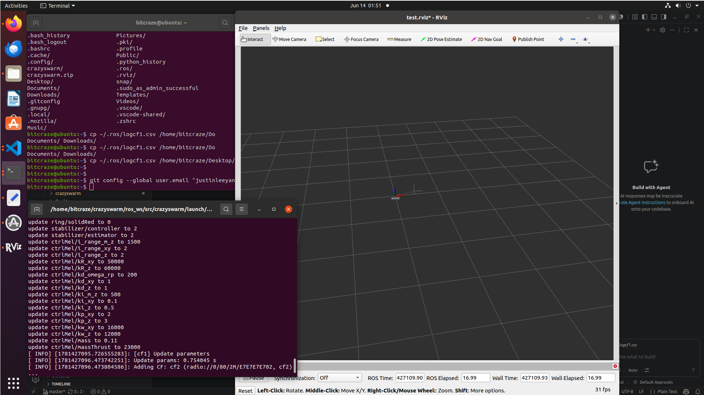
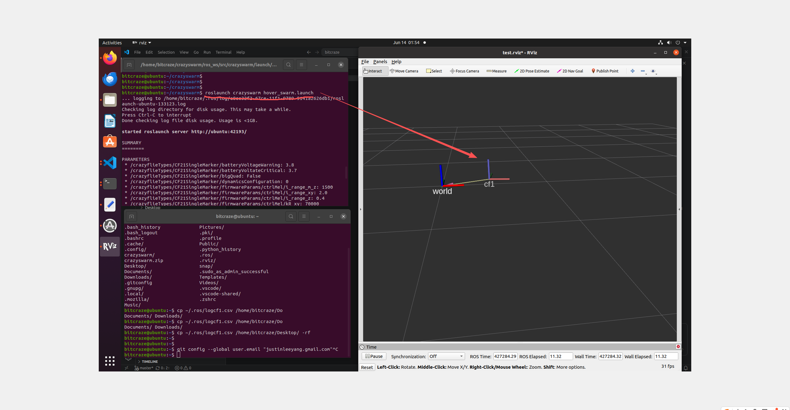
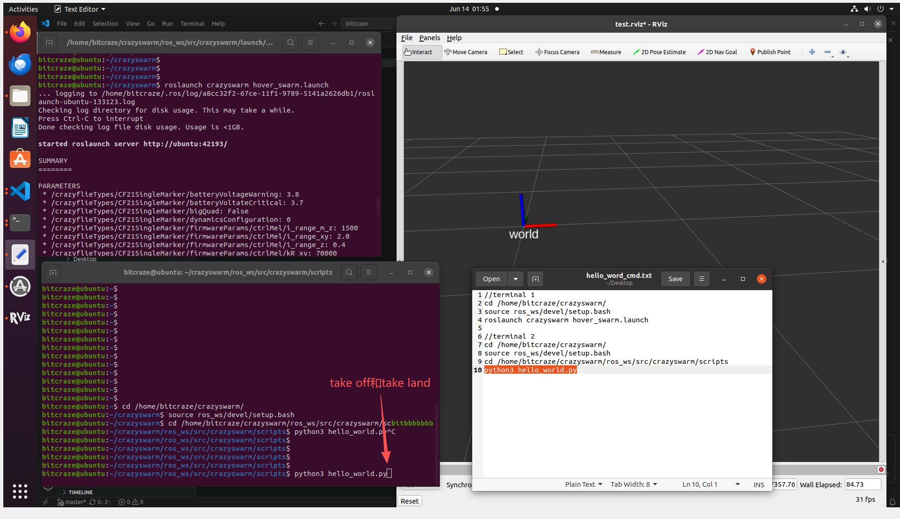
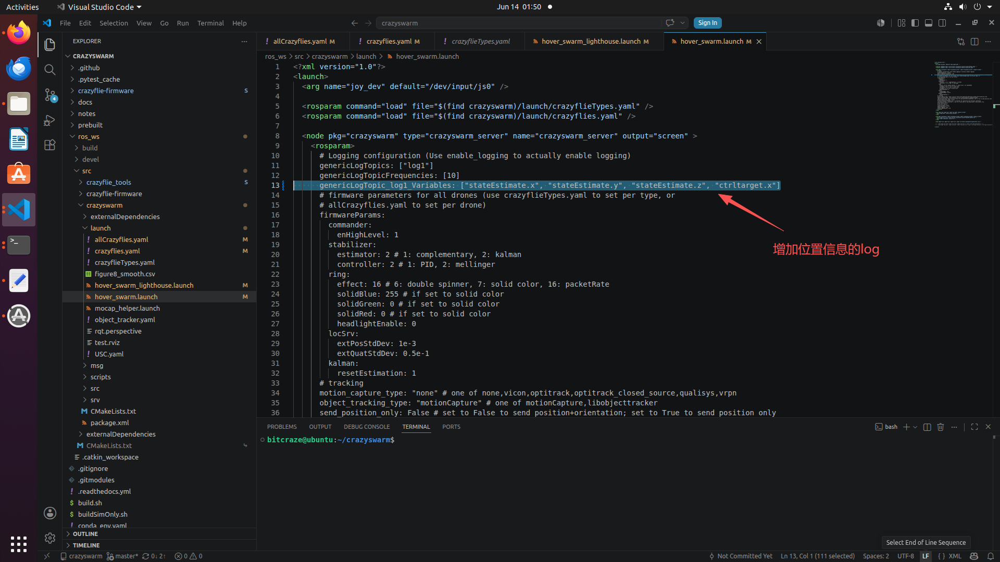
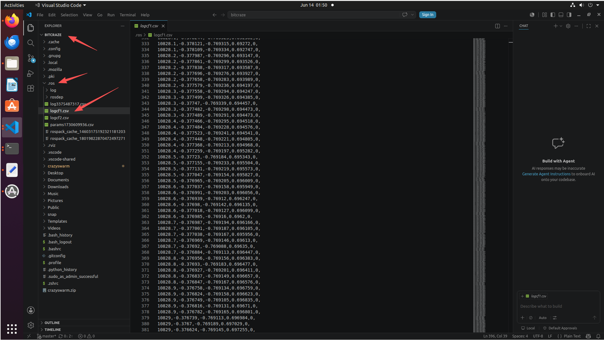
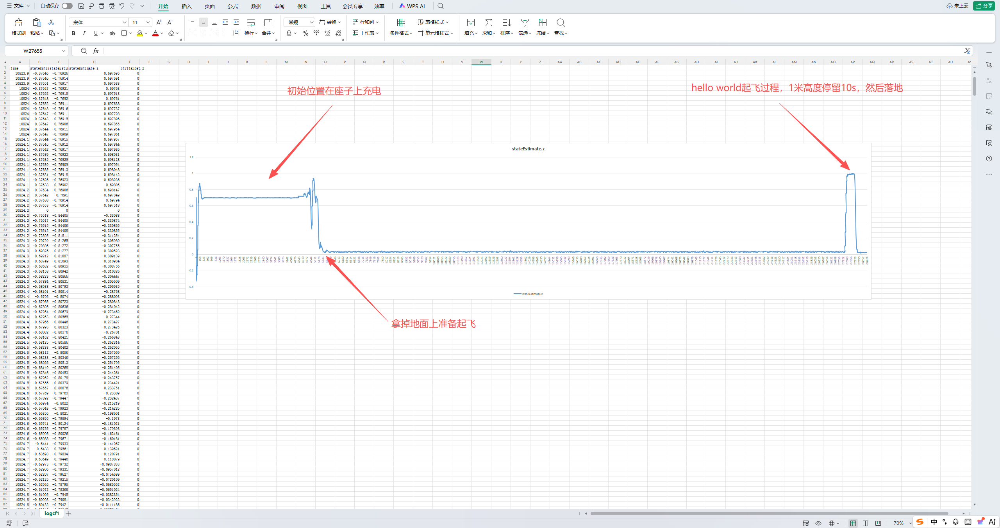

Crazyswarm 1 开始
===================

.. contents:: 目录
    :depth: 4
    :local:

目标
----
本章节旨在帮助用户快速上手 Crazyswarm 1 的真机飞行，涵盖环境准备、关键配置和首飞流程，避免常见的入门误区。

参考链接： https://crazyswarm.readthedocs.io/en/latest/installation.html

阶段 A：仿真跑通
---------------------

1. 克隆项目并准备 Python 环境（建议 Conda）。
2. 确认示例脚本在仿真中可运行。

最小验证命令（示例）：

.. code-block:: bash

    python hello_world.py --sim

验收标准：

- 3D 视图中可看到单机起飞、悬停数秒、降落。
- 无导入错误、无依赖缺失错误。

阶段 B：准备 Ubuntu 真机环境
-------------------------------------------

推荐两种方式：

1. 双系统（更稳，USB 和时延表现更好）。
2. 虚拟机 Ubuntu（可行，但要仔细处理 USB 透传和网络）。

核心要求：

- 安装 ROS（Noetic 常见于 Ubuntu 20.04）。
- 安装并构建 Crazyswarm 工作空间。
- 每次开新终端都先 source 工作空间环境。

.. code-block:: bash

    source ros_ws/devel/setup.bash

阶段 C：真机飞行前的 4 个关键配置
---------------------------------

1. 无线地址与信道

- 每台 Crazyflie 地址必须唯一。
- 常见约定地址：0xE7E7E7E7XX（XX 为编号的十六进制）。
- 大约每个 radio 负责 15 台，超过后要分多个 channel。
- 修改地址/信道后，必须重启 Crazyflie。

2. 固件版本一致

- Crazyflie 与 Crazyradio 建议先刷到官方已验证版本。
- 不统一固件版本时，联调问题会显著增多。

3. 运动捕捉配置

- 在 launch 中正确设置 motion capture 类型与主机地址。
- 优先采用唯一 marker 布局，减少识别混淆。

4. 机体清单配置

- 在 crazyflies.yaml 中维护参与飞行的机器（id/channel/type/initialPosition）。
- 启动时如果清单里有机器不可通信，服务会报错退出。

阶段 D：首飞闭环
-------------------------------

终端 1：启动服务

.. code-block:: bash

    source ros_ws/devel/setup.bash
    roslaunch crazyswarm hover_swarm.launch

终端 2：执行脚本

.. code-block:: bash

    source ros_ws/devel/setup.bash
    python hello_world.py

Crazyswarm1 虚拟机环境下的真机飞行
-------------------------------------------

虚拟机环境默认已经做好，但是因为有8G的容量，暂时还没有可共享的地方，可以联系作者获取虚拟机镜像，或者按照上面的步骤自己搭建环境。

Crazyflie地址问题
^^^^^^^^^^^^^^^^^^^^^^^^^^^^
默认支持2个飞行器，地址分别是E7E7E7E701和E7E7E7E702，信道默认是80。可以在allCrazyflies.yaml和crazyflies.yaml中修改地址和信道，但要确保每台飞行器的地址唯一，并且修改后重启飞行器。

终端启动
^^^^^^^^^^^^^^

参考文本hello_world.py 执行脚本，Ubuntu20.04需要开启两个终端: 

- `hello_world.py 执行脚本 <../../../_static/videos/swarm/crazyswarm/crazyswarm1/crazyswarm1_hello_word_cmd.txt>`_

.. code-block:: bash

    # terminal 1
    cd /home/bitcraze/crazyswarm/
    source ros_ws/devel/setup.bash
    roslaunch crazyswarm hover_swarm.launch

    # terminal 2
    cd /home/bitcraze/crazyswarm/
    source ros_ws/devel/setup.bash
    cd /home/bitcraze/crazyswarm/ros_ws/src/crazyswarm/scripts
    python3 hello_world.py

终端1启动 roslaunch crazyswarm hover_swarm.launch， rviz会3D显示飞行器起飞、悬停、降落的过程。

终端2启动 python3 hello_world.py， 控制真实飞行器起飞、悬停、降落的过程。

Log位置信息

genericLogTopic_log1_Variables中可以存储位置数据，放到log中，但是必须是rviz启动可以看到cf1的位置数据，才能存储到log中。可以在rviz中添加一个topic，显示log中的位置数据。

log数据存储在/home/bitcraze/.ros/目录下

- `logcf1位置数据示例 <../../../_static/videos/swarm/crazyswarm/crazyswarm1/logcf1.log.txt>`_

log数据解析整个过程，下图是z轴的数据，因为只是起飞、悬停、降落，所以z轴数据是先上升，保持10s时间，然后下降的过程。

