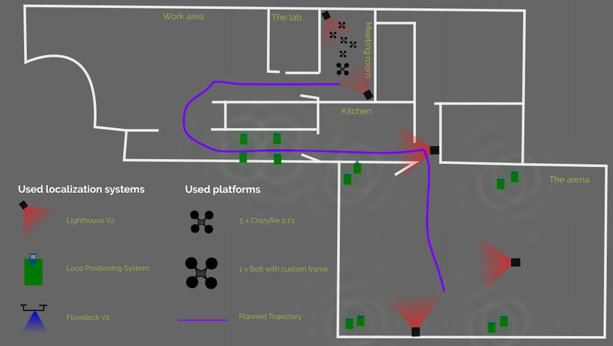
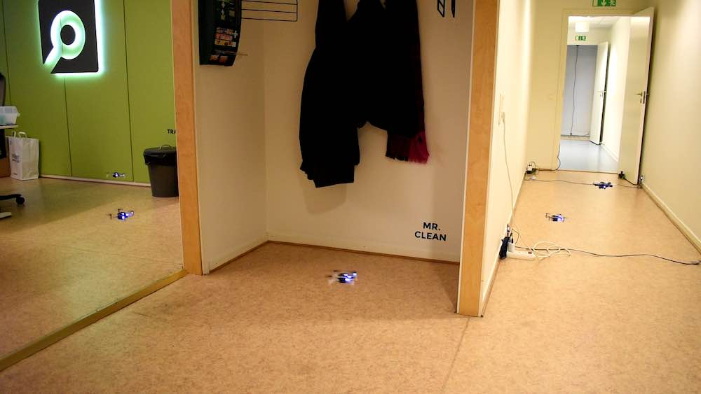
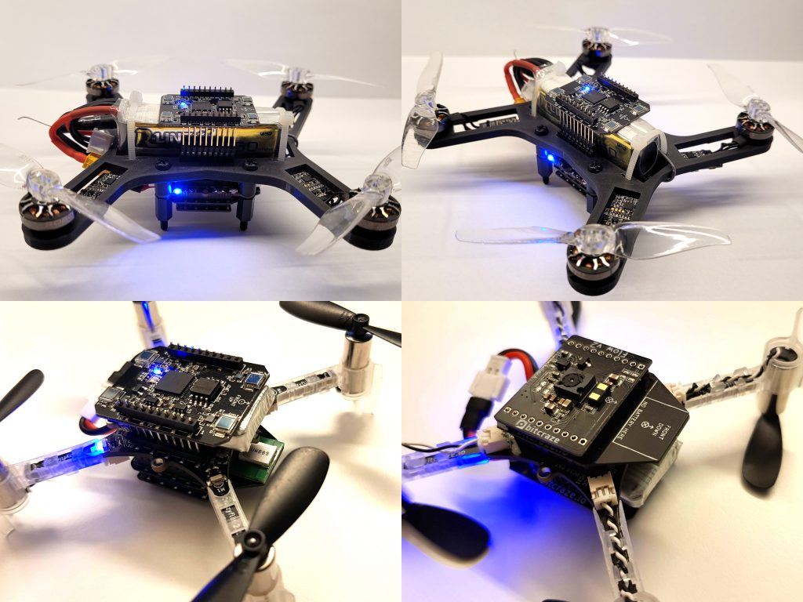
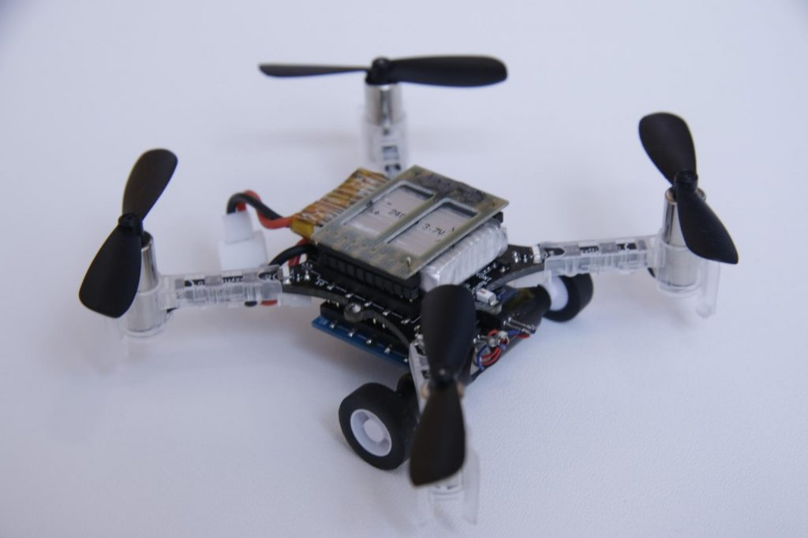
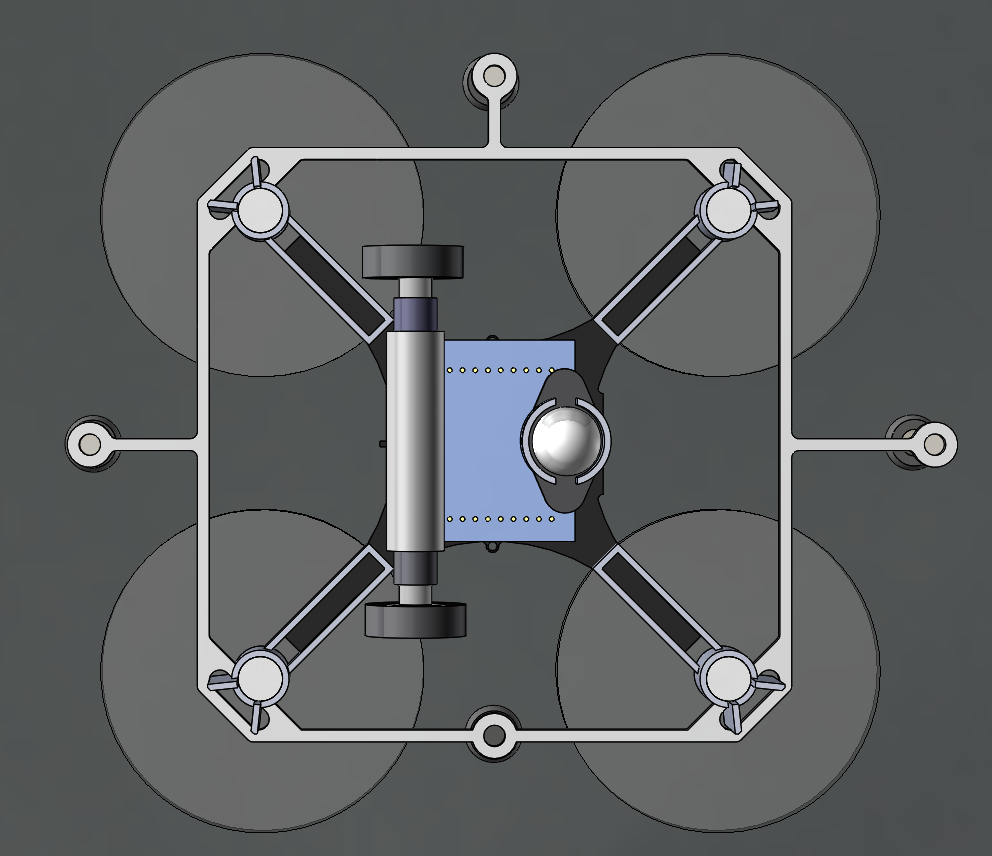

Crazyswarm 简介
===============

Crazyswarm 是一个功能强大的多无人机编队控制系统，最初由南加州大学 (USC) 和加州理工学院 (Caltech) 开发，专为控制大量 Crazyflie 微型无人机而设计，广泛应用于研究、教学和演示领域。

主要功能
--------

- **多无人机控制**：支持同时控制几十架 Crazyflie 无人机。
- **精确定位**：配合 Vicon、OptiTrack 等定位系统，实现厘米级精度。
- **轨迹规划与控制**：支持离线轨迹导入与实时控制，适用于复杂编队飞行。
- **基于 ROS 架构**：便于集成其他机器人系统与算法模块。
- **多语言接口**：支持 Python 与 C++ 接口进行开发和实验。

系统组成
--------

1. **Crazyflie 无人机**：由 Bitcraze 开发的微型飞行平台。
2. **定位系统**：如 Vicon、OptiTrack 或 Crazyflie 的 LPS 系统。
3. **Crazyswarm 软件栈**：
   
   - `crazyswarm` ROS 节点：统一管理飞行任务（起飞、降落、轨迹跟踪）。
   - 定制版 `crazyflie-firmware`：支持高频率控制输入。
   - `crazyflie_ros`：与 Crazyflie 通信的 ROS 驱动层。
4. **地面工作站**：运行 ROS 的计算机，用于任务发布和数据处理。

常见应用
--------

- 多机飞行编队演示
- 分布式协同控制算法研究
- 教学平台（控制、定位、飞行原理）
- 室内 SLAM、轨迹跟踪与路径规划实验

开源地址
--------

GitHub 仓库：  
`https://github.com/USC-ACTLab/crazyswarm`

视频集锦
--------

视频1
^^^^^^^^^^^

.. raw:: html

   

      <video width="100%" height="auto" controls autoplay muted loop>
         <source src="../../_static/videos/swarm/Spiraling Swarm Demo 2020.mp4" type="video/mp4">
         Your browser does not support the video tag.
      </video>
   

视频2
^^^^^^^^^^^

.. raw:: html

   

      <video width="100%" height="auto" controls autoplay muted loop>
         <source src="../../_static/videos/swarm/Swarm mapping with Crazyswarm2 and Map Merging.mp4" type="video/mp4">
         Your browser does not support the video tag.
      </video>
   

视频3
^^^^^^^^^^^

   https://www.bitcraze.io/2020/12/the-hyper-demo/

演示中使用了三种不同的定位系统：Lighthouse（V2）、Loco 定位系统（TDoA3）和 Flow 平台。飞行空间的不同区域由不同的系统覆盖，这些系统可以单独或重叠覆盖。所有平台始终处于活动状态，并在有可用数据时进行拾取，并将其推送至扩展卡尔曼估计器。

在我们开始的会议室里，我们使用了两个 Lighthouse V2 基站，它们提供了非常精确的位置估算（包括偏航），为我们带来了良好的开端。当 Crazyflies 搬到办公室后，它们只依赖 Flowdeck，尽管误差可能会随着时间的推移而累积，但运行良好。

当 Crazyflies 绕过拐角，进入通往厨房的走廊时，我们发现误差有时会过大，要么是位置不对，要么是偏航角不对，导致 Crazyflies 撞到墙上。为了解决这个问题，我们在走廊里添加了 4 个 LPS 节点，解决了这个问题。需要注意的是，所有 4 个锚点都在地面上，这不足以为 Crazyflies 提供良好的 3D 位置，但 Flow 平台上的距离传感器提供了 Z 轴信息，整体效果不错。

从厨房进入竞技场的拐角非常狭窄，而且错误的积累再次使得仅依靠 Flow 甲板变得很麻烦，因此我们添加了一个灯塔基站以获得额外的帮助。

最后，在竞技场的第一部分，LPS系统实现了全3D覆盖，与Flow平台配合使用，运行非常顺畅。大约进行到一半时，Crazyflies也开始接入Lighthouse系统，我们现在同时使用这三个系统的数据。

显然，我们在 Lighthouse 系统中使用了超过 2 个基站，尽管它并未获得官方支持，但仍然需要一些谨慎和人工操作才能正常工作。例如，需要手动调整几何数据以适应全局坐标系。

厨房和竞技场之间的墙很厚，UWB 不太可能穿透，但我们仍然偶尔会从竞技场的锚点收到 LPS 数据。我们的解释是，这些数据包一定是在墙上弹跳到厨房的。这些零散的数据包被 Crazyflies 捕获，但由于 Lighthouse 基站提供了强大的信息源，LPS 数据包并没有造成任何问题。

.. raw:: html

   

      <video width="100%" height="auto" controls autoplay muted loop>
         <source src="../../_static/videos/swarm/Bitcraze-Hyper-Demo/Bitcraze Hyper Demo 2020_5 crazyflies and the Crazyflie Bolt using 3 different positioning systems.mp4" type="video/mp4">
         Your browser does not support the video tag.
      </video>
   

视频4 --- 飞行器和车协同
^^^^^^^^^^^^^^^^^^^^^^^^

   https://www.bitcraze.io/2017/07/multi-robot-path-planning-for-flying-and-driving-vehicles/

.. raw:: html

   

      <video width="100%" height="auto" controls autoplay muted loop>
         <source src="../../_static/videos/swarm/Multi-robot/Multi-robot Path Planning for Flying-and-Driving Vehicles_1920x1080_h264.mp4" type="video/mp4">
         Your browser does not support the video tag.
      </video>
   

.. toctree::
   :maxdepth: 2
   :caption: Crazyswarm

